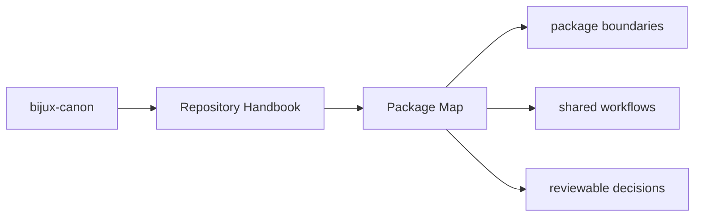
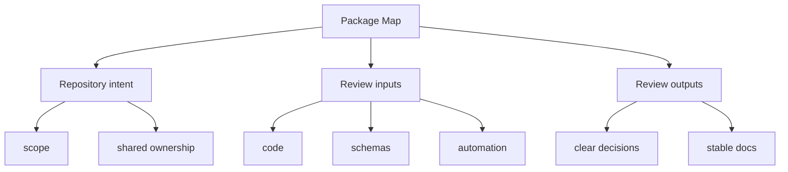

# Package Map

The canonical packages each own a distinct slice of the overall system:

- [bijux-canon-ingest](../bijux-canon-ingest/foundation/index.md) for deterministic document ingestion, chunking, retrieval assembly, and ingest-facing boundaries.
- [bijux-canon-index](../bijux-canon-index/foundation/index.md) for contract-driven vector execution with replay-aware determinism, audited backend behavior, and provenance-rich result handling.
- [bijux-canon-reason](../bijux-canon-reason/foundation/index.md) for deterministic evidence-aware reasoning, claim formation, verification, and traceable reasoning workflows.
- [bijux-canon-agent](../bijux-canon-agent/foundation/index.md) for deterministic, auditable agent orchestration with role-local behavior, pipeline control, and trace-backed results.
- [bijux-canon-runtime](../bijux-canon-runtime/foundation/index.md) for governed execution and replay authority with auditable non-determinism handling, persistence, and package-to-package coordination.

## Page Maps

## Shared Maintainer Packages

- [bijux-canon-dev](../bijux-canon-dev/index.md) for repository automation, schema drift checks, SBOM support, and quality gates
- [compatibility packages](../compat-packages/index.md) for legacy distribution and import preservation

## Use This Page When

- you are dealing with repository-wide seams rather than one package alone
- you need shared workflow, schema, or governance context before changing code
- you want the monorepo view that sits above the package handbooks

## What This Page Answers

- which repository-level decision this page clarifies
- which shared assets or workflows a reviewer should inspect
- how the repository boundary differs from package-local ownership

## Reviewer Lens

- compare the page claims with the real root files, workflows, or schema assets
- check that repository guidance still stops where package ownership begins
- confirm that any repository rule described here is still enforceable in code or automation

## Honesty Boundary

These pages explain repository-level intent and shared rules, but they do not override package-local ownership or serve as evidence without the referenced files, workflows, and checks.

## Purpose

This page keeps the package relationships visible from one place before a reader dives into package-local detail.

## Stability

Update this page only when package ownership changes, not for ordinary internal refactors.
