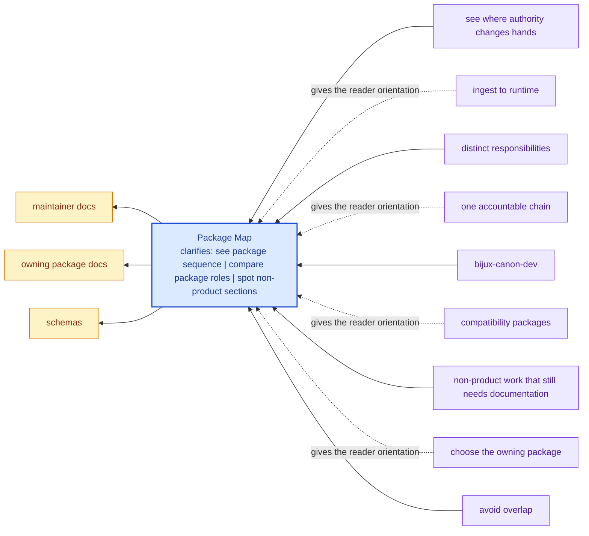

# Package Map

The package map is the clearest explanation of the product idea in this
repository. Each canonical package owns a distinct part of one larger system,
and the split is the point:

- `bijux-canon-ingest` prepares deterministic material from upstream inputs
- `bijux-canon-index` executes retrieval and backend-facing vector behavior
- `bijux-canon-reason` turns evidence into inspectable reasoning outcomes
- `bijux-canon-agent` orchestrates role-based workflows and trace-backed runs
- `bijux-canon-runtime` governs execution, replay, and acceptance authority

Read that list as a sequence of responsibilities, not as branding. The
package names matter because they let the system tell the truth about where a
concern belongs when code, interfaces, and tests evolve over time.

These repository pages should explain the cross-package frame that no single package can explain alone. They are strongest when they make the monorepo easier to understand without turning the root into a second owner of package behavior.

## Visual Summary

## Canonical Package Roles

| Package | Core role | Open it when |
| --- | --- | --- |
| `bijux-canon-ingest` | deterministic preparation of input material | the question starts with source material, chunking, or ingest-local safeguards |
| `bijux-canon-index` | retrieval execution and provenance-rich result handling | you are reviewing vector behavior, backends, or replay-aware retrieval output |
| `bijux-canon-reason` | evidence-aware reasoning, claims, and verification | you need to inspect how evidence becomes inspectable conclusions |
| `bijux-canon-agent` | role-based orchestration and trace-backed workflow control | the question is about agent coordination rather than one local reasoning step |
| `bijux-canon-runtime` | governed execution, replay, persistence, and final acceptability | you need the authority layer that decides whether a run is acceptable and durable |

The canonical packages each own a distinct slice of the overall system:

- [bijux-canon-ingest](../bijux-canon-ingest/foundation/index.md) for deterministic document ingestion, chunking, retrieval assembly, and ingest-facing boundaries.
- [bijux-canon-index](../bijux-canon-index/foundation/index.md) for contract-driven vector execution with replay-aware determinism, audited backend behavior, and provenance-rich result handling.
- [bijux-canon-reason](../bijux-canon-reason/foundation/index.md) for deterministic evidence-aware reasoning, claim formation, verification, and traceable reasoning workflows.
- [bijux-canon-agent](../bijux-canon-agent/foundation/index.md) for deterministic, auditable agent orchestration with role-local behavior, pipeline control, and trace-backed results.
- [bijux-canon-runtime](../bijux-canon-runtime/foundation/index.md) for governed execution and replay authority with auditable non-determinism handling, persistence, and package-to-package coordination.

## Shared Maintainer Packages

- [bijux-canon-dev](../bijux-canon-dev/index.md) for repository automation, schema drift checks, SBOM support, and quality gates
- [compatibility packages](../compat-packages/index.md) for legacy distribution and import preservation

## Concrete Anchors

- `pyproject.toml` for workspace metadata and commit conventions
- `Makefile` and `makes/` for root automation
- `apis/` and `.github/workflows/` for schema and validation review

## Use This Page When

- you are dealing with repository-wide seams rather than one package alone
- you need shared workflow, schema, or governance context before changing code
- you want the monorepo view that sits above the package handbooks

## Decision Rule

Use `Package Map` to decide whether the current question is genuinely repository-wide or whether it belongs back in one package handbook. If the answer depends mostly on one package's local behavior, this page should redirect instead of absorbing detail that the package should own.

## What This Page Answers

- which repository-level decision this page clarifies
- which shared assets or workflows a reviewer should inspect
- how the repository boundary differs from package-local ownership

## Reviewer Lens

- compare the page claims with the real root files, workflows, or schema assets
- check that repository guidance still stops where package ownership begins
- confirm that any repository rule described here is still enforceable in code or automation

## Honesty Boundary

These pages explain repository-level intent and shared rules, but they do not override package-local ownership. They also do not count as proof by themselves; the real backstops are the referenced files, workflows, schemas, and checks.

## Next Checks

- move to the owning package docs when the question stops being repository-wide
- check root files, schemas, or workflows named here before trusting prose alone
- use maintainer docs next if the root issue is really about automation or drift tooling

## Purpose

This page lets a reader see the whole system shape from one place before diving into package-local detail.

## Stability

Update this page only when package ownership changes, not for ordinary internal refactors.
