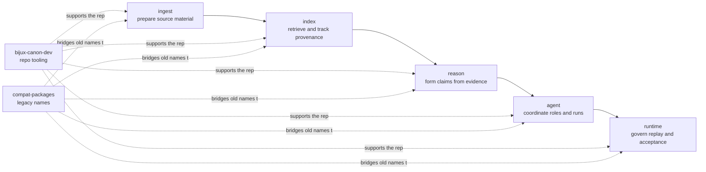

# Package Map

This page is the quickest way to understand the package family without opening
five separate handbooks first.

## Who Owns What

## Canonical Package Roles

| Package | Core role | Open it when |
| --- | --- | --- |
| `bijux-canon-ingest` | deterministic preparation of input material | the question starts with source material, chunking, or ingest-local safeguards |
| `bijux-canon-index` | retrieval execution and provenance-rich result handling | you are reviewing vector behavior, backends, or replay-aware retrieval output |
| `bijux-canon-reason` | evidence-aware reasoning, claims, and verification | you need to inspect how evidence becomes inspectable conclusions |
| `bijux-canon-agent` | role-based orchestration and trace-backed workflow control | the question is about agent coordination rather than one local reasoning step |
| `bijux-canon-runtime` | governed execution, replay, persistence, and final acceptability | you need the authority layer that decides whether a run is acceptable and durable |

## Supporting Sections

- [bijux-canon-dev](../bijux-canon-dev/index.md) for repository automation,
  schema drift checks, SBOM support, and quality gates
- [compatibility packages](../compat-packages/index.md) for legacy
  distribution and import preservation

## Compatibility Package Entry Points

| Legacy package | Canonical package | Legacy handbook |
| --- | --- | --- |
| `agentic-flows` | `bijux-canon-runtime` | [agentic-flows](../compat-packages/agentic-flows/index.md) |
| `bijux-agent` | `bijux-canon-agent` | [bijux-agent](../compat-packages/bijux-agent/index.md) |
| `bijux-rag` | `bijux-canon-ingest` | [bijux-rag](../compat-packages/bijux-rag/index.md) |
| `bijux-rar` | `bijux-canon-reason` | [bijux-rar](../compat-packages/bijux-rar/index.md) |
| `bijux-vex` | `bijux-canon-index` | [bijux-vex](../compat-packages/bijux-vex/index.md) |

If you are still not sure where a change belongs after reading this page, the
right next step is usually one package foundation section, not more root prose.
