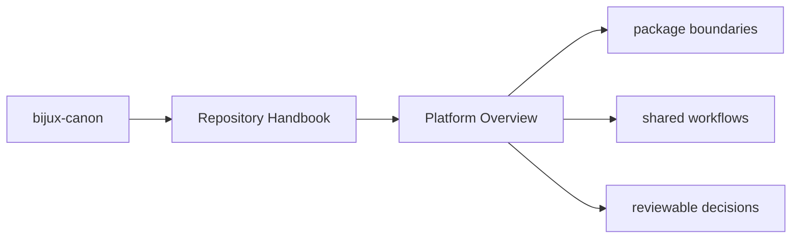
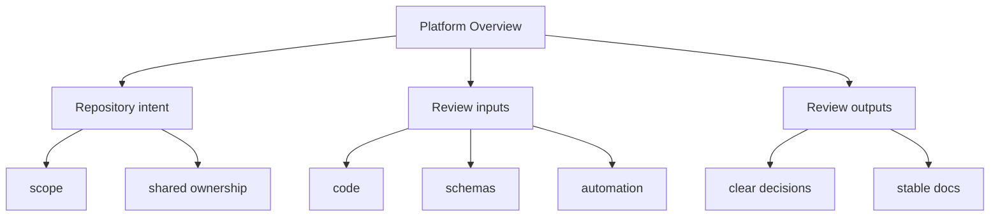

# Platform Overview

`bijux-canon` is a multi-package repository for deterministic ingest,
indexing, reasoning, agent execution, runtime governance, and repository
maintenance. Each package is publishable on its own, but the repository keeps
their interfaces, schemas, and shared validation work in one place.

These repository pages should explain the shared monorepo frame that no single package can explain alone. They are most useful when a reader needs to reason about packages together rather than in isolation.

## Page Maps

## What the Repository Provides

- publishable Python distributions under `packages/`
- shared API schemas under `apis/`
- root automation through `Makefile`, `makes/`, and CI workflows
- one canonical documentation system under `docs/`

## What the Repository Does Not Try to Be

- a single import package with one root `src/` tree
- a place where repository glue silently overrides package ownership
- a documentation mirror that drifts away from the checked-in code

## Concrete Anchors

- `pyproject.toml` for workspace metadata and commit conventions
- `Makefile` and `makes/` for root automation
- `apis/` and `.github/workflows/` for schema and validation review

## Use This Page When

- you are dealing with repository-wide seams rather than one package alone
- you need shared workflow, schema, or governance context before changing code
- you want the monorepo view that sits above the package handbooks

## Decision Rule

Use `Platform Overview` to decide whether the current question is genuinely repository-wide or whether it belongs back in one package handbook. If the answer depends mostly on one package's local behavior, this page should redirect rather than absorb that detail.

## What This Page Answers

- which repository-level decision this page clarifies
- which shared assets or workflows a reviewer should inspect
- how the repository boundary differs from package-local ownership

## Reviewer Lens

- compare the page claims with the real root files, workflows, or schema assets
- check that repository guidance still stops where package ownership begins
- confirm that any repository rule described here is still enforceable in code or automation

## Next Checks

- move to the owning package docs when the question stops being repository-wide
- check root files, schemas, or workflows named here before trusting prose alone
- use maintainer docs next if the root issue is really about automation or drift tooling

## Update This Page When

- root workflows, schemas, or shared governance change materially
- repository policy moves into or out of package-local ownership
- the current repository explanation no longer matches checked-in root assets

## Honesty Boundary

These pages explain repository-level intent and shared rules, but they do not override package-local ownership or serve as evidence without the referenced files, workflows, and checks.

## Purpose

This page gives the shortest description of what the repository is and why it is organized as a monorepo rather than a single distribution.

## Stability

Keep this page aligned with the real package set and the root-level automation that currently exists in the repository.

## What Good Looks Like

- `Platform Overview` keeps repository guidance above package-local detail instead of competing with it
- the reader can tell which root assets matter to the topic before opening code
- cross-package reasoning becomes simpler because the repository frame is explicit

## Failure Signals

- `Platform Overview` begins absorbing details that should live in package-local docs
- the page stops naming concrete root assets that support its claims
- reviewers cannot tell whether the page is describing policy, process, or one local implementation

## Cross Implications

- weak repository pages force package docs to carry root context they should not own
- schema, release, and automation review all become more fragmented when root guidance drifts
- maintainer pages become harder to interpret if repository policy is not clear first

## Core Claim

Each repository handbook page should make one monorepo-level decision legible enough that package-local pages do not need to reinvent root context.

## Why It Matters

Repository pages matter because they keep shared rules, schemas, workflows, and release expectations from being rediscovered separately inside each package.

## If It Drifts

- root rules become folklore instead of checked-in reference
- packages start re-explaining shared repository behavior inconsistently
- reviewers lose the ability to separate monorepo policy from package-local design

## Representative Scenario

A cross-package change touches schemas, automation, and release behavior at once. The repository page should tell the reviewer which part of that decision belongs at the root and which part belongs back in package-local docs.

## Source Of Truth Order

- root files like `pyproject.toml`, `Makefile`, `makes/`, and `.github/workflows/` for actual repository behavior
- `apis/` for tracked shared schema artifacts
- this section for the explanation of how those assets fit together

## Common Misreadings

- that repository policy can be inferred safely from one package alone
- that root docs should silently absorb package-local details
- that repository guidance is authoritative without corresponding checked-in assets
