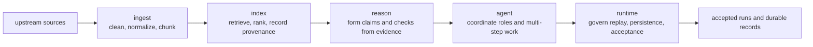

# Platform Overview

The easiest way to understand `bijux-canon` is to read it as a chain of
responsibilities. Each package takes one kind of ambiguity out of the system.
The split is not a packaging detail. The split is the design.

## From Raw Inputs To Accepted Runs

## What Each Step Adds

- `bijux-canon-ingest` makes source material deterministic enough to build on.
- `bijux-canon-index` makes retrieval explicit and provenance-aware.
- `bijux-canon-reason` turns evidence into claims that can be inspected and
  challenged.
- `bijux-canon-agent` coordinates role-based work so the system can do more
  than one local step.
- `bijux-canon-runtime` decides whether the resulting run is acceptable,
  replayable, and worth keeping.

## Why The Split Helps

- Review conversations get shorter because the first question becomes "which
  package owns this?" instead of "where in the tree did this end up?"
- Interfaces become easier to defend because each package can keep a narrower
  promise.
- Problems show up earlier because the system has explicit handoff points
  instead of one blurred implementation surface.

Do not read the chain as if each package is only the next directory in a
pipeline. Each package is an ownership boundary first.
