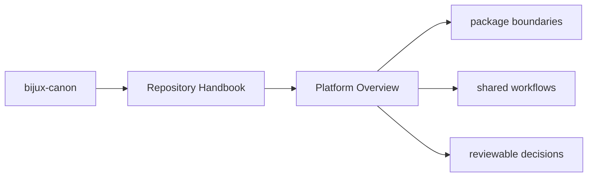
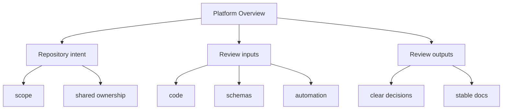

# Platform Overview

`bijux-canon` is a multi-package repository for deterministic ingest,
indexing, reasoning, agent execution, runtime governance, and repository
maintenance. Each package is publishable on its own, but the repository keeps
their interfaces, schemas, and shared validation work in one place.

## Page Maps

## What the Repository Provides

- publishable Python distributions under `packages/`
- shared API schemas under `apis/`
- root automation through `Makefile`, `makes/`, and CI workflows
- one canonical documentation system under `docs/`

## What the Repository Does Not Try to Be

- a single import package with one root `src/` tree
- a place where repository glue silently overrides package ownership
- a documentation mirror that drifts away from the checked-in code

## Purpose

This page gives the shortest description of what the repository is and why it is organized as a monorepo rather than a single distribution.

## Stability

Keep this page aligned with the real package set and the root-level automation that currently exists in the repository.
