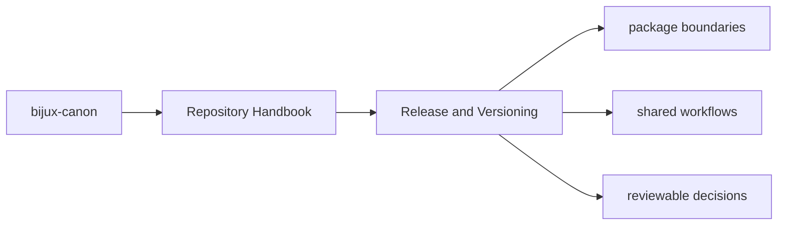

# Release and Versioning

The repository uses commitizen for conventional commit messages and package
tags for version discovery through Hatch VCS. Version resolution is therefore
both a repository concern and a package concern.

## Page Maps

## Shared Release Facts

- root commit rules live in `pyproject.toml`
- package versions are written to package-local `_version.py` files by Hatch VCS
- release support helpers live in `bijux-canon-dev`

## Versioning Rule

Commit messages should communicate long-lived intent clearly enough that a
maintainer can understand them years later without opening the diff first.

## Purpose

This page connects the root commit conventions to the package release mechanism.

## Stability

Keep this page aligned with the release tooling that is actually configured in the repository.
