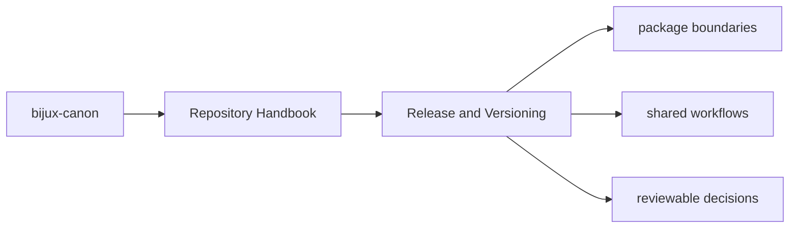
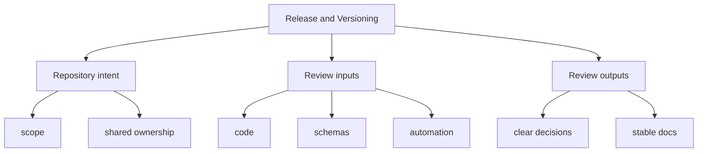

# Release and Versioning

The repository uses commitizen for conventional commit messages and package
tags for version discovery through Hatch VCS. Version resolution is therefore
both a repository concern and a package concern.

## Page Maps

## Shared Release Facts

- root commit rules live in `pyproject.toml`
- package versions are written to package-local `_version.py` files by Hatch VCS
- release support helpers live in `bijux-canon-dev`

## Versioning Rule

Commit messages should communicate long-lived intent clearly enough that a
maintainer can understand them years later without opening the diff first.

## Use This Page When

- you are dealing with repository-wide seams rather than one package alone
- you need shared workflow, schema, or governance context before changing code
- you want the monorepo view that sits above the package handbooks

## What This Page Answers

- which repository-level decision this page clarifies
- which shared assets or workflows a reviewer should inspect
- how the repository boundary differs from package-local ownership

## Reviewer Lens

- compare the page claims with the real root files, workflows, or schema assets
- check that repository guidance still stops where package ownership begins
- confirm that any repository rule described here is still enforceable in code or automation

## Honesty Boundary

These pages explain repository-level intent and shared rules, but they do not override package-local ownership or serve as evidence without the referenced files, workflows, and checks.

## Purpose

This page connects the root commit conventions to the package release mechanism.

## Stability

Keep this page aligned with the release tooling that is actually configured in the repository.
