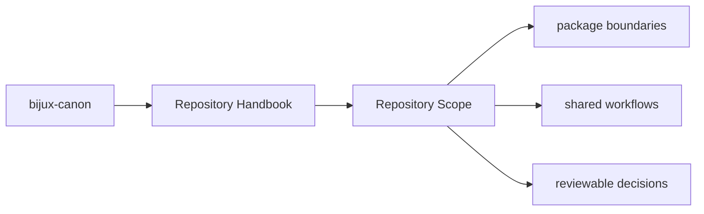
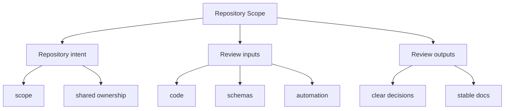

# Repository Scope

The root repository owns only the concerns that are shared across packages or
that coordinate them as one releasable workspace.

## Page Maps

## In Scope

- workspace-level build and test orchestration
- documentation, governance, and contributor-facing repository rules
- API schema storage and drift checks that involve multiple packages
- release tagging and versioning conventions shared across packages

## Out of Scope

- package-local domain behavior that belongs inside a package handbook
- hidden root logic that bypasses package APIs
- undocumented exceptions to the published package boundaries

## What This Page Answers

- which repository-level decision this page clarifies
- which shared assets or workflows a reviewer should inspect
- how the repository boundary differs from package-local ownership

## Purpose

This page keeps the repository from becoming a vague catch-all layer above the packages.

## Stability

Update this page only when ownership truly moves between the repository and one of the packages.
