# Repository Scope

The root should stay boring in the best possible way. When the root starts
accumulating product behavior, every package boundary becomes harder to trust.

## Root Versus Package Ownership

```mermaid
flowchart LR
    subgraph root["root owns"]
        automation["workspace automation"]
        docs["root handbook and navigation"]
        schemas["shared schemas and drift review"]
        release["shared release rules"]
    end

    subgraph packages["packages own"]
        behavior["domain behavior"]
        interfaces["commands, APIs, contracts"]
        workflows["package-local workflows"]
        proof["package tests and invariants"]
    end

    smell["bad smell:<br/>root helper quietly overrides package behavior"]

    root -.must not drift into.-> smell
    smell -.usually belongs in.-> packages
```

## In Scope

- workspace-level build and test orchestration
- documentation, governance, and contributor-facing repository rules
- API schema storage and drift checks that involve multiple packages
- release tagging and versioning conventions shared across packages

## Out Of Scope

- package-local domain behavior that belongs inside a package handbook
- hidden root logic that bypasses package APIs
- undocumented exceptions to the published package boundaries

## Fast Scope Test

If the answer depends mostly on one package's source tree, tests, or public
surface, it probably does not belong at the root.
