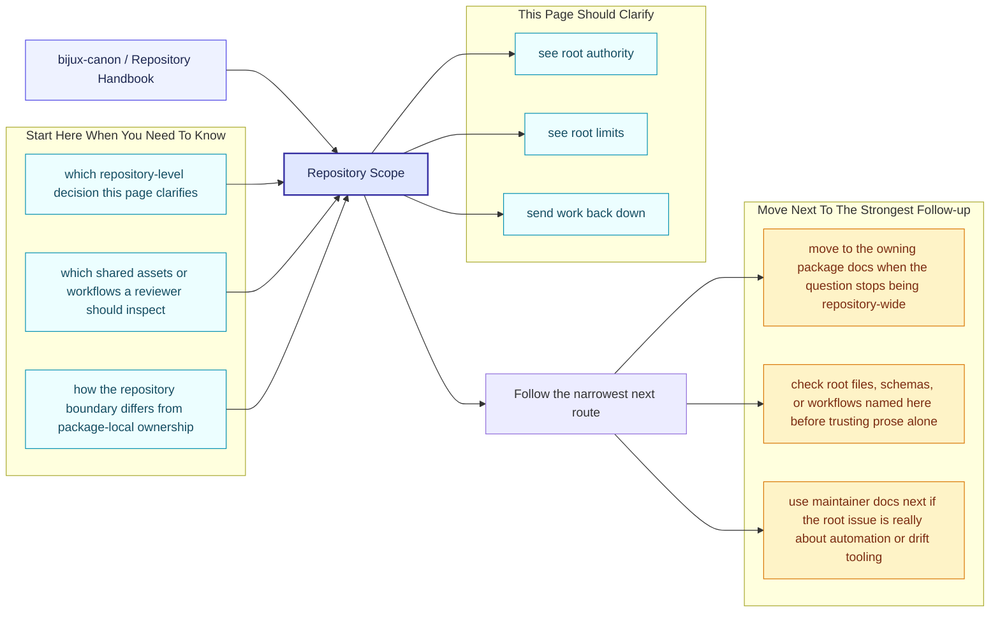
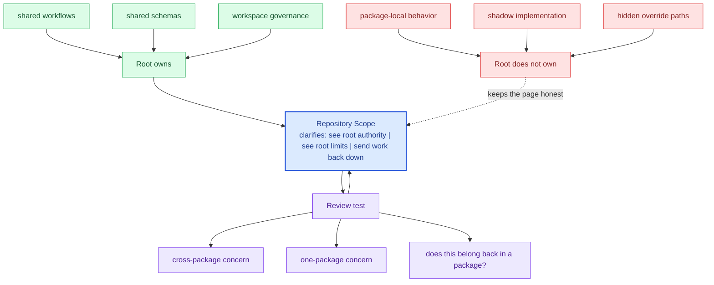

# Repository Scope

The repository root is intentionally narrow. It exists to coordinate packages
that must move together, not to become a second implementation layer above
them.

A good scope test is simple: if a question can be answered honestly from one
package handbook, it probably does not belong at the root. Root scope should
stay reserved for rules, assets, and workflows that genuinely sit across
package boundaries.

These repository pages should explain the cross-package frame that no single package can explain alone. They are strongest when they make the monorepo easier to understand without turning the root into a second owner of package behavior.

## Page Maps

## In Scope

- workspace-level build and test orchestration
- documentation, governance, and contributor-facing repository rules
- API schema storage and drift checks that involve multiple packages
- release tagging and versioning conventions shared across packages

## Out of Scope

- package-local domain behavior that belongs inside a package handbook
- hidden root logic that bypasses package APIs
- undocumented exceptions to the published package boundaries

## Concrete Anchors

- `pyproject.toml` for workspace metadata and commit conventions
- `Makefile` and `makes/` for root automation
- `apis/` and `.github/workflows/` for schema and validation review

## Use This Page When

- you are dealing with repository-wide seams rather than one package alone
- you need shared workflow, schema, or governance context before changing code
- you want the monorepo view that sits above the package handbooks

## Decision Rule

Use `Repository Scope` to decide whether the current question is genuinely repository-wide or whether it belongs back in one package handbook. If the answer depends mostly on one package's local behavior, this page should redirect instead of absorbing detail that the package should own.

## What This Page Answers

- which repository-level decision this page clarifies
- which shared assets or workflows a reviewer should inspect
- how the repository boundary differs from package-local ownership

## Reviewer Lens

- compare the page claims with the real root files, workflows, or schema assets
- check that repository guidance still stops where package ownership begins
- confirm that any repository rule described here is still enforceable in code or automation

## Honesty Boundary

These pages explain repository-level intent and shared rules, but they do not override package-local ownership. They also do not count as proof by themselves; the real backstops are the referenced files, workflows, schemas, and checks.

## Next Checks

- move to the owning package docs when the question stops being repository-wide
- check root files, schemas, or workflows named here before trusting prose alone
- use maintainer docs next if the root issue is really about automation or drift tooling

## Purpose

This page keeps the repository from becoming a vague catch-all layer above the packages.

## Stability

Update this page only when ownership truly moves between the repository and one of the packages.
