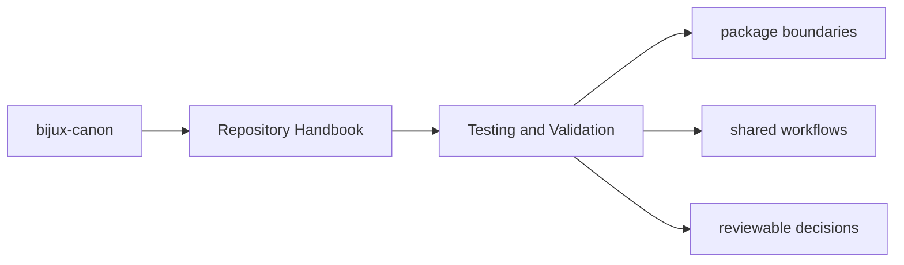

# Testing and Validation

Validation in `bijux-canon` is layered: packages protect their own behavior,
while the repository protects the seams between packages, schemas, docs, and
release conventions.

## Page Maps

## Validation Layers

- package-local unit, integration, e2e, and invariant suites
- schema drift and packaging checks in `bijux-canon-dev`
- repository CI workflows under `.github/workflows/`

## Validation Rule

A prose promise is incomplete until either package tests or repository tooling
can detect its drift.

## Purpose

This page explains the relationship between package truth and repository truth.

## Stability

Keep it aligned with the current test layout and CI workflows instead of aspirational future checks.
