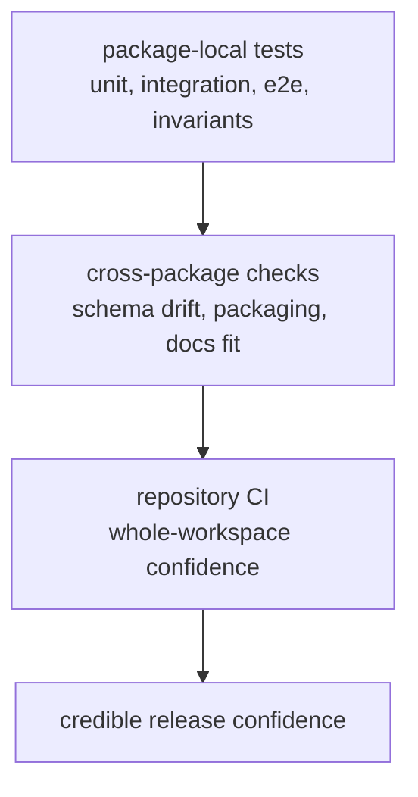

# Testing and Validation

Validation in `bijux-canon` is layered: packages protect their own behavior,
while the repository protects the seams between packages, schemas, docs, and
release conventions.

Trust has to be local before it can be global. Each package proves its own
promises first. The repository then proves that the packages still fit
together honestly.

## Layers Of Proof

## Validation Layers

- package-local unit, integration, e2e, and invariant suites
- schema drift and packaging checks in `bijux-canon-dev`
- repository CI workflows under `.github/workflows/`

## Validation Rule

A prose promise is incomplete until either package tests or repository tooling
can detect its drift.

Docs can explain why a check matters. Docs cannot substitute for the check.
