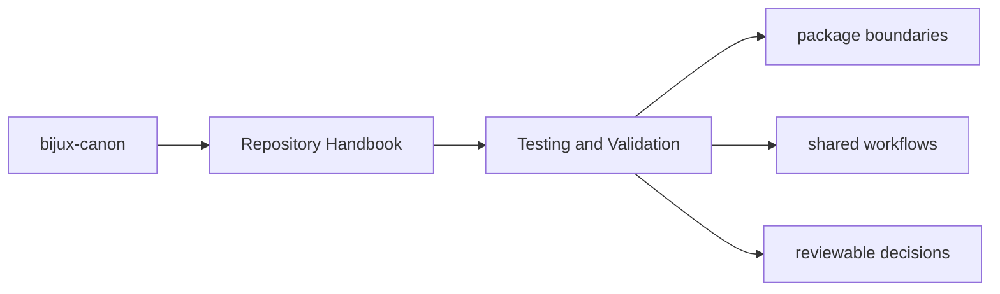
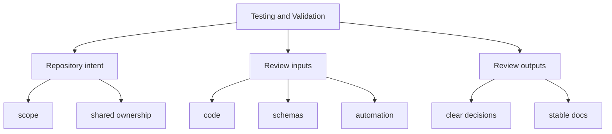

# Testing and Validation

Validation in `bijux-canon` is layered: packages protect their own behavior,
while the repository protects the seams between packages, schemas, docs, and
release conventions.

## Page Maps

## Validation Layers

- package-local unit, integration, e2e, and invariant suites
- schema drift and packaging checks in `bijux-canon-dev`
- repository CI workflows under `.github/workflows/`

## Validation Rule

A prose promise is incomplete until either package tests or repository tooling
can detect its drift.

## Concrete Anchors

- `pyproject.toml` for workspace metadata and commit conventions
- `Makefile` and `makes/` for root automation
- `apis/` and `.github/workflows/` for schema and validation review

## Use This Page When

- you are dealing with repository-wide seams rather than one package alone
- you need shared workflow, schema, or governance context before changing code
- you want the monorepo view that sits above the package handbooks

## What This Page Answers

- which repository-level decision this page clarifies
- which shared assets or workflows a reviewer should inspect
- how the repository boundary differs from package-local ownership

## Reviewer Lens

- compare the page claims with the real root files, workflows, or schema assets
- check that repository guidance still stops where package ownership begins
- confirm that any repository rule described here is still enforceable in code or automation

## Honesty Boundary

These pages explain repository-level intent and shared rules, but they do not override package-local ownership or serve as evidence without the referenced files, workflows, and checks.

## Purpose

This page explains the relationship between package truth and repository truth.

## Stability

Keep it aligned with the current test layout and CI workflows instead of aspirational future checks.

## Core Claim

Each repository handbook page should make one monorepo-level decision legible enough that package-local pages do not need to reinvent root context.

## Why It Matters

Repository pages matter because they keep shared rules, schemas, workflows, and release expectations from being rediscovered separately inside each package.

## If It Drifts

- root rules become folklore instead of checked-in reference
- packages start re-explaining shared repository behavior inconsistently
- reviewers lose the ability to separate monorepo policy from package-local design
