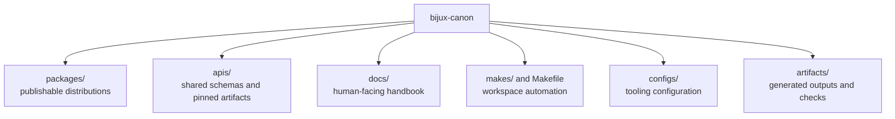

# Workspace Layout

The tree should help people place work quickly. If the layout makes ownership
harder to see, it is working against the design instead of supporting it.

## The Top-Level Shape

## Top-Level Directories

- `packages/` for publishable Python distributions
- `apis/` for shared schema sources and pinned artifacts
- `docs/` for the canonical handbook
- `makes/` and `Makefile` for workspace automation
- `artifacts/` for generated or checked validation outputs
- `configs/` for root-managed tool configuration

## Layout Rule

A concern should live at the root only when it serves more than one package or
when it is about the workspace itself.

The root should explain the workspace. It should not become a quiet backdoor
for product behavior.
