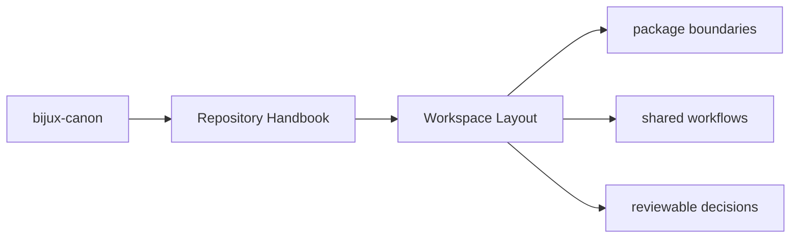
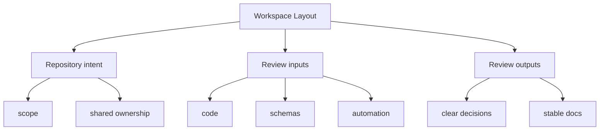

# Workspace Layout

The repository layout is intentionally direct so maintainers can see where a
concern belongs before they open any code.

## Page Maps

## Top-Level Directories

- `packages/` for publishable Python distributions
- `apis/` for shared schema sources and pinned artifacts
- `docs/` for the canonical handbook
- `makes/` and `Makefile` for workspace automation
- `artifacts/` for generated or checked validation outputs
- `configs/` for root-managed tool configuration

## Layout Rule

A concern should live at the root only when it serves more than one package or
when it is about the workspace itself.

## Use This Page When

- you are dealing with repository-wide seams rather than one package alone
- you need shared workflow, schema, or governance context before changing code
- you want the monorepo view that sits above the package handbooks

## What This Page Answers

- which repository-level decision this page clarifies
- which shared assets or workflows a reviewer should inspect
- how the repository boundary differs from package-local ownership

## Reviewer Lens

- compare the page claims with the real root files, workflows, or schema assets
- check that repository guidance still stops where package ownership begins
- confirm that any repository rule described here is still enforceable in code or automation

## Purpose

This page provides the shortest file-system map for the repository.

## Stability

Keep this page aligned with the real root directories and remove any mention of retired roots.
