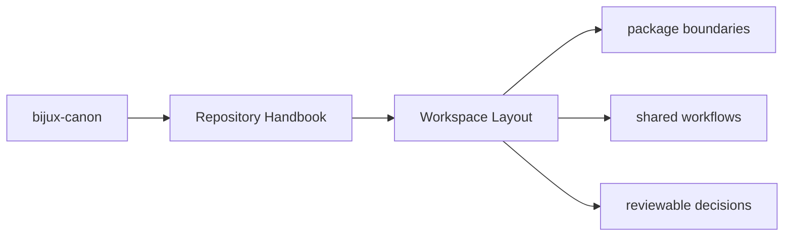

# Workspace Layout

The repository layout is intentionally direct so maintainers can see where a
concern belongs before they open any code.

## Page Maps

## Top-Level Directories

- `packages/` for publishable Python distributions
- `apis/` for shared schema sources and pinned artifacts
- `docs/` for the canonical handbook
- `makes/` and `Makefile` for workspace automation
- `artifacts/` for generated or checked validation outputs
- `configs/` for root-managed tool configuration

## Layout Rule

A concern should live at the root only when it serves more than one package or
when it is about the workspace itself.

## Purpose

This page provides the shortest file-system map for the repository.

## Stability

Keep this page aligned with the real root directories and remove any mention of retired roots.
