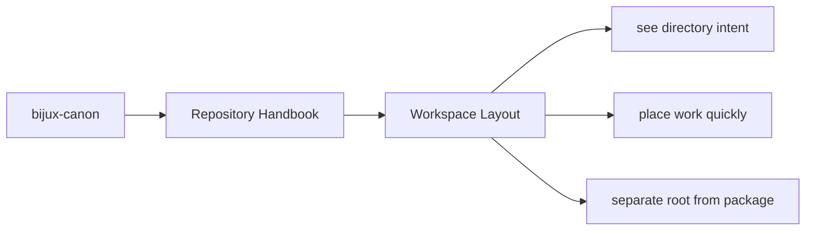
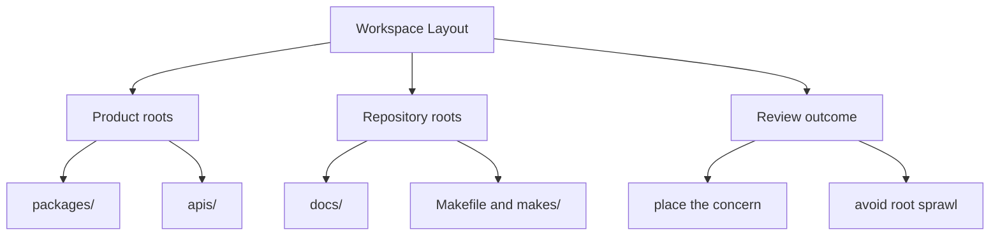

# Workspace Layout

The repository layout is intentionally direct so maintainers can see where a
concern belongs before they open any code. The directory tree is part of the
design language: it should reinforce the package split instead of making it
harder to see.

These repository pages should explain the cross-package frame that no single package can explain alone. They are strongest when they make the monorepo easier to understand without turning the root into a second owner of package behavior.

## Page Maps

## Top-Level Directories

- `packages/` for publishable Python distributions
- `apis/` for shared schema sources and pinned artifacts
- `docs/` for the canonical handbook
- `makes/` and `Makefile` for workspace automation
- `artifacts/` for generated or checked validation outputs
- `configs/` for root-managed tool configuration

## Layout Rule

A concern should live at the root only when it serves more than one package or
when it is about the workspace itself.

## Concrete Anchors

- `pyproject.toml` for workspace metadata and commit conventions
- `Makefile` and `makes/` for root automation
- `apis/` and `.github/workflows/` for schema and validation review

## Use This Page When

- you are dealing with repository-wide seams rather than one package alone
- you need shared workflow, schema, or governance context before changing code
- you want the monorepo view that sits above the package handbooks

## Decision Rule

Use `Workspace Layout` to decide whether the current question is genuinely repository-wide or whether it belongs back in one package handbook. If the answer depends mostly on one package's local behavior, this page should redirect instead of absorbing detail that the package should own.

## What This Page Answers

- which repository-level decision this page clarifies
- which shared assets or workflows a reviewer should inspect
- how the repository boundary differs from package-local ownership

## Reviewer Lens

- compare the page claims with the real root files, workflows, or schema assets
- check that repository guidance still stops where package ownership begins
- confirm that any repository rule described here is still enforceable in code or automation

## Next Checks

- move to the owning package docs when the question stops being repository-wide
- check root files, schemas, or workflows named here before trusting prose alone
- use maintainer docs next if the root issue is really about automation or drift tooling

## Update This Page When

- root workflows, schemas, or shared governance change materially
- repository policy moves into or out of package-local ownership
- the current repository explanation no longer matches checked-in root assets

## Honesty Boundary

These pages explain repository-level intent and shared rules, but they do not override package-local ownership. They also do not count as proof by themselves; the real backstops are the referenced files, workflows, schemas, and checks.

## Purpose

This page provides the shortest file-system map for the repository.

## Stability

Keep this page aligned with the real root directories and remove any mention of retired roots.

## What Good Looks Like

Use these points as the fast check for whether the page is doing real explanatory work.

- `Workspace Layout` keeps repository guidance above package-local detail instead of competing with it
- the reader can tell which root assets matter to the topic before opening code
- cross-package reasoning becomes simpler because the repository frame is explicit

## Failure Signals

These are the quickest signs that the page is drifting from honest explanation into noise or stale certainty.

- `Workspace Layout` begins absorbing details that should live in package-local docs
- the page stops naming concrete root assets that support its claims
- reviewers cannot tell whether the page is describing policy, process, or one local implementation

## Tradeoffs To Hold

A strong page names the tensions it is managing instead of pretending every desirable goal improves together.

- prefer repository-wide clarity over squeezing package-specific nuance into root pages
- prefer durable repository rules over explanations that only fit the current implementation snapshot
- prefer explicit ownership boundaries between root, product, maintainer, and compatibility docs over a superficially shorter navigation tree

## Cross Implications

- weak repository pages force package docs to carry root context they should not own
- schema, release, and automation review all become more fragmented when root guidance drifts
- maintainer pages become harder to interpret if repository policy is not clear first

## Approval Questions

A reviewer should be able to answer these clearly before trusting the page or the change it is helping to explain.

- does the page stay genuinely repository-wide instead of absorbing package-local detail
- can a reviewer tie the page's claims back to concrete root assets, workflows, or schemas
- would a package owner still agree that the root page is clarifying shared policy rather than redefining local ownership

## Evidence Checklist

Check these assets before trusting the prose. They are the concrete places where the page either holds up or falls apart.

- inspect the named root files, workflows, or schema directories directly
- check at least one owning package doc to confirm the repository page is not absorbing local detail
- verify that the page's policy language still has a checked-in enforcement or review mechanism behind it

## Anti-Patterns

These patterns make documentation feel fuller while quietly making it less clear, less honest, or less durable.

- using repository pages to hide unresolved package-boundary decisions
- documenting root policy without naming the actual checked-in assets that support it
- letting one successful workflow example stand in for repository-wide truth

## Escalate When

These conditions mean the problem is larger than a local wording fix and needs a wider review conversation.

- a supposedly root decision is really moving package ownership around
- the page cannot stay accurate without changing multiple package handbooks too
- the root rule described here no longer has a clear checked-in enforcement path

## Core Claim

Each repository handbook page should make one monorepo-level decision legible enough that package-local pages do not need to reinvent root context.

## Why It Matters

Repository pages matter because they explain the rules of coordination. Without them, every package has to re-explain shared schemas, release posture, and workspace expectations in slightly different words, and trust erodes fast.

## If It Drifts

- root rules become folklore instead of checked-in reference
- packages start re-explaining shared repository behavior inconsistently
- reviewers lose the ability to separate monorepo policy from package-local design

## Representative Scenario

A cross-package change touches schemas, automation, and release behavior at once. The repository page should help the reviewer separate root-owned coordination from package-owned behavior instead of merging everything into one fuzzy story.

## Source Of Truth Order

- root files like `pyproject.toml`, `Makefile`, `makes/`, and `.github/workflows/` for actual repository behavior
- `apis/` for tracked shared schema artifacts
- this section for the explanation of how those assets fit together

## Common Misreadings

- that repository policy can be inferred safely from one package alone
- that root docs should silently absorb package-local details
- that repository guidance is authoritative without corresponding checked-in assets
