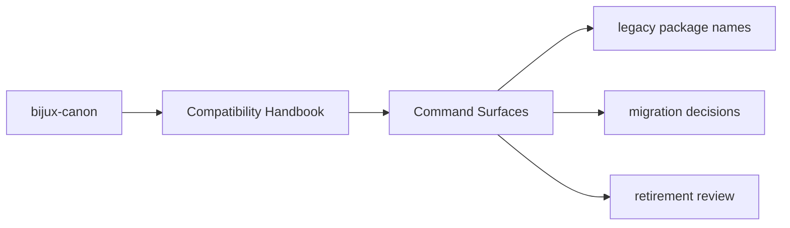

# Command Surfaces

Some compatibility packages also preserve historic command names so migration
does not break operator scripts immediately.

## Page Maps

## Command Rule

A compatibility command should only exist when the canonical package still
provides a meaningful route behind it.

## Purpose

This page records the intent behind legacy command preservation.

## Stability

Keep it aligned with the command declarations in compatibility package metadata.
