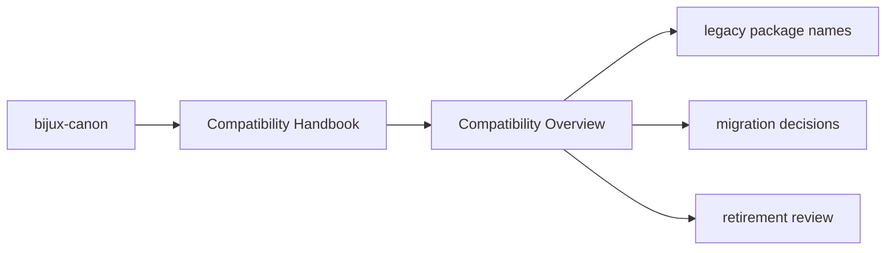
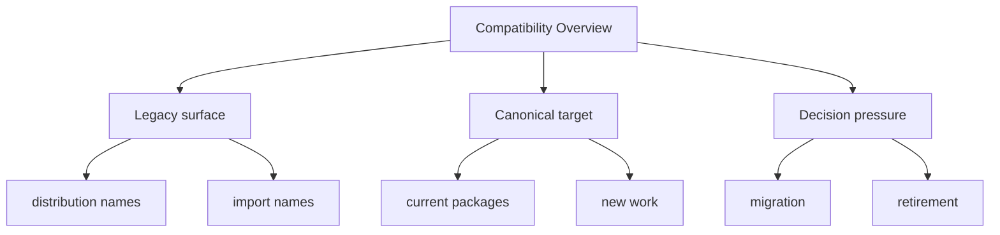

# Compatibility Overview

These packages exist to reduce migration breakage, not to become the preferred
long-term entrypoints for new work.

## Page Maps

## Preserved Surfaces

- legacy distribution names
- legacy Python import names
- legacy command names where they still exist

## What This Page Answers

- which legacy surface is still preserved
- when new work should move to the canonical package instead
- what evidence would justify retiring a compatibility package

## Purpose

This page gives the shortest honest description of why the compatibility packages remain.

## Stability

Keep it aligned with the actual compatibility promises that are still checked in.
