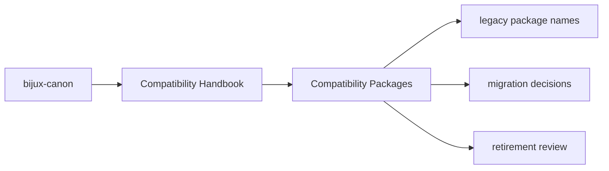

# Compatibility Packages

The compatibility packages preserve older distribution names, import names,
and command names while the canonical package family now lives under the
`bijux-canon-*` naming system.

## Page Maps

## Pages in This Section

- [Compatibility Overview](compatibility-overview.md)
- [Legacy Name Map](legacy-name-map.md)
- [Migration Guidance](migration-guidance.md)
- [Package Behavior](package-behavior.md)
- [Import Surfaces](import-surfaces.md)
- [Command Surfaces](command-surfaces.md)
- [Release Policy](release-policy.md)
- [Validation Strategy](validation-strategy.md)
- [Retirement Conditions](retirement-conditions.md)

## Legacy Name Map

- `agentic-flows` maps to `bijux-canon-runtime`
- `bijux-agent` maps to `bijux-canon-agent`
- `bijux-rag` maps to `bijux-canon-ingest`
- `bijux-rar` maps to `bijux-canon-reason`
- `bijux-vex` maps to `bijux-canon-index`

## Purpose

This page explains the role of the compatibility handbooks without encouraging new work to start there.

## Stability

Keep it aligned with the legacy packages that still ship from `packages/compat-*`.
