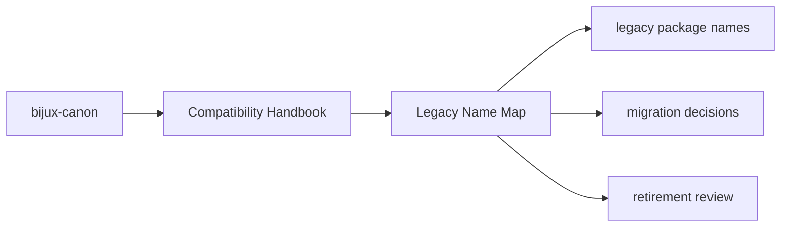
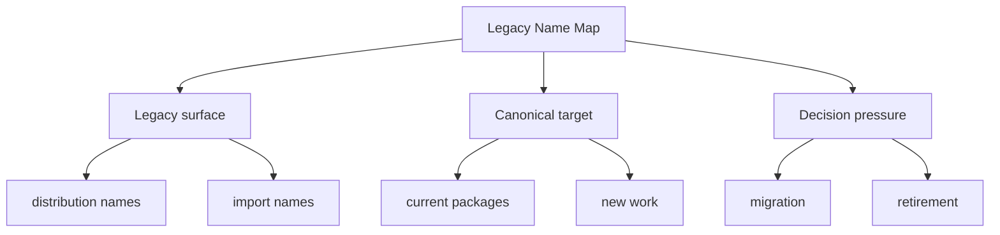

# Legacy Name Map

- `agentic-flows` maps to `bijux-canon-runtime`
- `bijux-agent` maps to `bijux-canon-agent`
- `bijux-rag` maps to `bijux-canon-ingest`
- `bijux-rar` maps to `bijux-canon-reason`
- `bijux-vex` maps to `bijux-canon-index`

## Page Maps

## What This Page Answers

- which legacy surface is still preserved
- when new work should move to the canonical package instead
- what evidence would justify retiring a compatibility package

## Purpose

This page provides the exact mapping between retired public names and current canonical names.

## Stability

Update it only when a compatibility package is added or retired.
