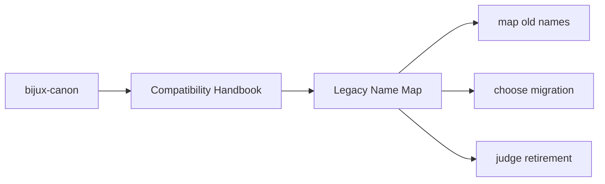
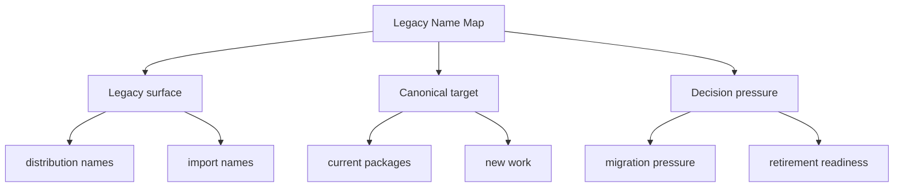

# Legacy Name Map

- `agentic-flows` maps to `bijux-canon-runtime`
- `bijux-agent` maps to `bijux-canon-agent`
- `bijux-rag` maps to `bijux-canon-ingest`
- `bijux-rar` maps to `bijux-canon-reason`
- `bijux-vex` maps to `bijux-canon-index`

These compatibility pages should make legacy names understandable without romanticizing them. Their value is in helping readers migrate with less ambiguity, not in making the old names feel equally current.

## Page Maps

## Concrete Anchors

- `packages/compat-*` for the preserved legacy packages
- the compatibility package `README.md` files for canonical targets
- the matching canonical package docs for current behavior and new work

## Use This Page When

- you are tracing a legacy package name back to its canonical replacement
- you need migration guidance rather than product implementation detail
- you are deciding whether a compatibility surface still deserves to exist

## Decision Rule

Use `Legacy Name Map` to decide whether a preserved legacy name is still serving a real migration need. If the only reason to keep it is habit rather than an identified dependent environment, the section should bias the reviewer toward migration or retirement planning.

## What This Page Answers

- which legacy surface is still preserved
- when new work should move to the canonical package instead
- what evidence would justify retiring a compatibility package

## Reviewer Lens

- compare legacy names here with the compatibility package metadata and README targets
- check that migration advice still points at current canonical docs
- confirm that compatibility language does not accidentally encourage new work to start here

## Next Checks

- move to the canonical package docs once the current target package is known
- inspect compatibility package metadata if the question is about what remains preserved
- use this section again only when evaluating migration progress or retirement readiness

## Update This Page When

- a legacy package is added, retired, or repointed to a different canonical target
- migration guidance becomes stale compared with the current package set
- compatibility scope changes materially enough to affect retirement decisions

## Honesty Boundary

This section documents preserved legacy surfaces, but it does not claim those legacy names are the preferred place for new work or long-term design growth. If a legacy name remains, that is a migration fact, not a design endorsement.

## Purpose

This page provides the exact mapping between retired public names and current canonical names.

## Stability

Update it only when a compatibility package is added or retired.

## What Good Looks Like

Use these points as the fast check for whether the page is doing real explanatory work.

- `Legacy Name Map` makes the legacy-to-canonical path obvious
- migration pressure is clearer than nostalgia for old package names
- retirement can be discussed from evidence rather than from vague discomfort

## Failure Signals

These are the quickest signs that the page is drifting from honest explanation into noise or stale certainty.

- `Legacy Name Map` spends more time defending legacy names than clarifying migration
- the canonical target is harder to find than the old name
- retirement conversations keep stalling because the remaining need is not described concretely

## Tradeoffs To Hold

A strong page names the tensions it is managing instead of pretending every desirable goal improves together.

- prefer a clear migration path over preserving every historical detail equally
- prefer honest legacy labeling over making old surfaces look more current than they are
- prefer repository-wide contract clarity over retaining compatibility language that now conflicts with canonical package docs

## Cross Implications

- unclear compatibility pages slow adoption of the canonical package docs
- retirement planning becomes harder because repository and package owners lack one shared migration story
- legacy naming pressure can distort product package expectations if it is not kept explicitly separate

## Approval Questions

A reviewer should be able to answer these clearly before trusting the page or the change it is helping to explain.

- does the page make the canonical replacement clearer than the legacy name itself
- is there still real evidence for preservation or is the section only reflecting habit
- would a reader leave knowing whether to migrate, preserve temporarily, or retire the legacy surface

## Evidence Checklist

Check these assets before trusting the prose. They are the concrete places where the page either holds up or falls apart.

- inspect the relevant `packages/compat-*` metadata and README files
- check the canonical target package docs named by this page
- confirm there is still a real migration consumer before accepting preservation as necessary

## Anti-Patterns

These patterns make documentation feel fuller while quietly making it less clear, less honest, or less durable.

- treating compatibility shims like long-term product expansion points
- preserving legacy names because they are familiar rather than because they are needed
- letting migration guidance become less visible than the legacy label itself

## Escalate When

These conditions mean the problem is larger than a local wording fix and needs a wider review conversation.

- a legacy surface is still present but no one can name a real dependent consumer
- migration guidance now conflicts with the canonical package story
- retirement or preservation would affect more than one repository stakeholder group

## Core Claim

Each compatibility page should make migration pressure clearer than legacy habit, so preserved names remain understandable without becoming a second product line.

## Why It Matters

Compatibility pages matter because legacy package names often survive longer than the people who remember why they exist. Without explicit migration guidance, old names become sticky and retirement decisions become emotionally expensive instead of evidence-based.

## If It Drifts

- legacy names become easier to keep using than to migrate away from
- canonical targets become ambiguous in old automation or docs
- retirement decisions get delayed because the actual migration state is unclear

## Representative Scenario

A legacy dependency name appears in an old environment file. The compatibility docs should let a maintainer map it to the canonical package and judge whether that old name still deserves to survive.

## Source Of Truth Order

- the `packages/compat-*` metadata and README files for preserved legacy surfaces
- the matching canonical package docs for current behavior
- this section for the migration and retirement explanation that ties them together

## Common Misreadings

- that legacy names are still the preferred public names
- that compatibility packages should grow like first-class product packages
- that preserved import or distribution names prove long-term architectural importance
