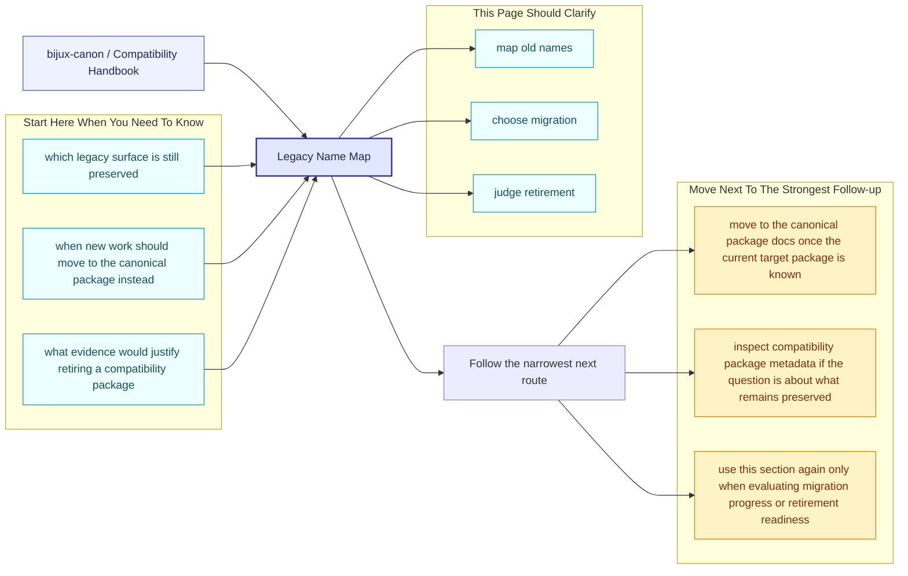
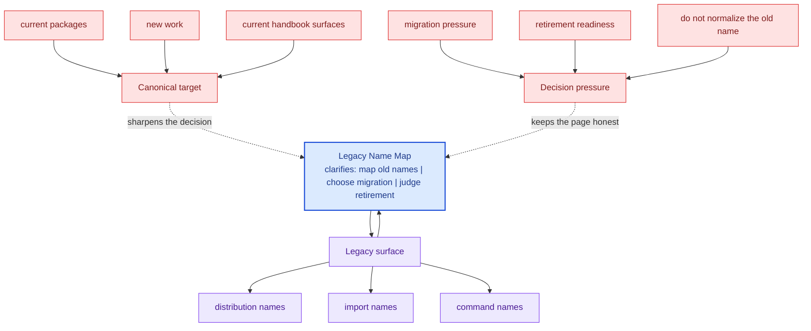

# Legacy Name Map

- `agentic-flows` maps to `bijux-canon-runtime`
- `bijux-agent` maps to `bijux-canon-agent`
- `bijux-rag` maps to `bijux-canon-ingest`
- `bijux-rar` maps to `bijux-canon-reason`
- `bijux-vex` maps to `bijux-canon-index`

These compatibility pages should make legacy names understandable without romanticizing them. Their value is in helping readers migrate with less ambiguity, not in making the old names feel equally current.

## Page Maps

## Concrete Anchors

- `packages/compat-*` for the preserved legacy packages
- the compatibility package `README.md` files for canonical targets
- the matching canonical package docs for current behavior and new work

## Use This Page When

- you are tracing a legacy package name back to its canonical replacement
- you need migration guidance rather than product implementation detail
- you are deciding whether a compatibility surface still deserves to exist

## Decision Rule

Use `Legacy Name Map` to decide whether a preserved legacy name is still serving a real migration need. If the only reason to keep it is habit rather than an identified dependent environment, the section should bias the reviewer toward migration or retirement planning.

## What This Page Answers

- which legacy surface is still preserved
- when new work should move to the canonical package instead
- what evidence would justify retiring a compatibility package

## Reviewer Lens

- compare legacy names here with the compatibility package metadata and README targets
- check that migration advice still points at current canonical docs
- confirm that compatibility language does not accidentally encourage new work to start here

## Next Checks

- move to the canonical package docs once the current target package is known
- inspect compatibility package metadata if the question is about what remains preserved
- use this section again only when evaluating migration progress or retirement readiness

## Honesty Boundary

This section documents preserved legacy surfaces, but it does not claim those legacy names are the preferred place for new work or long-term design growth. If a legacy name remains, that is a migration fact, not a design endorsement.

## Purpose

This page provides the exact mapping between retired public names and current canonical names.

## Stability

Update it only when a compatibility package is added or retired.
