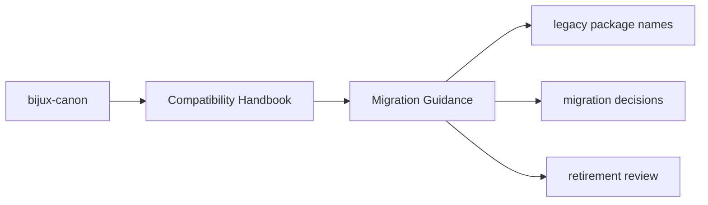
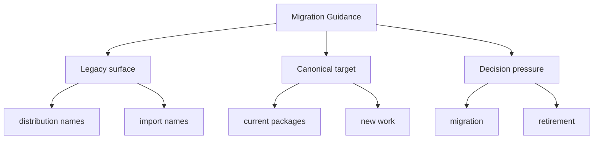

# Migration Guidance

New work should target the canonical package names directly and treat the
compatibility packages as temporary bridges.

## Page Maps

## Recommended Migration Pattern

- switch dependencies to the canonical `bijux-canon-*` distribution
- switch imports to the canonical package docs and source roots
- keep compatibility packages only where an external environment still depends on them

## Concrete Anchors

- `packages/compat-*` for the preserved legacy packages
- the compatibility package `README.md` files for canonical targets
- the matching canonical package docs for current behavior and new work

## Use This Page When

- you are tracing a legacy package name back to its canonical replacement
- you need migration guidance rather than product implementation detail
- you are deciding whether a compatibility surface still deserves to exist

## What This Page Answers

- which legacy surface is still preserved
- when new work should move to the canonical package instead
- what evidence would justify retiring a compatibility package

## Reviewer Lens

- compare legacy names here with the compatibility package metadata and README targets
- check that migration advice still points at current canonical docs
- confirm that compatibility language does not accidentally encourage new work to start here

## Honesty Boundary

This section documents preserved legacy surfaces, but it does not claim those legacy names are the preferred place for new work or long-term design growth.

## Purpose

This page tells maintainers how to move away from legacy names without ambiguity.

## Stability

Keep it aligned with the canonical packages that compatibility packages currently point to.

## Core Claim

Each compatibility page should make migration pressure clearer than legacy habit, so preserved names remain understandable without becoming a second product line.

## Why It Matters

Compatibility pages matter because legacy package names often survive longer than the people who remember why they exist, and that makes migration drift expensive.
