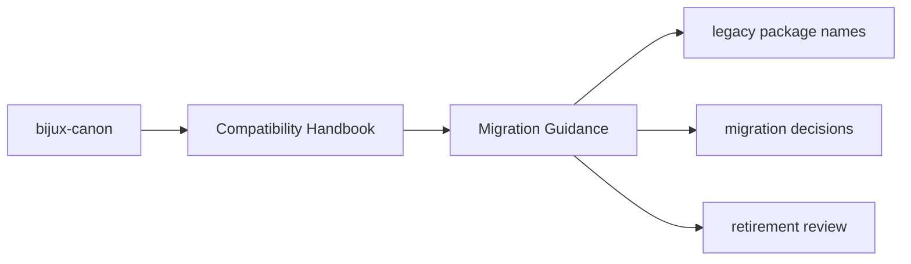

# Migration Guidance

New work should target the canonical package names directly and treat the
compatibility packages as temporary bridges.

## Page Maps

## Recommended Migration Pattern

- switch dependencies to the canonical `bijux-canon-*` distribution
- switch imports to the canonical package docs and source roots
- keep compatibility packages only where an external environment still depends on them

## Purpose

This page tells maintainers how to move away from legacy names without ambiguity.

## Stability

Keep it aligned with the canonical packages that compatibility packages currently point to.
