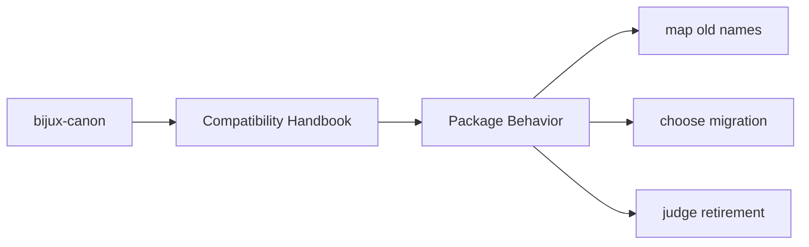
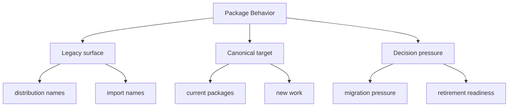

# Package Behavior

Each compatibility package is intentionally thin: package metadata, minimal
import surface preservation, build glue, and documentation pointing at the
canonical replacement.

Thinness is the design goal here. These packages should preserve a path, not
become a parallel product line with its own growing surface area.

These compatibility pages should make legacy names understandable without romanticizing them. Their value is in helping readers migrate with less ambiguity, not in making the old names feel equally current.

## Page Maps

## Expected Behavior

- preserve name-based compatibility
- avoid becoming an independent product surface
- defer real behavior to the canonical package

## Concrete Anchors

- `packages/compat-*` for the preserved legacy packages
- the compatibility package `README.md` files for canonical targets
- the matching canonical package docs for current behavior and new work

## Use This Page When

- you are tracing a legacy package name back to its canonical replacement
- you need migration guidance rather than product implementation detail
- you are deciding whether a compatibility surface still deserves to exist

## Decision Rule

Use `Package Behavior` to decide whether a preserved legacy name is still serving a real migration need. If the only reason to keep it is habit rather than an identified dependent environment, the section should bias the reviewer toward migration or retirement planning.

## What This Page Answers

- which legacy surface is still preserved
- when new work should move to the canonical package instead
- what evidence would justify retiring a compatibility package

## Reviewer Lens

- compare legacy names here with the compatibility package metadata and README targets
- check that migration advice still points at current canonical docs
- confirm that compatibility language does not accidentally encourage new work to start here

## Next Checks

- move to the canonical package docs once the current target package is known
- inspect compatibility package metadata if the question is about what remains preserved
- use this section again only when evaluating migration progress or retirement readiness

## Honesty Boundary

This section documents preserved legacy surfaces, but it does not claim those legacy names are the preferred place for new work or long-term design growth. If a legacy name remains, that is a migration fact, not a design endorsement.

## Purpose

This page describes the intended minimalism of the compatibility layer.

## Stability

Keep it aligned with the actual package contents in `packages/compat-*`.
