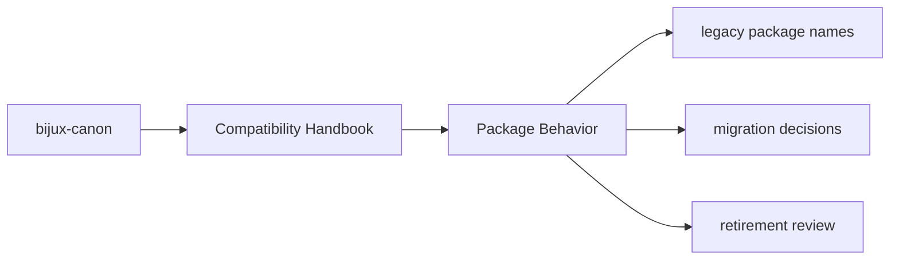
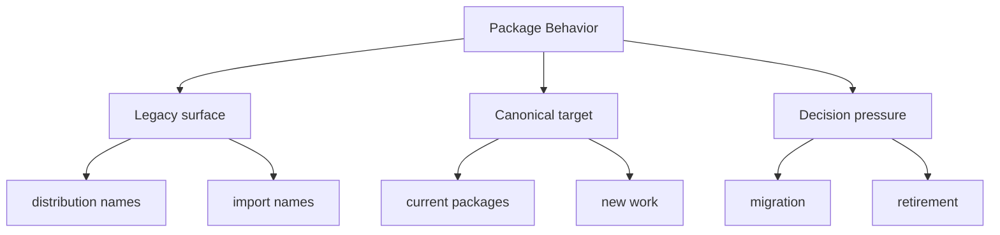

# Package Behavior

Each compatibility package is intentionally thin: package metadata, minimal
import surface preservation, build glue, and documentation pointing at the
canonical replacement.

## Page Maps

## Expected Behavior

- preserve name-based compatibility
- avoid becoming an independent product surface
- defer real behavior to the canonical package

## Purpose

This page describes the intended minimalism of the compatibility layer.

## Stability

Keep it aligned with the actual package contents in `packages/compat-*`.
