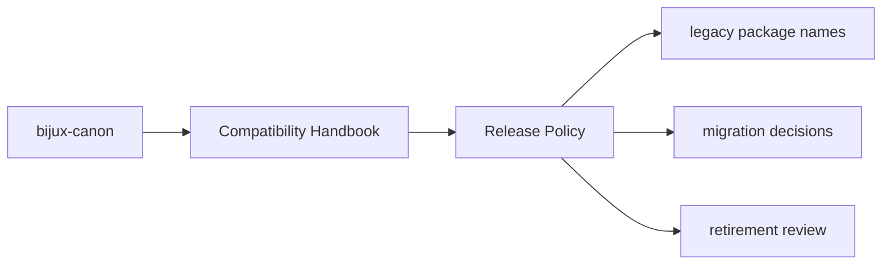

# Release Policy

Compatibility packages should release only when they still serve a real
migration need or when the canonical target package changes in a way that
requires compatibility metadata to move with it.

## Page Maps

## Policy

- keep releases narrow and clearly justified
- avoid feature growth inside the compatibility packages
- document canonical targets in every compatibility package README

## Purpose

This page keeps compatibility releases from drifting into independent product work.

## Stability

Keep it aligned with the current maintenance strategy for legacy packages.
