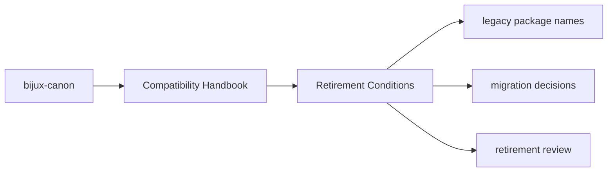
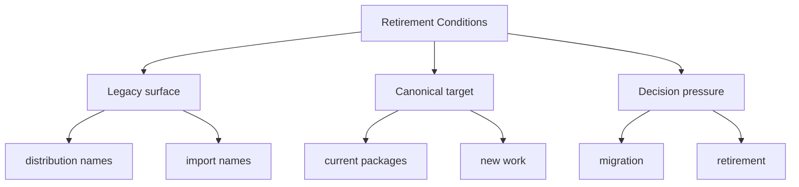

# Retirement Conditions

A compatibility package can be retired only when the dependent environments
that still need it are understood and the retirement path is documented.

## Page Maps

## Retirement Signals

- no remaining supported consumers depend on the legacy name
- migration guidance has been in place long enough to be credible
- removal will not silently strand existing automation

## Concrete Anchors

- `packages/compat-*` for the preserved legacy packages
- the compatibility package `README.md` files for canonical targets
- the matching canonical package docs for current behavior and new work

## Use This Page When

- you are tracing a legacy package name back to its canonical replacement
- you need migration guidance rather than product implementation detail
- you are deciding whether a compatibility surface still deserves to exist

## What This Page Answers

- which legacy surface is still preserved
- when new work should move to the canonical package instead
- what evidence would justify retiring a compatibility package

## Reviewer Lens

- compare legacy names here with the compatibility package metadata and README targets
- check that migration advice still points at current canonical docs
- confirm that compatibility language does not accidentally encourage new work to start here

## Honesty Boundary

This section documents preserved legacy surfaces, but it does not claim those legacy names are the preferred place for new work or long-term design growth.

## Purpose

This page explains the threshold for removing a compatibility package.

## Stability

Update this page only when the retirement policy itself changes.

## Core Claim

Each compatibility page should make migration pressure clearer than legacy habit, so preserved names remain understandable without becoming a second product line.

## Why It Matters

Compatibility pages matter because legacy package names often survive longer than the people who remember why they exist, and that makes migration drift expensive.

## If It Drifts

- legacy names become easier to keep using than to migrate away from
- canonical targets become ambiguous in old automation or docs
- retirement decisions get delayed because the actual migration state is unclear

## Representative Scenario

A legacy dependency name appears in an old environment file. The compatibility docs should let a maintainer map it to the canonical package and judge whether that old name still deserves to survive.
