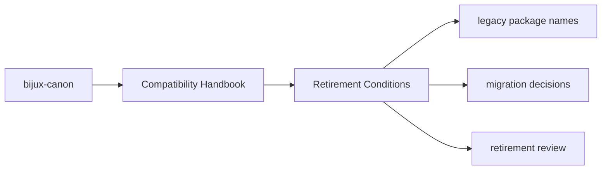

# Retirement Conditions

A compatibility package can be retired only when the dependent environments
that still need it are understood and the retirement path is documented.

## Page Maps

## Retirement Signals

- no remaining supported consumers depend on the legacy name
- migration guidance has been in place long enough to be credible
- removal will not silently strand existing automation

## Purpose

This page explains the threshold for removing a compatibility package.

## Stability

Update this page only when the retirement policy itself changes.
