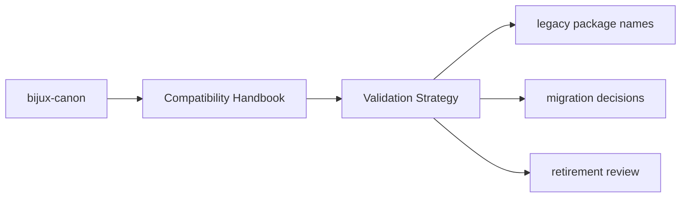

# Validation Strategy

Compatibility packages are small, but they still need validation for import
preservation, packaging metadata, and migration pointers.

## Page Maps

## Validation Focus

- import resolution
- packaging metadata correctness
- links and references to the canonical package docs

## Purpose

This page explains what counts as sufficient validation for the compatibility layer.

## Stability

Keep it aligned with the actual compatibility package tests or maintenance checks.
