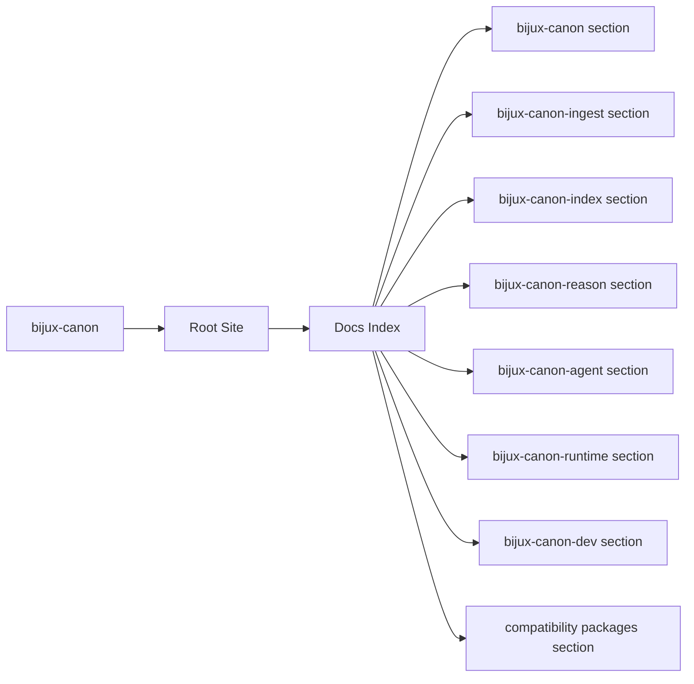

# Docs Index

`bijux-canon` is the canonical documentation site for the monorepo, the five
product packages, the repository maintenance package, and the legacy
compatibility shims that still preserve older installation names.

<strong>Use this site as the current contract.</strong> 
The sections beneath it are intentionally organized with one repository
handbook, one maintainer handbook, one compatibility handbook, and five
package handbooks that all share the same five-category spine.

  
<h3>Repository</h3>
Explains the monorepo boundary, shared workflows, schemas, validation, and release intent.

  
<h3>Packages</h3>
Each canonical package uses the same foundation, architecture, interfaces, operations, and quality layout.

  
<h3>Maintenance</h3>
Separate sections cover the repository tooling package and the compatibility shims so their intent stays explicit.

<a class="md-button md-button--primary" href="bijux-canon/">Open the repository handbook</a>
<a class="md-button" href="bijux-canon-ingest/foundation/">bijux-canon-ingest</a>
<a class="md-button" href="bijux-canon-index/foundation/">bijux-canon-index</a>
<a class="md-button" href="bijux-canon-reason/foundation/">bijux-canon-reason</a>
<a class="md-button" href="bijux-canon-agent/foundation/">bijux-canon-agent</a>
<a class="md-button" href="bijux-canon-runtime/foundation/">bijux-canon-runtime</a>
<a class="md-button" href="bijux-canon-dev/">Open maintainer docs</a>
<a class="md-button" href="compat-packages/">Open compatibility docs</a>

## Page Maps

## Documentation Scope

- the bijux-canon section
- the bijux-canon-ingest section
- the bijux-canon-index section
- the bijux-canon-reason section
- the bijux-canon-agent section
- the bijux-canon-runtime section
- the bijux-canon-dev section
- the compatibility packages section

## Reading Map

- start with [bijux-canon](bijux-canon/index.md) for repository-wide behavior
- move into one product package when you need ownership details or operator guidance
- use [bijux-canon-dev](bijux-canon-dev/index.md) for maintainer automation and quality gates
- use [compatibility packages](compat-packages/index.md) when tracing a legacy install name

## Purpose

This page routes readers into the canonical repository and package handbooks without mixing product ownership with maintenance-only or legacy-only concerns.

## Stability

This page is part of the canonical docs spine. Keep it aligned with the sections actually rendered in `docs/` and the packages that still ship from this repository.
