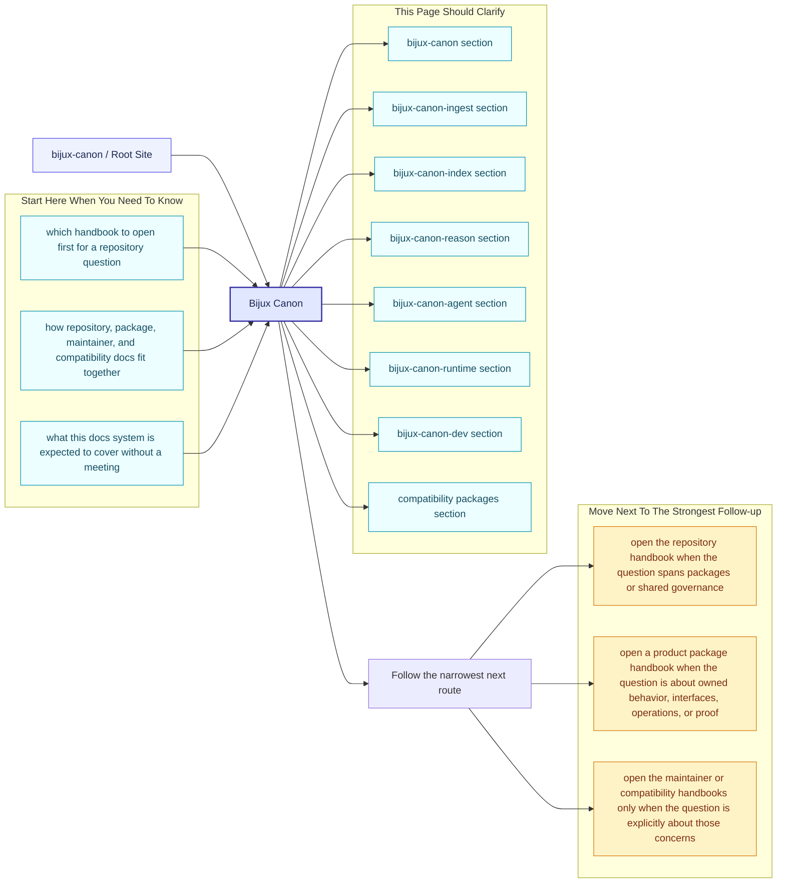
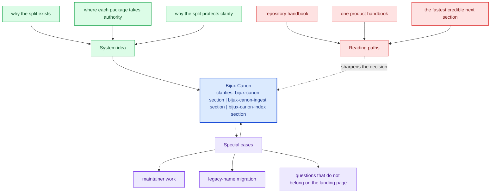

# Bijux Canon

`bijux-canon` is a deliberately split system for deterministic ingest,
retrieval, reasoning, orchestration, and governed execution. The split
is the architecture, not a packaging afterthought. Each package owns one
kind of promise clearly enough that readers can understand the system by
skimming the docs instead of reconstructing intent from the tree.

This site is meant to stand on its own. A new reader should be able to
answer three questions quickly: why the repository is split, which
package owns the current concern, and which checked-in files prove the
story being told.

<strong>Start with the package split, not the file tree.</strong> 
Ingest prepares deterministic material. Index executes retrieval and
captures provenance. Reason turns evidence into inspectable claims.
Agent coordinates role-based work. Runtime governs replay, persistence,
and final acceptance. The repository handbook exists to explain how those
responsibilities fit together without pretending they are one thing.

If you only remember one idea, remember this: the split protects clarity.
Each package can stay strong because it is not also trying to absorb the
whole system.

  
<h3>Whole-System Idea</h3>
Use the root pages to understand why the repository is split and how the five canonical packages fit into one accountable flow.

  
<h3>Honesty Rule</h3>
The docs are only useful if they send readers back to code, schemas, tests, and release assets quickly enough to verify the claims.

  
<h3>Fast Reading Path</h3>
Open the repository handbook for cross-package questions, one product handbook for owned behavior, the maintainer handbook for repository health, and compatibility docs only for legacy names.

<a class="md-button md-button--primary" href="bijux-canon/">Open the repository handbook</a>
<a class="md-button" href="bijux-canon-ingest/foundation/">bijux-canon-ingest</a>
<a class="md-button" href="bijux-canon-index/foundation/">bijux-canon-index</a>
<a class="md-button" href="bijux-canon-reason/foundation/">bijux-canon-reason</a>
<a class="md-button" href="bijux-canon-agent/foundation/">bijux-canon-agent</a>
<a class="md-button" href="bijux-canon-runtime/foundation/">bijux-canon-runtime</a>
<a class="md-button" href="bijux-canon-dev/">Open maintainer docs</a>
<a class="md-button" href="compat-packages/">Open compatibility docs</a>

Treat the root page as the shortest honest explanation of the whole documentation system. A reader should be able to skim it, understand the package split, and know which handbook branch to open next without needing a meeting first.

## Page Maps

## Start Here

- open [bijux-canon](bijux-canon/index.md) when the question crosses package boundaries or touches shared governance
- open one product package when you need ownership, interfaces, operations, or proof for one package
- open [bijux-canon-dev](bijux-canon-dev/index.md) for repository automation, schema enforcement, and maintainer-only guardrails
- open [compatibility packages](compat-packages/index.md) only when a legacy distribution, import, or command name is part of the problem

## Package Flow

| Package | Owns | Open It When |
| --- | --- | --- |
| `bijux-canon-ingest` | document preparation, chunking, and ingest-facing boundaries | you need to understand how raw inputs become deterministic material |
| `bijux-canon-index` | vector execution, backend integration, and provenance-rich retrieval results | you are reviewing search or retrieval behavior rather than document preparation |
| `bijux-canon-reason` | evidence-aware reasoning, claims, and verification | you need to inspect how evidence becomes explainable conclusions |
| `bijux-canon-agent` | role-based orchestration and trace-backed agent workflows | you are reviewing how multi-step agent work is coordinated and explained |
| `bijux-canon-runtime` | governed execution, replay, persistence, and final acceptability | you need the authority layer that decides whether a run is acceptable and durable |

## Documentation Scope

- the bijux-canon section
- the bijux-canon-ingest section
- the bijux-canon-index section
- the bijux-canon-reason section
- the bijux-canon-agent section
- the bijux-canon-runtime section
- the bijux-canon-dev section
- the compatibility packages section

## Concrete Anchors

- `docs/index.md` as the root routing page
- `mkdocs.yml` as the published navigation source
- `scripts/render_docs_catalog.py` as the generator that shapes the docs tree

## Use This Page When

- you are orienting yourself before opening a repository, package, maintainer, or compatibility page
- you need the fastest route to the correct handbook section
- you are reviewing whether the current docs system covers the right surfaces

## Decision Rule

Use this page to decide which handbook branch owns the current question. If a reader still cannot tell whether the issue is repository-wide, package-local, maintainer-only, or legacy-only after reading this page, then the root story is not clear enough yet.

## What This Page Answers

- which handbook to open first for a given repository question
- how the repository, package, maintainer, and compatibility docs relate
- what the current documentation system is expected to cover

## Reviewer Lens

- check that the first useful next step is obvious within a few seconds
- look for package, maintainer, or compatibility material that is leaking back into the landing page
- confirm that the route described here still matches the rendered navigation and the actual handbook content

## Honesty Boundary

This page can route readers quickly, but it does not replace the package, maintainer, or compatibility pages that carry the detailed proof for those surfaces.

## Next Checks

- open the repository handbook when the question spans packages or shared governance
- open a product package handbook when the question is about owned behavior, interfaces, operations, or proof
- open the maintainer or compatibility handbooks only when the question is explicitly about those concerns

## Purpose

This page is the front door to the handbook. Its job is to make the split legible quickly enough that a reader can choose the right next section before they drown in detail.

## Stability

This page is part of the canonical docs spine. Keep it aligned with the sections rendered in `docs/`, the packages that still ship from this repository, and the reasons the split exists.
