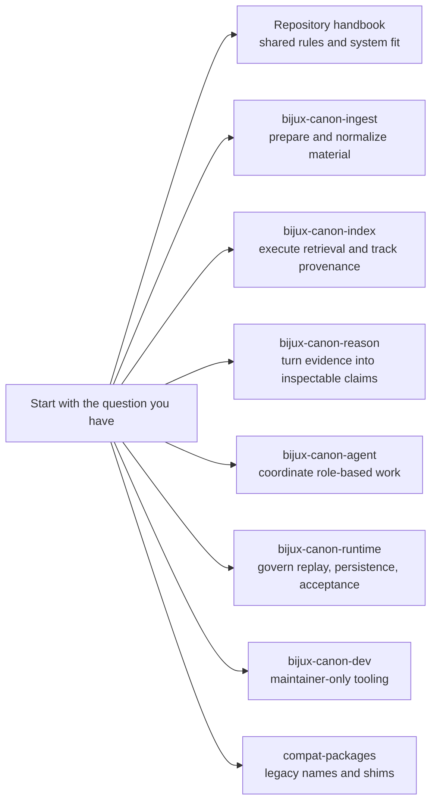

# Bijux Canon

`bijux-canon` is split on purpose. It is easier to understand, review, and
trust when ingest, retrieval, reasoning, orchestration, and runtime authority
stay separate instead of dissolving into one vague codebase.

This landing page is for orientation. A reader should be able to skim it,
decide where their question belongs, and move on without needing a meeting.

## How To Read The Site

## Start Here

- Open the [Repository Handbook](bijux-canon/index.md) when the question
  crosses package boundaries or touches shared repository rules.
- Open one product package when the question is about owned behavior, public
  surfaces, workflows, or proof inside that package.
- Open [bijux-canon-dev](bijux-canon-dev/index.md) only for maintainer-side
  automation, release helpers, schema drift checks, and similar repository
  health concerns.
- Open [compat-packages](compat-packages/index.md) only when a legacy name is
  part of the problem. They exist to help migration, not to compete with the
  canonical package family.

## The Five Core Packages

- [`bijux-canon-ingest`](bijux-canon-ingest/foundation/index.md) is where raw
  material becomes deterministic, reviewable input.
- [`bijux-canon-index`](bijux-canon-index/foundation/index.md) is where
  retrieval becomes explicit and provenance-aware.
- [`bijux-canon-reason`](bijux-canon-reason/foundation/index.md) is where
  evidence becomes claims, checks, and inspectable reasoning traces.
- [`bijux-canon-agent`](bijux-canon-agent/foundation/index.md) is where
  role-based work is coordinated into coherent runs.
- [`bijux-canon-runtime`](bijux-canon-runtime/foundation/index.md) is where the
  system decides whether a run is acceptable, replayable, and worth keeping.

## Two Supporting Sections

- [`bijux-canon-dev`](bijux-canon-dev/index.md) owns the developer tooling and
  maintainer workflows that do not belong in a product package.
- [`compat-packages`](compat-packages/index.md) explains the legacy names that
  still exist as migration shims.

The root docs should shorten conversations, not create new documentation
ceremony.
