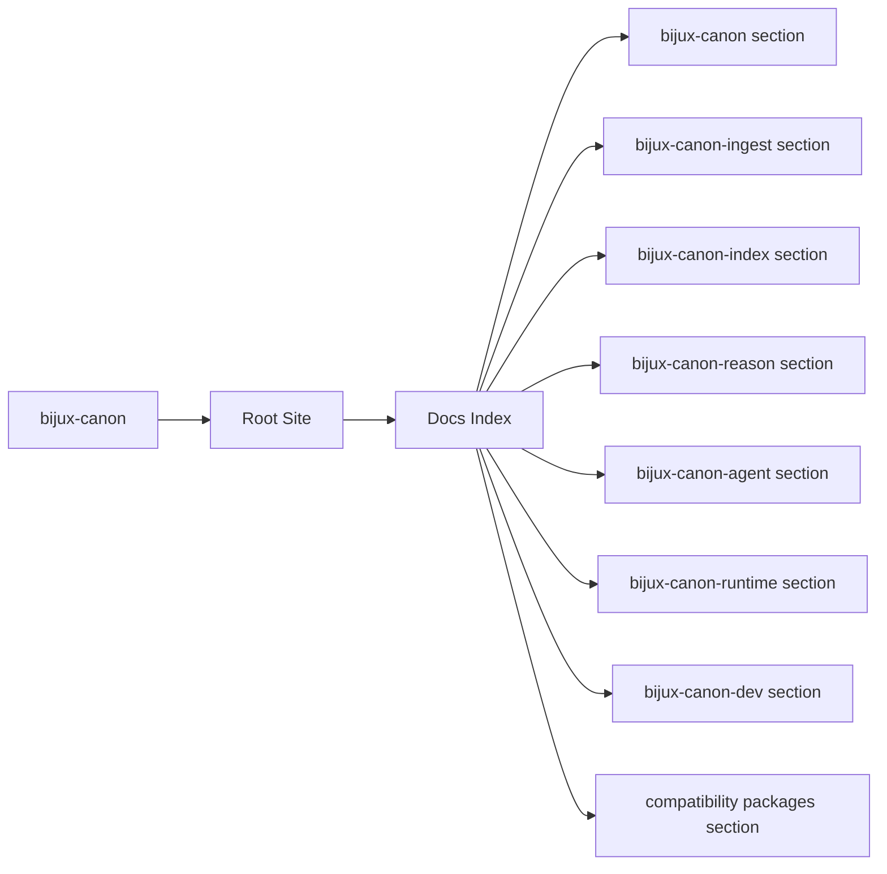
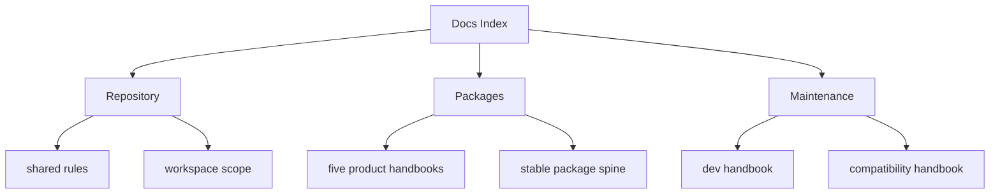

# Docs Index

`bijux-canon` is the canonical documentation site for the monorepo, the five
product packages, the repository maintenance package, and the legacy
compatibility shims that still preserve older installation names.

<strong>Use this site as the current contract.</strong> 
The sections beneath it are intentionally organized with one repository
handbook, one maintainer handbook, one compatibility handbook, and five
package handbooks that all share the same five-category spine.

  
<h3>Repository</h3>
Explains the monorepo boundary, shared workflows, schemas, validation, and release intent.

  
<h3>Packages</h3>
Each canonical package uses the same foundation, architecture, interfaces, operations, and quality layout.

  
<h3>Maintenance</h3>
Separate sections cover the repository tooling package and the compatibility shims so their intent stays explicit.

<a class="md-button md-button--primary" href="bijux-canon/">Open the repository handbook</a>
<a class="md-button" href="bijux-canon-ingest/foundation/">bijux-canon-ingest</a>
<a class="md-button" href="bijux-canon-index/foundation/">bijux-canon-index</a>
<a class="md-button" href="bijux-canon-reason/foundation/">bijux-canon-reason</a>
<a class="md-button" href="bijux-canon-agent/foundation/">bijux-canon-agent</a>
<a class="md-button" href="bijux-canon-runtime/foundation/">bijux-canon-runtime</a>
<a class="md-button" href="bijux-canon-dev/">Open maintainer docs</a>
<a class="md-button" href="compat-packages/">Open compatibility docs</a>

Treat the root page as the routing layer for the whole documentation system. Its job is not to duplicate every handbook, but to make the correct next reading choice obvious before the reader commits to a longer path.

## Page Maps

## Documentation Scope

- the bijux-canon section
- the bijux-canon-ingest section
- the bijux-canon-index section
- the bijux-canon-reason section
- the bijux-canon-agent section
- the bijux-canon-runtime section
- the bijux-canon-dev section
- the compatibility packages section

## Reading Map

- start with [bijux-canon](bijux-canon/index.md) for repository-wide behavior
- move into one product package when you need ownership details or operator guidance
- use [bijux-canon-dev](bijux-canon-dev/index.md) for maintainer automation and quality gates
- use [compatibility packages](compat-packages/index.md) when tracing a legacy install name

## Concrete Anchors

- `docs/index.md` as the root routing page
- `mkdocs.yml` as the published navigation source
- `scripts/render_docs_catalog.py` as the generator that shapes the docs tree

## Use This Page When

- you are orienting yourself before opening a repository, package, maintainer, or compatibility page
- you need the fastest route to the correct handbook section
- you are reviewing whether the current docs system covers the right surfaces

## What This Page Answers

- which handbook to open first for a given repository question
- how the repository, package, maintainer, and compatibility docs relate
- what the current documentation system is expected to cover

## Reviewer Lens

- check that every rendered handbook section still belongs in the root site
- look for package or maintainer material that should have moved to a more specific section
- confirm that the home page still routes readers to the fastest useful entrypoint

## Honesty Boundary

This page can route readers to the right section quickly, but it does not replace the more specific handbook pages that prove package, maintainer, or compatibility details.

## Section Contract

- route readers into the correct repository, package, maintainer, or compatibility section
- keep the overall documentation system legible from one entry page
- avoid collapsing all handbook responsibilities into the home page itself

## Reading Advice

- start with the repository handbook when the question spans packages
- move into a product package when you need ownership, interfaces, operations, or quality detail
- use the maintainer or compatibility sections only when the problem is explicitly about those concerns

## Next Checks

- open the repository handbook when the question spans packages or schemas
- open a product package handbook when the question is about ownership or package behavior
- open the maintainer or compatibility handbooks only when the question is explicitly about those concerns

## Update This Page When

- the rendered handbook structure changes materially
- the root site stops being the fastest route into the documentation system
- new major sections are added or retired from the root docs tree

## Purpose

This page routes readers into the canonical repository and package handbooks without mixing product ownership with maintenance-only or legacy-only concerns.

## Stability

This page is part of the canonical docs spine. Keep it aligned with the sections actually rendered in `docs/` and the packages that still ship from this repository.

## Core Claim

The root page should let a reviewer choose the right handbook path in seconds instead of forcing them to infer the documentation system from the tree layout.

## Why It Matters

If this page is vague, readers enter the wrong handbook branch first and the cost of reviewing the repository rises immediately because context has to be rebuilt page by page.

## If It Drifts

- readers start the wrong review path and waste time rebuilding orientation
- the root site stops acting like the reliable front door to the repository handbook
- package, maintainer, and compatibility sections become harder to distinguish quickly

## Representative Scenario

A reviewer opens the docs with only a vague question like 'where does this change belong'. The root page should route them to the right handbook branch before they spend time reading the wrong kind of documentation.

## Source Of Truth Order

- `docs/index.md` and `mkdocs.yml` for the published routing structure
- `scripts/render_docs_catalog.py` for how that structure is generated
- the target handbook pages themselves for the actual subject-specific detail

## Common Misreadings

- that the root page itself should contain all of the repository detail
- that package, maintainer, and compatibility docs are interchangeable reading paths
- that the navigation tree alone is enough without explicit routing guidance
