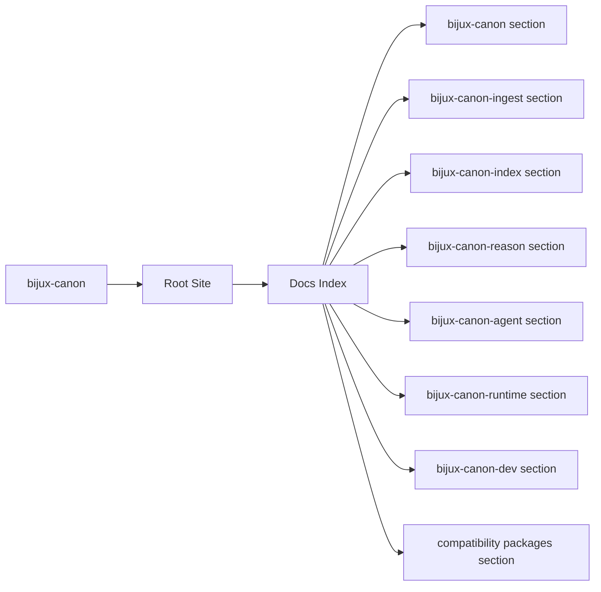
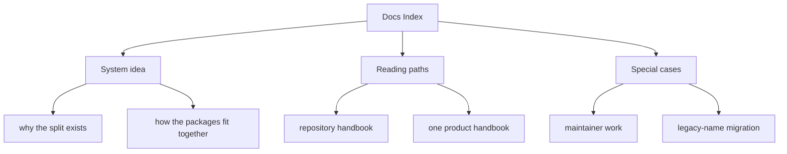

# Docs Index

`bijux-canon` is a deliberately split system for deterministic ingest,
retrieval, reasoning, agent orchestration, and governed execution.
The repository does not hide those concerns inside one oversized package.
It keeps them as separate publishable packages so each promise stays
easier to explain, easier to test, and harder to blur by accident.

This site is meant to be self-sufficient. A reader should be able to skim
the root pages, understand why the split exists, and know where to go next
without needing a meeting first.

<strong>Start with the package split, not the file tree.</strong> 
Ingest prepares deterministic material. Index makes retrieval behavior
reviewable. Reason turns evidence into inspectable claims. Agent
coordinates role-based work. Runtime decides whether execution and replay
results are acceptable. The root docs explain how those responsibilities
fit together without pretending they are one thing.

If you only remember one idea, remember this: the split exists to protect
clarity. Each package is allowed to be strong because it is not also trying
to absorb the whole system.

  
<h3>Whole-System Idea</h3>
Why the repository is split, which package carries which responsibility, and how the full flow stays understandable without collapsing ownership.

  
<h3>Honesty Rule</h3>
The docs are not allowed to win arguments against code, schemas, tests, or release assets. They must point back to them clearly enough that readers can verify the story.

  
<h3>Fast Reading Path</h3>
Use the repository handbook for cross-package questions, one product handbook for owned behavior, the maintainer handbook for repository health, and the compatibility handbook only for legacy names.

<a class="md-button md-button--primary" href="bijux-canon/">Open the repository handbook</a>
<a class="md-button" href="bijux-canon-ingest/foundation/">bijux-canon-ingest</a>
<a class="md-button" href="bijux-canon-index/foundation/">bijux-canon-index</a>
<a class="md-button" href="bijux-canon-reason/foundation/">bijux-canon-reason</a>
<a class="md-button" href="bijux-canon-agent/foundation/">bijux-canon-agent</a>
<a class="md-button" href="bijux-canon-runtime/foundation/">bijux-canon-runtime</a>
<a class="md-button" href="bijux-canon-dev/">Open maintainer docs</a>
<a class="md-button" href="compat-packages/">Open compatibility docs</a>

Treat the root page as the shortest honest explanation of the whole documentation system. It should help a reader understand the package split, the system-level flow, and the right next page before they commit to a longer read.

## Page Maps

## Documentation Scope

- the bijux-canon section
- the bijux-canon-ingest section
- the bijux-canon-index section
- the bijux-canon-reason section
- the bijux-canon-agent section
- the bijux-canon-runtime section
- the bijux-canon-dev section
- the compatibility packages section

## Reading Map

- start with [bijux-canon](bijux-canon/index.md) when the question crosses package boundaries or touches shared governance
- open one product package when you need to know who owns behavior, interfaces, operations, or proof
- use [bijux-canon-dev](bijux-canon-dev/index.md) for repository automation, schema enforcement, and maintainer-only guardrails
- use [compatibility packages](compat-packages/index.md) when you encounter an old distribution or import name and need the canonical replacement

## Concrete Anchors

- `docs/index.md` as the root routing page
- `mkdocs.yml` as the published navigation source
- `scripts/render_docs_catalog.py` as the generator that shapes the docs tree

## Use This Page When

- you are orienting yourself before opening a repository, package, maintainer, or compatibility page
- you need the fastest route to the correct handbook section
- you are reviewing whether the current docs system covers the right surfaces

## Decision Rule

Use this page to decide which handbook branch owns the current question. If a reader still cannot tell whether the issue is repository-wide, package-local, maintainer-only, or legacy-only after reading this page, then the root story is not clear enough yet.

## What This Page Answers

- which handbook to open first for a given repository question
- how the repository, package, maintainer, and compatibility docs relate
- what the current documentation system is expected to cover

## Reviewer Lens

- check that every rendered handbook section still belongs in the root site
- look for package or maintainer material that should have moved to a more specific section
- confirm that the home page still routes readers to the fastest useful entrypoint

## Honesty Boundary

This page can route readers to the right section quickly, but it does not replace the more specific handbook pages that prove package, maintainer, or compatibility details.

## Section Contract

- route readers into the correct repository, package, maintainer, or compatibility section
- keep the overall documentation system legible from one entry page
- avoid collapsing all handbook responsibilities into the home page itself

## Reading Advice

- start with the repository handbook when the question spans packages
- move into a product package when you need ownership, interfaces, operations, or quality detail
- use the maintainer or compatibility sections only when the problem is explicitly about those concerns

## Next Checks

- open the repository handbook when the question spans packages or schemas
- open a product package handbook when the question is about ownership or package behavior
- open the maintainer or compatibility handbooks only when the question is explicitly about those concerns

## Update This Page When

- the rendered handbook structure changes materially
- the root site stops being the fastest route into the documentation system
- new major sections are added or retired from the root docs tree

## Purpose

This page is the front door to the handbook. Its job is to explain the shape of the system quickly enough that readers can choose the right branch before they drown in detail.

## Stability

This page is part of the canonical docs spine. Keep it aligned with the sections actually rendered in `docs/`, the packages that still ship from this repository, and the reasons the split exists.

## What Good Looks Like

Use these points as the fast check for whether the page is doing real explanatory work.

- the correct next handbook path becomes obvious within a few seconds
- the root page reduces orientation cost instead of adding another layer of ambiguity
- the documentation system feels intentionally divided rather than accidentally scattered

## Failure Signals

These are the quickest signs that the page is drifting from honest explanation into noise or stale certainty.

- the root page starts sounding like a summary of everything instead of a route to somewhere specific
- readers still need trial-and-error to find the right handbook branch
- the distinction between repository, package, maintainer, and compatibility docs becomes blurry again

## Tradeoffs To Hold

A strong page names the tensions it is managing instead of pretending every desirable goal improves together.

- prefer routing clarity over turning the root page into a compressed summary of every section
- prefer a small amount of duplication in navigation language over forcing readers to infer where a question belongs
- prefer stable handbook boundaries over a root index that changes shape every time one package adds material

## Cross Implications

- when this page drifts, every handbook branch becomes harder to discover correctly
- root routing mistakes amplify the cost of weak package or maintainer pages because readers reach them later
- the value of the whole docs system depends on this page remaining a fast orientation surface

## Approval Questions

A reviewer should be able to answer these clearly before trusting the page or the change it is helping to explain.

- does the page still route most readers to one clearly better next section
- would a new reviewer understand the difference between repository, product, maintainer, and compatibility docs from this page alone
- is the navigation claim backed by the current rendered handbook structure rather than by intention only

## Evidence Checklist

Check these assets before trusting the prose. They are the concrete places where the page either holds up or falls apart.

- check `mkdocs.yml` against the rendered root navigation
- inspect `scripts/render_docs_catalog.py` if the page routing no longer reflects the intended handbook structure
- sample at least one target handbook branch to confirm the route this page recommends is still the right one

## Anti-Patterns

These patterns make documentation feel fuller while quietly making it less clear, less honest, or less durable.

- turning the root page into a second copy of the whole handbook
- assuming navigation clarity emerges automatically from file count or section count
- treating handbook routing as cosmetic instead of as part of review efficiency

## Escalate When

These conditions mean the problem is larger than a local wording fix and needs a wider review conversation.

- the root page no longer routes readers to one clearly better next section
- major documentation branches overlap so much that readers cannot tell where a question belongs
- a structural handbook change would affect more than one section at once

## Core Claim

The root page should let a reviewer choose the right handbook path in seconds instead of forcing them to infer the documentation system from the tree layout.

## Why It Matters

If this page is vague, readers start with the wrong mental model. They confuse package boundaries, over-ascribe responsibility to the root, and lose trust in the documentation before they ever reach the detailed pages.

## If It Drifts

- readers start the wrong review path and waste time rebuilding orientation
- the root site stops acting like the reliable front door to the repository handbook
- package, maintainer, and compatibility sections become harder to distinguish quickly

## Representative Scenario

A reviewer opens the docs with only a vague question like 'where does this change belong'. The root page should route them to the right handbook branch before they spend time reading the wrong kind of documentation.

## Source Of Truth Order

- `docs/index.md` and `mkdocs.yml` for the published routing structure
- `scripts/render_docs_catalog.py` for how that structure is generated
- the target handbook pages themselves for the actual subject-specific detail

## Common Misreadings

- that the root page itself should contain all of the repository detail
- that package, maintainer, and compatibility docs are interchangeable reading paths
- that the navigation tree alone is enough without explicit routing guidance
