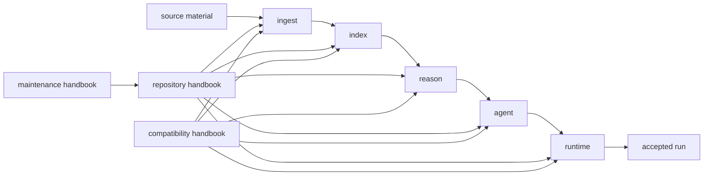
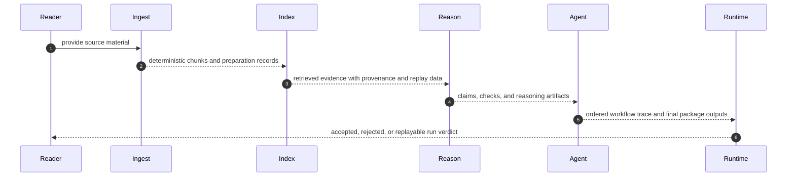

# Bijux Canon

`bijux-canon` is a package system for deterministic ingest, retrieval,
reasoning, orchestration, and governed execution. Open this site to find the
package that owns the behavior under review and the repository rules that keep
the package handoffs explicit.

The split is the design. Each package owns one operational promise strongly
enough that you can follow the full system as a chain of accountable
handoffs instead of treating the repository as one blurred codebase.

One concrete reading path makes that split easier to trust. A source document
is prepared by `bijux-canon-ingest`, turned into replayable retrieval behavior
by `bijux-canon-index`, translated into inspectable claims by
`bijux-canon-reason`, coordinated by `bijux-canon-agent`, and accepted or
replayed under `bijux-canon-runtime`. The root owns the rules that keep those
handoffs visible. It does not own the package behavior itself.

<!-- bijux-canon-badges:generated:start -->

<!-- bijux-canon-badges:generated:end -->

<strong>Start with owned promises, not with directory names.</strong>
Ingest prepares deterministic material. Index executes retrieval and preserves provenance. Reason turns evidence into inspectable claims. Agent coordinates role-based work with explicit traces. Runtime governs execution, replay, persistence, and final acceptability. The repository handbook explains the seams without pretending the root owns package behavior.

  
<h3>System Shape</h3>
Five canonical packages carry the product flow, the root explains shared coordination, the maintainer handbook explains repository health, and compatibility docs exist only to bridge old names.

  
<h3>Integrity Rule</h3>
Statements here must stay consistent with checked-in code, schemas, tests, release assets, and published package boundaries.

  
<h3>Fast Route</h3>
Open the repository handbook for cross-package seams, a product handbook for owned behavior, the maintainer handbook for automation, and compatibility docs only when a legacy package name is still in play.

<a class="md-button md-button--primary" href="https://bijux.io/bijux-canon/01-bijux-canon/">Open the repository handbook</a>
<a class="md-button" href="https://bijux.io/bijux-canon/07-bijux-canon-maintain/">Open maintenance docs</a>
<a class="md-button" href="https://bijux.io/bijux-canon/08-compat-packages/">Open compatibility docs</a>

## System Map

Read the homepage like a chain of ownership. The product story moves left to
right through the five canonical packages. The repository handbook explains the
shared boundary rules around that chain. The maintenance handbook proves how
the repository enforces those rules. The compatibility handbook exists only to
route old names back to their canonical owners.

## Start Here

- open the [Repository Handbook](https://bijux.io/bijux-canon/01-bijux-canon/) when the question crosses package boundaries or touches shared root rules
- open one product handbook when the behavior already belongs to ingest, index, reason, agent, or runtime
- open the [Maintenance Handbook](https://bijux.io/bijux-canon/07-bijux-canon-maintain/) for automation, Make routing, CI contracts, and repository health
- open the [Compatibility Handbook](https://bijux.io/bijux-canon/08-compat-packages/) only when an older distribution, import, or command name is still in play

## One Real Run

A useful mental model is a reviewable run. Each layer changes the question that
the next layer is allowed to ask. Ingest asks whether source material is stable
enough to hand forward. Index asks whether retrieval happened through an
auditable contract. Reason asks what the retrieved evidence supports. Agent
asks how the work should be coordinated. Runtime asks whether the full run can
be accepted, persisted, and replayed.

## Package Handbooks

| Package | Owns | Open It When |
| --- | --- | --- |
| `bijux-canon-ingest` | document preparation, chunking, and ingest-facing boundaries | you need to understand how raw inputs become deterministic material |
| `bijux-canon-index` | vector execution, backend integration, and provenance-rich retrieval results | you are reviewing search or retrieval behavior rather than document preparation |
| `bijux-canon-reason` | evidence-aware reasoning, claims, and verification | you need to inspect how evidence becomes explainable conclusions |
| `bijux-canon-agent` | role-based orchestration and trace-backed agent workflows | you are reviewing how multi-step agent work is coordinated and explained |
| `bijux-canon-runtime` | governed execution, replay, persistence, and final acceptability | you need the authority layer that decides whether a run is acceptable and durable |

## Shared Handbooks

- [Repository Handbook](https://bijux.io/bijux-canon/01-bijux-canon/) explains the root-owned design boundary, shared workflow, and package seams
- [Maintainer Handbook](https://bijux.io/bijux-canon/07-bijux-canon-maintain/) documents helper code, Make surfaces, and workflow contracts that keep the repository healthy
- [Compatibility Handbook](https://bijux.io/bijux-canon/08-compat-packages/) documents preserved legacy names and the migration pressure away from them

## Proof Surfaces

- `mkdocs.yml` for the published navigation source
- `packages/` for the package split this page is introducing
- `docs/` for the handbook entry pages that route readers into the repository
- `packages/bijux-canon-dev/src/bijux_canon_dev/docs/repository_docs_catalog.py` for the catalog tooling behind the handbook structure

Start with `packages/` if the main question is package ownership. Start with
`mkdocs.yml` if the main question is documentation routing. Start with
`Makefile`, `makes/`, or `.github/workflows/` if the claim is about shared
verification or release behavior. If none of those surfaces can support the
claim quickly, the homepage should be treated as orientation rather than proof.

## Leave This Page When

- one package or shared handbook clearly owns the question
- the next step is a concrete interface, workflow, schema, test, or release surface
- the issue is known to be maintainer-only or legacy-only
