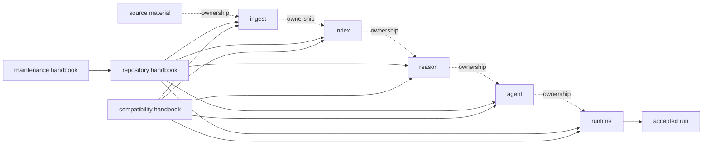
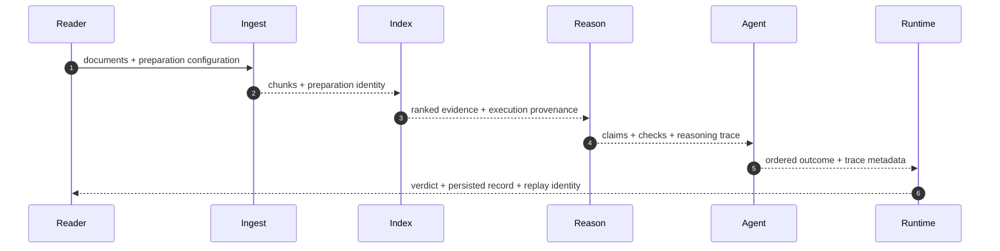
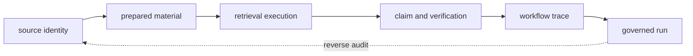
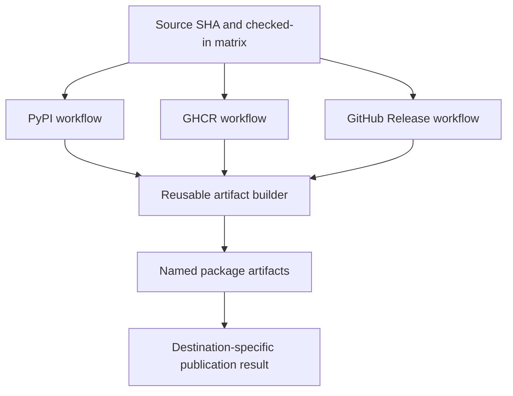

# Bijux Canon

`bijux-canon` turns documents and datasets into governed AI execution records.
Its five canonical Python packages divide the work into preparation,
retrieval, reasoning, orchestration, and runtime authority. That separation
makes the origin of an output, the contract at each handoff, and the owner of a
failure visible after a run has completed.

A source document can be cleaned and chunked by `bijux-canon-ingest`, queried
through a declared backend contract by `bijux-canon-index`, interpreted and
verified by `bijux-canon-reason`, coordinated through a trace-producing
`bijux-canon-agent` workflow, and accepted, persisted, or replayed by
`bijux-canon-runtime`. These packages can also be used independently; the
sequence describes ownership, not a mandatory monolithic deployment.

<!-- bijux-canon-badges:generated:start -->

<!-- bijux-canon-badges:generated:end -->

<strong>Choose the package that owns the decision.</strong>
Ingest decides how source material is prepared. Index decides how vector work executes and is explained. Reason decides how evidence supports a claim. Agent decides how role-specific work is coordinated. Runtime decides whether the resulting run is acceptable and durable.

  
<h3>Five canonical packages</h3>
Each package has typed Python surfaces, package-local tests, and a versioned HTTP schema. Ingest, reason, agent, and runtime also publish canonical commands.

  
<h3>Eleven distributions</h3>
Five canonical product packages and six explicit compatibility aliases are published from one tagged source line.

  
<h3>Evidence before confidence</h3>
Determinism, replay, verification, and compatibility claims are bounded by checked-in contracts and tests rather than inferred from a successful demonstration.

<a class="md-button md-button--primary" href="https://bijux.io/bijux-canon/01-bijux-canon/">Open the repository handbook</a>
<a class="md-button" href="https://bijux.io/bijux-canon/01-bijux-canon/foundation/evidence-map/">Trace a claim to its evidence</a>
<a class="md-button" href="https://bijux.io/bijux-canon/07-bijux-canon-maintain/">Open maintenance docs</a>
<a class="md-button" href="https://bijux.io/bijux-canon/08-compat-packages/">Open compatibility docs</a>

## Find The Authority

| Question | Owning handbook | Strongest starting evidence |
| --- | --- | --- |
| How did source bytes become retrieval-ready material? | [Ingest](02-bijux-canon-ingest/index.md) | normalized records, chunk configuration, source identity, and typed failures |
| Why did vector execution select, rank, refuse, or diverge? | [Index](03-bijux-canon-index/index.md) | request contract, capability resolution, execution artifact, and provenance |
| What evidence supports this claim? | [Reason](04-bijux-canon-reason/index.md) | exact support spans, content hashes, reasoning trace, and verification report |
| Why did this role run, and why did the workflow stop? | [Agent](05-bijux-canon-agent/index.md) | pipeline definition, ordered calls, convergence decision, and complete trace |
| May this run be accepted, retained, resumed, or replayed? | [Runtime](06-bijux-canon-runtime/index.md) | manifest, authority, policy, finalized trace, execution store, and replay verdict |
| Which root rule proves packages and releases agree? | [Repository](01-bijux-canon/index.md) | workspace metadata, API pins, Make targets, and workflows |
| Which check or publication path enforces repository health? | [Maintenance](07-bijux-canon-maintain/index.md) | maintainer command, exit status, artifact, and workflow job |
| What does an older installation, import, or command map to? | [Compatibility](08-compat-packages/index.md) | bridge metadata, alias identity tests, and canonical target |

## System Map

```mermaid
flowchart LR
    source["source material"]
    ingest["ingest"]
    index["index"]
    reason["reason"]
    agent["agent"]
    runtime["runtime"]
    accepted["accepted run"]
    repository["repository handbook"]
    maintain["maintenance handbook"]
    compat["compatibility handbook"]

    source -. ownership .-> ingest
    ingest -. ownership .-> index
    index -. ownership .-> reason
    reason -. ownership .-> agent
    agent -. ownership .-> runtime
    runtime --> accepted
    repository --> ingest
    repository --> index
    repository --> reason
    repository --> agent
    repository --> runtime
    maintain --> repository
    compat --> ingest
    compat --> index
    compat --> reason
    compat --> agent
    compat --> runtime
```

The product responsibility moves left to right through the five canonical
packages. The dotted links are custody boundaries, not proof of a single
installed end-to-end command. The repository section covers shared boundaries,
maintenance covers verification and publication machinery, and compatibility
maps preserved names to the canonical packages that own current behavior.

## Capability And Composition Status

Each canonical package has package-local contracts and evidence. Cross-package
runtime composition is a separate contract and is not currently complete:

| Surface | Current status | Trustworthy claim |
| --- | --- | --- |
| ingest, index, reason, and agent package-local APIs | independently implemented and tested at their documented boundaries | the owning package can be evaluated on its own contract |
| runtime planning | resolves and validates a `FlowManifest` without calling lower-package runners | a plan can be reviewed without claiming execution |
| runtime live adapters | expect root callables named `retrieve`, `enforce_contract`, `reason`, and `run`; the canonical roots do not currently expose the complete set | the architecture identifies intended owners, but installed end-to-end execution is not established |
| compatibility fallbacks | alias the canonical package implementations | they preserve names; they do not fill missing integration APIs |
| runtime HTTP run and replay | schema-tracked but return `501 Not Implemented` | schema presence documents the intended boundary, not service availability |

This distinction protects package achievements from being overstated as system
integration. A host may compose package-local surfaces explicitly, but it must
own that adapter and validate the resulting custody chain.

## Handoff Contracts

Each layer changes both the artifact and the question that the next layer is
allowed to answer. The sequence below describes the evidence that a complete
composition must preserve; it is not a transcript of a currently verified
runtime command.

```mermaid
sequenceDiagram
    autonumber
    participant Reader
    participant Ingest
    participant Index
    participant Reason
    participant Agent
    participant Runtime

    Reader->>Ingest: documents + preparation configuration
    Ingest-->>Index: chunks + preparation identity
    Index-->>Reason: ranked evidence + execution provenance
    Reason-->>Agent: claims + checks + reasoning trace
    Agent-->>Runtime: ordered outcome + trace metadata
    Runtime-->>Reader: verdict + persisted record + replay identity
```

| Boundary | Contract evidence | Failure remains visible as |
| --- | --- | --- |
| source to ingest | `RawDoc`, `CleanDoc`, `Chunk`, configuration, CSV/JSONL adapters | parse, validation, safeguard, or transformation error |
| ingest to index | prepared records, execution request, backend capability profile | unsupported capability or vector execution failure |
| index to reason | ranked evidence, provenance, artifact and run identifiers | insufficient or unverifiable evidence |
| reason to agent | claims, checks, manifest, trace, replay identity | reasoning or verification failure |
| agent to runtime | pipeline outcome, ordered trace, run configuration | orchestration, convergence, or trace validation failure |
| runtime to durable record | flow manifest, dataset identity, authority and verification policy | rejection, mismatch, budget violation, or replay drift |

## One Result, Six Custody Identities

An end-to-end result remains reviewable only when these identities travel
together:

| Identity | First owner | Question it answers |
| --- | --- | --- |
| source identity | ingest | which bytes, records, and preparation configuration entered the system? |
| prepared-material identity | ingest | which cleaned records and chunks were handed to retrieval? |
| execution identity | index | which backend, capabilities, index, request, and ranked result produced retrieval evidence? |
| claim identity | reason | which evidence spans, checks, and status support or refuse a conclusion? |
| workflow identity | agent | which ordered roles, provider calls, convergence rule, and terminal outcome occurred? |
| governed-run identity | runtime | which manifest, policy, store record, and replay verdict were accepted as durable? |

```mermaid
flowchart LR
    S["source identity"] --> P["prepared material"]
    P --> E["retrieval execution"]
    E --> C["claim and verification"]
    C --> W["workflow trace"]
    W --> R["governed run"]
    R -. "reverse audit" .-> S
```

A final answer is not a seventh authority. It is a projection of this custody
chain. If one identity is unavailable, narrow the claim to the last intact
boundary rather than reconstructing the missing handoff from downstream text.

## Package Handbooks

| Package | Owns | Open It When |
| --- | --- | --- |
| `bijux-canon-ingest` | document preparation, chunking, and ingest-facing boundaries | you need to understand how raw inputs become deterministic material |
| `bijux-canon-index` | vector execution, backend integration, and provenance-rich retrieval results | you are reviewing search or retrieval behavior rather than document preparation |
| `bijux-canon-reason` | evidence-aware reasoning, claims, and verification | you need to inspect how evidence becomes explainable conclusions |
| `bijux-canon-agent` | role-based orchestration and trace-backed agent workflows | you are reviewing how multi-step agent work is coordinated and explained |
| `bijux-canon-runtime` | governed execution, replay, persistence, and final acceptability | you need the authority layer that decides whether a run is acceptable and durable |

## Choose An Integration Surface

| Need | Install | Begin with |
| --- | --- | --- |
| normalize, clean, chunk, or prepare source material | `bijux-canon-ingest` | [ingest installation and setup](02-bijux-canon-ingest/operations/installation-and-setup.md) |
| execute vector operations through a declared backend contract | `bijux-canon-index` | [index entrypoints and examples](03-bijux-canon-index/interfaces/entrypoints-and-examples.md) |
| build claims and verify their evidence references | `bijux-canon-reason` | [reason operator workflows](04-bijux-canon-reason/interfaces/operator-workflows.md) |
| coordinate role-specific work and retain its trace | `bijux-canon-agent` | [agent CLI surface](05-bijux-canon-agent/interfaces/cli-surface.md) |
| authorize and retain a complete governed run | `bijux-canon-runtime` | [runtime operator workflows](06-bijux-canon-runtime/interfaces/operator-workflows.md) |

The package boundaries are compositional: install several when the application
crosses several authorities, but keep each decision at its owning boundary.
Compatibility packages are for continuity of an existing distribution, import,
or command name; they are not an alternative architecture.

## Shared Handbooks

- [Repository Handbook](01-bijux-canon/index.md) explains the root-owned design boundary, shared workflow, and package seams
- [Evidence Map](01-bijux-canon/foundation/evidence-map.md) traces system claims to their decision owner, retained record, and proof limit
- [Maintainer Handbook](07-bijux-canon-maintain/index.md) documents helper code, Make surfaces, and workflow contracts that keep the repository healthy
- [Compatibility Handbook](08-compat-packages/index.md) documents preserved continuity names and the migration pressure back toward canonical package ownership

## Match Evidence To The Claim

| Claim | Prefer | Not sufficient by itself |
| --- | --- | --- |
| a Python or CLI contract is stable | public facade, contract page, compatibility test, and caller example | an internal helper name |
| an HTTP operation is available | schema, server route, live contract test, and documented status | OpenAPI presence alone |
| preparation is reproducible | [source, configuration, transformation, output, and observation identity](02-bijux-canon-ingest/quality/evidence-interpretation.md) | matching chunk text without source custody |
| retrieval is exact or bounded | [artifact, plan, backend capability, budget, approximation, and provenance](03-bijux-canon-index/quality/evidence-interpretation.md) | plausible neighbors or a fixed seed |
| evidence supports a claim | [exact bytes, support edge, inference kind, findings, and manifested run](04-bijux-canon-reason/quality/evidence-interpretation.md) | confidence text or a citation label |
| an agent outcome is auditable | [pipeline definition, calls, lifecycle, convergence, terminal state, and trace](05-bijux-canon-agent/quality/evidence-interpretation.md) | final content or a `converged` flag |
| a run was accepted or replayed | [authority, execution, finalization, arbitration, persistence, and replay verdict](06-bijux-canon-runtime/quality/evidence-interpretation.md) | completion, database presence, or similar output |
| a compatibility name is equivalent | dependency pin, module identity, command parity, and canonical tests | successful installation |
| a release contains the intended package | tagged source, build manifest, publication guard, and published artifact | a green build job |

Each link above starts at the artifact a user can inspect. The package quality
indexes continue into invariants, tests, limitations, and risks when a stronger
assurance argument is required.

## Follow Release Custody

```mermaid
flowchart TD
    S[Source SHA and checked-in matrix] --> P[PyPI workflow]
    S --> O[GHCR workflow]
    S --> G[GitHub Release workflow]
    P --> B[Reusable artifact builder]
    O --> B
    G --> B
    B --> D[Named package artifacts]
    D --> R[Destination-specific publication result]
```

The three publication workflows are independent. Each calls the reusable
artifact builder from its own run, retains named package artifacts, and grants
write permission only at its destination boundary. The repository does not
claim an atomic all-destination release, nor does one successful destination
prove the others.

For a release review, record the source SHA, release tag, resolved package
matrix, artifact name, destination workflow, and final publication job. See
[release workflows](07-bijux-canon-maintain/gh-workflows/release-workflows.md)
for the exact custody and refusal contracts.

## Reconcile Conflicting Evidence

When two surfaces appear to disagree, inspect the owning package's public
facade and schema, the code that makes the disputed decision, the narrowest
relevant test, and the artifact emitted by a real run. Treat the supported
claim as the intersection of those sources. A schema without a live route, a
command without a parity test, or a replay label without retained identities is
not enough to establish the broader behavior.
