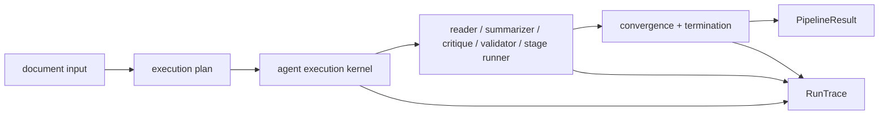

# bijux-canon-agent

<!-- bijux-canon-badges:generated:start -->
[](https://pypi.org/project/bijux-canon-agent/)
[-0A7BBB)](https://pypi.org/project/bijux-canon-agent/)
[](https://github.com/bijux/bijux-canon/blob/main/LICENSE)
[](https://github.com/bijux/bijux-canon/actions/workflows/verify.yml?query=branch%3Amain)
[](https://github.com/bijux/bijux-canon)

[](https://pypi.org/project/bijux-canon-agent/)
[](https://pypi.org/project/bijux-canon-runtime/)
[](https://pypi.org/project/bijux-canon/)
[](https://pypi.org/project/bijux-canon-ingest/)
[](https://pypi.org/project/bijux-canon-reason/)
[](https://pypi.org/project/bijux-canon-index/)
[](https://pypi.org/project/agentic-flows/)
[](https://pypi.org/project/bijux-agent/)
[](https://pypi.org/project/bijux-rag/)
[](https://pypi.org/project/bijux-rar/)
[](https://pypi.org/project/bijux-vex/)

[](https://github.com/bijux/bijux-canon/pkgs/container/bijux-canon%2Fbijux-canon-agent)
[](https://github.com/bijux/bijux-canon/pkgs/container/bijux-canon%2Fbijux-canon-runtime)
[](https://github.com/bijux/bijux-canon/pkgs/container/bijux-canon%2Fbijux-canon)
[](https://github.com/bijux/bijux-canon/pkgs/container/bijux-canon%2Fbijux-canon-ingest)
[](https://github.com/bijux/bijux-canon/pkgs/container/bijux-canon%2Fbijux-canon-reason)
[](https://github.com/bijux/bijux-canon/pkgs/container/bijux-canon%2Fbijux-canon-index)
[](https://github.com/bijux/bijux-canon/pkgs/container/bijux-canon%2Fagentic-flows)
[](https://github.com/bijux/bijux-canon/pkgs/container/bijux-canon%2Fbijux-agent)
[](https://github.com/bijux/bijux-canon/pkgs/container/bijux-canon%2Fbijux-rag)
[](https://github.com/bijux/bijux-canon/pkgs/container/bijux-canon%2Fbijux-rar)
[](https://github.com/bijux/bijux-canon/pkgs/container/bijux-canon%2Fbijux-vex)

[](https://bijux.io/bijux-canon/05-bijux-canon-agent/)
[](https://bijux.io/bijux-canon/06-bijux-canon-runtime/)
[](https://bijux.io/bijux-canon/02-bijux-canon-ingest/)
[](https://bijux.io/bijux-canon/04-bijux-canon-reason/)
[](https://bijux.io/bijux-canon/03-bijux-canon-index/)
<!-- bijux-canon-badges:generated:end -->

`bijux-canon-agent` is the package that turns a declared agent workflow into a
deterministic, inspectable execution. It is where role implementations,
pipeline coordination, trace production, and package-local operator surfaces
come together.

If you need to understand how an agent run is composed, how trace-backed output
is produced, or where agent-facing CLI and HTTP behavior lives, start here. If
you need replay governance, runtime persistence, or cross-package execution
authority, you are probably looking for `bijux-canon-runtime` instead.

## Pipeline Contract



The pipeline owns ordering and lifecycle, not the private reasoning inside a
role. `AgentExecutionKernel` controls call order and lifecycle callbacks;
`PipelineController` controls transitions; convergence strategies decide
whether another pass is justified; finalization joins status, output, failure,
telemetry, and trace completeness into one result.

Agent states (`pending`, `running`, `success`, `failed`, `aborted`) are distinct
from pipeline states (`init`, `running`, `judging`, `verified`, `done`,
`aborted`). Failure modes distinguish timeout, transient, validation, and fatal
conditions. A veto is not rewritten as an approval simply because some earlier
roles succeeded.

## CLI Workflow

```bash
bijux-canon-agent run documents/ \
  --config examples/reference-config.yml \
  --out artifacts/bijux-canon-agent

bijux-canon-agent run report.txt \
  --config examples/reference-config.yml \
  --out artifacts/bijux-canon-agent \
  --dry-run

bijux-canon-agent replay <trace.json>
```

Help, replay, dry-run, and local execution do not require provider credentials.
Remote adapters resolve only the selected provider's credential when a request
is executed. Keep credentials in the provider's environment variable rather
than serializable configuration; missing credentials fail the selected request
without exposing the variable name or secret value.

## HTTP Contract

`POST /v1/run` accepts text, a task goal, a context identifier, and a bounded
configuration object. The current handler validates that object but executes a
fixed offline pipeline: `simple` backend, `extractive` strategy, and the five
default roles. Configuration values do not currently alter execution. A
successful response carries the pipeline result; `trace_metadata` is part of
the response model but is not currently populated by the handler.

`GET /v1/health` provides process health. The checked-in contract is
[`apis/bijux-canon-agent/v1/schema.yaml`](../../apis/bijux-canon-agent/v1/schema.yaml).

## Evaluate A Pipeline Outcome

| Question | Evidence to inspect | What is not enough |
| --- | --- | --- |
| Which roles were authorized? | pipeline definition, resolved configuration, role order | installed provider adapters |
| What ran and in which order? | lifecycle transitions and per-agent call records | final artifact alone |
| Why did execution stop? | termination reason, convergence decision, vetoes, failures | a `success` field without trace context |
| Is the trace complete? | schema version, run fingerprint, mandatory entries, completeness validation | a log file |
| Can the result be governed downstream? | `PipelineResult`, trace identity, failure artifact, telemetry | provider response text detached from its run |

Deterministic orchestration means the controller's declared ordering and
decisions are inspectable. It does not make a remote model deterministic or
prove that convergence produced a correct artifact.

## Dependency Surface

Treat the base package as the canonical orchestration surface. CLI, HTTP,
provider, and template integrations are package-owned extensions that must stay
subordinate to the trace and workflow contract, not the other way around.

Install `bijux-canon-agent[document_readers]` to enable the optional CSV, PDF,
OCR, image, and DOCX readers. The extra installs pandas, pypdf, pdfminer.six,
pytesseract, PyMuPDF, Pillow, and python-docx; the operating system must also
provide the Tesseract executable for OCR. `bijux-canon-agent[extra]` is retained
as a compatibility alias for that same dependency set. Neither extra advertises
Excel support.

The package root deliberately exports only `API_VERSION`. It is not a facade
for pipeline classes, provider clients, or role implementations. Integrate
through the documented application, pipeline, interface, and trace modules so
that dependency ownership remains visible; use the versioned HTTP schema when
the service boundary is the intended contract.

“Deterministic” applies to declared controller ordering and inspectable
lifecycle decisions. Provider output may remain nondeterministic, and a
reconstructed trace is not a re-execution of the provider. Documentation and
automation should state which of those guarantees they rely on.

## Package Continuity

[`bijux-agent`](https://pypi.org/project/bijux-agent/) is an exact-version
compatibility distribution for this package. It preserves the `bijux_agent`
import root and `bijux-agent` command while resolving public exports, nested
modules, and command execution through `bijux-canon-agent`.

Use `bijux_canon_agent` and `bijux-canon-agent` in new integrations. Follow the
[migration guide](https://bijux.io/bijux-canon/08-compat-packages/migration/migration-guidance/)
to inventory dependency files, nested imports, pipeline configuration, and
entrypoints. The former
[`bijux/bijux-agent`](https://github.com/bijux/bijux-agent) repository is
historical; current implementation authority is this repository.

## Package Boundary

Agent owns role implementations, lifecycle transitions, execution ordering,
convergence, veto handling, failure artifacts, and trace production. Reason
owns evidence and claim semantics used inside reasoning-capable roles. Runtime
owns acceptance, durable run persistence, and governed replay above the
pipeline.

Provider adapters remain edge integrations. Their presence does not authorize
a provider, broaden the v1 HTTP contract, or transfer provider nondeterminism
into the deterministic orchestration core.

## Runtime Agent Adapter Status

The live runtime integration currently asks the `bijux_canon_agent` package
root for a `run` callable accepting an agent identifier, deterministic seed,
input fingerprint, declared output types, and retrieved evidence. It expects a
list of dictionaries containing `artifact_id`, `artifact_type`, and `content`,
with optional parent-artifact identifiers.

The package root deliberately exports only `API_VERSION`; it does not export
`run`. The package-native execution surface accepts a validated pipeline
definition, configuration, and workflow inputs, and preserves the outcome as a
`PipelineResult` with a `RunTrace`. Installing agent beside runtime therefore
does not make this live adapter callable.

The durable adapter belongs at the runtime integration boundary. It must
define how a runtime agent invocation selects a pipeline, how runtime evidence
becomes traceable workflow input, and how pipeline results, failure artifacts,
trace identity, content serialization, and parent relationships become
runtime artifacts. A broad package-root shortcut that returns untyped content
would bypass those decisions; runtime currently derives content hashes from
`str(content)`, so canonical serialization must also be explicit.

Live composition requires an installed-package test that resolves the adapter,
executes it with representative evidence, validates the runtime artifact
projection, and binds every projected artifact to its agent trace. The agent
CLI, HTTP, and Python pipeline remain package-local supported surfaces in the
meantime.

## Trace And Failure Guarantees

- traces carry schema version, run fingerprint, ordered entries, and field
  classifications used by replay and validation
- trace validators support the governed schema versions explicitly rather than
  accepting arbitrary historical shapes
- completion checks reject outcomes that omit mandatory trace evidence
- failure artifacts preserve category, class, message, stage, and relevant
  execution context
- API errors carry code, message, and HTTP status instead of overloading a
  nominally successful result payload

## Source Map

- [`src/bijux_canon_agent/agents`](https://github.com/bijux/bijux-canon/tree/main/packages/bijux-canon-agent/src/bijux_canon_agent/agents) for role-local behavior
- [`src/bijux_canon_agent/pipeline`](https://github.com/bijux/bijux-canon/tree/main/packages/bijux-canon-agent/src/bijux_canon_agent/pipeline) for execution flow
- [`src/bijux_canon_agent/application`](https://github.com/bijux/bijux-canon/tree/main/packages/bijux-canon-agent/src/bijux_canon_agent/application) for orchestration policies
- [`src/bijux_canon_agent/interfaces`](https://github.com/bijux/bijux-canon/tree/main/packages/bijux-canon-agent/src/bijux_canon_agent/interfaces) for CLI and HTTP edges
- [`src/bijux_canon_agent/traces`](https://github.com/bijux/bijux-canon/tree/main/packages/bijux-canon-agent/src/bijux_canon_agent/traces) for durable trace-facing models
- [`tests`](https://github.com/bijux/bijux-canon/tree/main/packages/bijux-canon-agent/tests) for executable package truth

## Read this next

- [Package guide](https://bijux.io/bijux-canon/05-bijux-canon-agent/)
- [Ownership boundary](https://bijux.io/bijux-canon/05-bijux-canon-agent/foundation/ownership-boundary/)
- [Architecture overview](https://bijux.io/bijux-canon/05-bijux-canon-agent/architecture/)
- [Interface contracts](https://bijux.io/bijux-canon/05-bijux-canon-agent/interfaces/)
- [Operator workflows](https://bijux.io/bijux-canon/05-bijux-canon-agent/interfaces/operator-workflows/)
- [Compatibility packages](https://bijux.io/bijux-canon/08-compat-packages/)
- [Changelog](https://github.com/bijux/bijux-canon/blob/main/packages/bijux-canon-agent/CHANGELOG.md)

## Primary entrypoint

- console script: `bijux-canon-agent`
- package history: [`CHANGELOG.md`](CHANGELOG.md)
