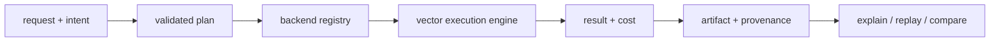

# bijux-canon-index

<!-- bijux-canon-badges:generated:start -->
[](https://pypi.org/project/bijux-canon-index/)
[-0A7BBB)](https://pypi.org/project/bijux-canon-index/)
[](https://github.com/bijux/bijux-canon/blob/main/LICENSE)
[](https://github.com/bijux/bijux-canon/actions/workflows/verify.yml?query=branch%3Amain)
[](https://github.com/bijux/bijux-canon)

[](https://pypi.org/project/bijux-canon-index/)
[](https://pypi.org/project/bijux-canon-runtime/)
[](https://pypi.org/project/bijux-canon/)
[](https://pypi.org/project/bijux-canon-agent/)
[](https://pypi.org/project/bijux-canon-ingest/)
[](https://pypi.org/project/bijux-canon-reason/)
[](https://pypi.org/project/agentic-flows/)
[](https://pypi.org/project/bijux-agent/)
[](https://pypi.org/project/bijux-rag/)
[](https://pypi.org/project/bijux-rar/)
[](https://pypi.org/project/bijux-vex/)

[](https://github.com/bijux/bijux-canon/pkgs/container/bijux-canon%2Fbijux-canon-index)
[](https://github.com/bijux/bijux-canon/pkgs/container/bijux-canon%2Fbijux-canon-runtime)
[](https://github.com/bijux/bijux-canon/pkgs/container/bijux-canon%2Fbijux-canon)
[](https://github.com/bijux/bijux-canon/pkgs/container/bijux-canon%2Fbijux-canon-agent)
[](https://github.com/bijux/bijux-canon/pkgs/container/bijux-canon%2Fbijux-canon-ingest)
[](https://github.com/bijux/bijux-canon/pkgs/container/bijux-canon%2Fbijux-canon-reason)
[](https://github.com/bijux/bijux-canon/pkgs/container/bijux-canon%2Fagentic-flows)
[](https://github.com/bijux/bijux-canon/pkgs/container/bijux-canon%2Fbijux-agent)
[](https://github.com/bijux/bijux-canon/pkgs/container/bijux-canon%2Fbijux-rag)
[](https://github.com/bijux/bijux-canon/pkgs/container/bijux-canon%2Fbijux-rar)
[](https://github.com/bijux/bijux-canon/pkgs/container/bijux-canon%2Fbijux-vex)

[](https://bijux.io/bijux-canon/03-bijux-canon-index/)
[](https://bijux.io/bijux-canon/06-bijux-canon-runtime/)
[](https://bijux.io/bijux-canon/05-bijux-canon-agent/)
[](https://bijux.io/bijux-canon/02-bijux-canon-ingest/)
[](https://bijux.io/bijux-canon/04-bijux-canon-reason/)
<!-- bijux-canon-badges:generated:end -->

`bijux-canon-index` is the vector execution package in `bijux-canon`. It does
more than "run a nearest-neighbor query." It executes a declared vector
operation against a concrete backend, records enough provenance to explain the
result later, and supports replay-oriented comparison when determinism matters.

If you need to understand vector-store adapters, embedding execution,
capability profiles, replay semantics, or provenance-aware result comparison,
start here. If you need document preparation, runtime governance, or repository
tooling, you are outside this package's boundary.

## Execution Contract

Every execution combines four declarations:

| Declaration | Supported values | Effect |
| --- | --- | --- |
| execution intent | `exact_validation`, `reproducible_research`, `exploratory_search`, `production_retrieval` | records why a particular loss and replay posture is acceptable |
| execution mode | `strict`, `bounded`, `exploratory` | controls refusal, tolerance, and diagnostic behavior |
| execution contract | `deterministic`, `non_deterministic` | distinguishes exact replay claims from bounded approximation |
| execution budget | latency, memory, error, candidate, and ANN limits | constrains resource use and approximation before execution |

An `ExecutionRequest` becomes an `ExecutionPlan`, an `ExecutionSession`, an
`ExecutionResult`, and—when materialized—an `ExecutionArtifact`. Provenance
records backend and parameter identity so `explain`, `replay`, and `compare`
operate on evidence rather than inference.



## Primary entrypoint

The repository contains a complete Typer application under
`bijux_canon_index.interfaces.cli.app`. The wheel registers that application as
the canonical `bijux-canon-index` console script:

```bash
bijux-canon-index --version
bijux-canon-index capabilities
bijux-canon-index execute \
  --vector '[0.2, 0.8]' \
  --execution-contract deterministic \
  --execution-intent exact_validation \
  --execution-mode strict
```

`python -m bijux_canon_index.interfaces.cli.app` invokes the same application
when a module command is preferable.

For local dense or hybrid retrieval, install the embedding dependencies and
explicitly acquire the pinned CPU model:

```bash
python -m pip install 'bijux-canon-index[local-cpu]'
bijux-canon-index model acquire \
  --profile local-minilm-384 \
  --cache-root artifacts/bijux-canon-index/models
```

The command downloads only the immutable declared revision, verifies every
required file, performs a one-vector offline CPU inference, and writes
`model.lock.json` plus `model.record.json`. The validation record binds the
source, revision, license pointer, file digests, dimension, installed runtime
compatibility, and offline-reuse result. Re-run `model validate --model-root
PATH` without network access before configuring Runtime. Use `model register`
for an existing directory containing the exact pinned files; registration does
not accept a different model or revision.

On Linux, install `torch` from the official CPU wheel index before installing
`local-cpu`; this prevents the default resolver from introducing CUDA runtime
packages into a CPU-only environment. On macOS, `local-cpu` is supported on
Python 3.11 because the safe FAISS/PyTorch combination has no newer Python ABI.
The `bijux-cli` dependency publishes a Linux x86_64 wheel; Linux ARM64 hosts
currently need a C build toolchain so pip can build that dependency from its
source distribution.

| Integration need | Supported surface | Authority to pin |
| --- | --- | --- |
| typed composition | application, domain, contract, and interface modules | imported symbol and distribution version |
| shell automation | `bijux-canon-index` | installed command and its rendered output contract |
| service integration | v1 HTTP API | checked-in OpenAPI schema and schema hash |
| historical automation | `bijux-vex` compatibility package | bridge version plus its exact canonical dependency |

The root import deliberately exposes only `__version__`. Examples that import
an imagined root-level engine or request facade do not describe a supported
API, even if equivalent types exist deeper in the package.

## Installed content retrieval

Runtime composes the canonical lexical and dense index owners through an
installed adapter. A hybrid query retains the complete bounded lexical and
dense candidate populations, measured VEX evidence, reciprocal-rank fusion,
content-derived evidence needs, and the final rerank. The default content
policy routes across relevant documents and then selects answer-bearing
passages using source structure such as abstract, result, discussion, and
limitation sections. It cannot introduce a chunk absent from the fused
candidate set.

Each dense attempt retains the exact comparison candidates, witness and result
identities, measured recall, observed effort, policy violations, and selected
action. A refused ANN attempt may execute one policy-bounded exact fallback.
Only an admitted final attempt can contribute hits. If exact fallback is not
permitted or also fails policy, retrieval returns a typed refusal with zero
hits, every attempt artifact ID, and operator remediation; evaluations retain
that refusal and its Runtime lineage in the query denominator.

The evidence planner is deterministic and identity-free: it derives bounded
method, result, comparison, limitation, and counterevidence needs from the
question text. It does not contain reviewed query IDs, document IDs, source
IDs, or qrels. Every generated need records its exact derivation and every
rerank records the immutable policy identity and candidate conservation.

Development configuration search executes the installed retriever first. It
then evaluates the observed finalization policy and bounded weighted-RRF
alternatives against independently reviewed development qrels. Failed and
refused executions remain in the denominator. Held-out labels are not an input
to this search. The stage report separately exposes candidate-depth,
channel-admitted, fusion, rerank, and final recall, so a passing final metric
cannot be misattributed to an earlier stage.

An installed retrieval artifact proves ranking behavior and exact source
lineage for one question. It does not prove that downstream claims are
entailed. That semantic responsibility belongs to `bijux-canon-reason`.

## HTTP Contract

The checked-in v1 schema exposes backend capabilities, corpus creation,
ingestion, vector execution, explanation, replay, artifact materialization,
artifact listing, and run listing. See
[`apis/bijux-canon-index/v1/schema.yaml`](../../apis/bijux-canon-index/v1/schema.yaml)
and its pinned JSON and schema hash.

## Evaluate An Execution Result

| Question | Evidence to inspect | Misleading shortcut |
| --- | --- | --- |
| Was the requested contract supported? | intent, mode, capability profile, backend identity | assuming every registered backend supports exact execution |
| Which data and parameters produced the ranking? | artifact, index/vector-store identity, metric, normalized parameters | keeping only document identifiers and scores |
| Did approximation remain within policy? | randomness profile, ANN parameters, witness data, budget observations | calling every seeded run deterministic |
| Can the outcome be replayed? | original artifact, request, fingerprints, current backend state, replay verdict | comparing final neighbor lists without identities |
| Why was work refused? | typed reason, invariant code, remediation, correlation ID | retrying the same unsupported contract silently |

An `ExecutionArtifact` is evidence of a vector operation under one declared
contract. It does not prove corpus completeness, semantic relevance, or the
truth of downstream claims.

Keep the prepared-input identity and execution artifact together. The former
shows which ingest-owned material entered the operation; the latter shows how
index interpreted and ranked that material. Either artifact alone leaves a
custody gap that replay cannot repair.

## Package Continuity

[`bijux-vex`](https://pypi.org/project/bijux-vex/) is an exact-version
compatibility distribution for this package. It preserves the `bijux_vex`
import root and `bijux-vex` command while delegating execution to canonical
index modules. Both commands resolve to the same public CLI application;
`bijux-canon-index` is the direct replacement for new automation.

Use `bijux-canon-index`, `bijux_canon_index`, or the versioned HTTP contract in
new integrations. Follow the
[migration guide](https://bijux.io/bijux-canon/08-compat-packages/migration/migration-guidance/)
to replace command automation deliberately and compare ranked results, typed
failures, and execution evidence. The former
[`bijux/bijux-vex`](https://github.com/bijux/bijux-vex) repository is
historical; current implementation authority is this repository.

## Package Boundary

Index owns embedding and vector-store execution once input has a stable
prepared identity. It owns capability negotiation, exact and bounded modes,
budgets, result provenance, artifacts, and retrieval replay. Ingest owns source
normalization; reason owns what retrieved evidence means; runtime owns whether
the full run may be accepted and persisted.

A plugin extends a registered execution seam. Registration does not make its
capability declaration accurate or its remote service trustworthy; conformance
and deployment controls remain necessary.

## Failure And Replay Semantics

- strict execution refuses unsupported capability, invalid-vector, and budget
  combinations before presenting a result as valid
- deterministic and non-deterministic runs have different support levels and
  different replay claims
- approximate runs can record witness mode, target recall, candidate limits,
  ANN parameters, low-signal policy, and an explicit non-replayable declaration
- replay can refuse changed indexes or parameters instead of silently comparing
  unlike executions
- corrupt artifacts, unavailable backends, backend divergence, and unsupported
  replay remain distinct failures

## Source Map

- [`src/bijux_canon_index/core`](https://github.com/bijux/bijux-canon/tree/main/packages/bijux-canon-index/src/bijux_canon_index/core) for stable primitives and errors
- [`src/bijux_canon_index/domain`](https://github.com/bijux/bijux-canon/tree/main/packages/bijux-canon-index/src/bijux_canon_index/domain) for execution and provenance semantics
- [`src/bijux_canon_index/application`](https://github.com/bijux/bijux-canon/tree/main/packages/bijux-canon-index/src/bijux_canon_index/application) for package workflows
- [`src/bijux_canon_index/infra`](https://github.com/bijux/bijux-canon/tree/main/packages/bijux-canon-index/src/bijux_canon_index/infra) for backends, adapters, and plugins
- [`src/bijux_canon_index/interfaces`](https://github.com/bijux/bijux-canon/tree/main/packages/bijux-canon-index/src/bijux_canon_index/interfaces) and [`src/bijux_canon_index/api`](https://github.com/bijux/bijux-canon/tree/main/packages/bijux-canon-index/src/bijux_canon_index/api) for boundaries
- [`plugins`](https://github.com/bijux/bijux-canon/tree/main/packages/bijux-canon-index/plugins) for plugin development support
- [`tests`](https://github.com/bijux/bijux-canon/tree/main/packages/bijux-canon-index/tests) for conformance and replay protection

## Read this next

- [Package guide](https://bijux.io/bijux-canon/03-bijux-canon-index/)
- [Architecture overview](https://bijux.io/bijux-canon/03-bijux-canon-index/architecture/)
- [API surface](https://bijux.io/bijux-canon/03-bijux-canon-index/interfaces/api-surface/)
- [Execution model](https://bijux.io/bijux-canon/03-bijux-canon-index/architecture/execution-model/)
- [Error model](https://bijux.io/bijux-canon/03-bijux-canon-index/architecture/error-model/)
- [Changelog](https://github.com/bijux/bijux-canon/blob/main/packages/bijux-canon-index/CHANGELOG.md)

## Distribution Surfaces

| Surface | Availability | Canonical access |
| --- | --- | --- |
| Python | available | import application and domain modules from `bijux_canon_index` |
| HTTP | available | serve the application against the pinned v1 OpenAPI contract |
| module CLI | available | `python -m bijux_canon_index.interfaces.cli.app` |
| console script | available | `bijux-canon-index` |

Consumers should select one surface explicitly and pin the corresponding
contract. Installed-wheel checks prove command registration and behavior.

Package history is recorded in [`CHANGELOG.md`](CHANGELOG.md).
