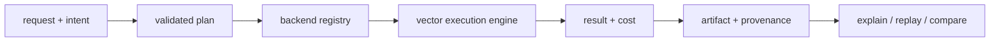

# bijux-canon-index

<!-- bijux-canon-badges:generated:start -->
[](https://pypi.org/project/bijux-canon-index/)
[-0A7BBB)](https://pypi.org/project/bijux-canon-index/)
[](https://github.com/bijux/bijux-canon/blob/main/LICENSE)
[](https://github.com/bijux/bijux-canon/actions/workflows/verify.yml?query=branch%3Amain)
[](https://github.com/bijux/bijux-canon)

[](https://pypi.org/project/bijux-canon-index/)
[](https://pypi.org/project/bijux-canon-runtime/)
[](https://pypi.org/project/bijux-canon/)
[](https://pypi.org/project/bijux-canon-agent/)
[](https://pypi.org/project/bijux-canon-ingest/)
[](https://pypi.org/project/bijux-canon-reason/)
[](https://pypi.org/project/agentic-flows/)
[](https://pypi.org/project/bijux-agent/)
[](https://pypi.org/project/bijux-rag/)
[](https://pypi.org/project/bijux-rar/)
[](https://pypi.org/project/bijux-vex/)

[](https://github.com/bijux/bijux-canon/pkgs/container/bijux-canon%2Fbijux-canon-index)
[](https://github.com/bijux/bijux-canon/pkgs/container/bijux-canon%2Fbijux-canon-runtime)
[](https://github.com/bijux/bijux-canon/pkgs/container/bijux-canon%2Fbijux-canon)
[](https://github.com/bijux/bijux-canon/pkgs/container/bijux-canon%2Fbijux-canon-agent)
[](https://github.com/bijux/bijux-canon/pkgs/container/bijux-canon%2Fbijux-canon-ingest)
[](https://github.com/bijux/bijux-canon/pkgs/container/bijux-canon%2Fbijux-canon-reason)
[](https://github.com/bijux/bijux-canon/pkgs/container/bijux-canon%2Fagentic-flows)
[](https://github.com/bijux/bijux-canon/pkgs/container/bijux-canon%2Fbijux-agent)
[](https://github.com/bijux/bijux-canon/pkgs/container/bijux-canon%2Fbijux-rag)
[](https://github.com/bijux/bijux-canon/pkgs/container/bijux-canon%2Fbijux-rar)
[](https://github.com/bijux/bijux-canon/pkgs/container/bijux-canon%2Fbijux-vex)

[](https://bijux.io/bijux-canon/03-bijux-canon-index/)
[](https://bijux.io/bijux-canon/06-bijux-canon-runtime/)
[](https://bijux.io/bijux-canon/05-bijux-canon-agent/)
[](https://bijux.io/bijux-canon/02-bijux-canon-ingest/)
[](https://bijux.io/bijux-canon/04-bijux-canon-reason/)
<!-- bijux-canon-badges:generated:end -->

`bijux-canon-index` is the vector execution package in `bijux-canon`. It does
more than "run a nearest-neighbor query." It executes a declared vector
operation against a concrete backend, records enough provenance to explain the
result later, and supports replay-oriented comparison when determinism matters.

If you need to understand vector-store adapters, embedding execution,
capability profiles, replay semantics, or provenance-aware result comparison,
start here. If you need document preparation, runtime governance, or repository
tooling, you are outside this package's boundary.

## Execution Contract

Every execution combines four declarations:

| Declaration | Supported values | Effect |
| --- | --- | --- |
| execution intent | `exact_validation`, `reproducible_research`, `exploratory_search`, `production_retrieval` | records why a particular loss and replay posture is acceptable |
| execution mode | `strict`, `bounded`, `exploratory` | controls refusal, tolerance, and diagnostic behavior |
| execution contract | `deterministic`, `non_deterministic` | distinguishes exact replay claims from bounded approximation |
| execution budget | latency, memory, error, candidate, and ANN limits | constrains resource use and approximation before execution |

An `ExecutionRequest` becomes an `ExecutionPlan`, an `ExecutionSession`, an
`ExecutionResult`, and—when materialized—an `ExecutionArtifact`. Provenance
records backend and parameter identity so `explain`, `replay`, and `compare`
operate on evidence rather than inference.



## Primary entrypoint

The repository contains a complete Typer application under
`bijux_canon_index.interfaces.cli.app`. The current package metadata does **not**
register a `bijux-canon-index` console script, so source and wheel users must
not assume that executable exists. The application can be invoked explicitly:

```bash
python -m bijux_canon_index.interfaces.cli.app capabilities
python -m bijux_canon_index.interfaces.cli.app execute \
  --vector '[0.2, 0.8]' \
  --execution-contract deterministic \
  --execution-intent exact_validation \
  --execution-mode strict
```

The missing console-script registration is a packaging limitation, not a
documentation alias. HTTP and in-process users are unaffected.

## HTTP Contract

The checked-in v1 schema exposes backend capabilities, corpus creation,
ingestion, vector execution, explanation, replay, artifact materialization,
artifact listing, and run listing. See
[`apis/bijux-canon-index/v1/schema.yaml`](../../apis/bijux-canon-index/v1/schema.yaml)
and its pinned JSON and schema hash.

## Evaluate An Execution Result

| Question | Evidence to inspect | Misleading shortcut |
| --- | --- | --- |
| Was the requested contract supported? | intent, mode, capability profile, backend identity | assuming every registered backend supports exact execution |
| Which data and parameters produced the ranking? | artifact, index/vector-store identity, metric, normalized parameters | keeping only document identifiers and scores |
| Did approximation remain within policy? | randomness profile, ANN parameters, witness data, budget observations | calling every seeded run deterministic |
| Can the outcome be replayed? | original artifact, request, fingerprints, current backend state, replay verdict | comparing final neighbor lists without identities |
| Why was work refused? | typed reason, invariant code, remediation, correlation ID | retrying the same unsupported contract silently |

An `ExecutionArtifact` is evidence of a vector operation under one declared
contract. It does not prove corpus completeness, semantic relevance, or the
truth of downstream claims.

## Legacy Continuity

- compatibility package: [`bijux-vex`](https://pypi.org/project/bijux-vex/)
- legacy import root: `bijux_vex`
- legacy command: `bijux-vex`
- canonical migration guide: [Migration guidance](https://bijux.io/bijux-canon/08-compat-packages/migration/migration-guidance/)
- retired repository target: [https://github.com/bijux/bijux-vex](https://github.com/bijux/bijux-vex) (see [Repository consolidation notes](https://bijux.io/bijux-canon/08-compat-packages/migration/repository-consolidation/))

## Package Boundary

Index owns embedding and vector-store execution once input has a stable
prepared identity. It owns capability negotiation, exact and bounded modes,
budgets, result provenance, artifacts, and retrieval replay. Ingest owns source
normalization; reason owns what retrieved evidence means; runtime owns whether
the full run may be accepted and persisted.

A plugin extends a registered execution seam. Registration does not make its
capability declaration accurate or its remote service trustworthy; conformance
and deployment controls remain necessary.

## Failure And Replay Semantics

- strict execution refuses unsupported capability, invalid-vector, and budget
  combinations before presenting a result as valid
- deterministic and non-deterministic runs have different support levels and
  different replay claims
- approximate runs can record witness mode, target recall, candidate limits,
  ANN parameters, low-signal policy, and an explicit non-replayable declaration
- replay can refuse changed indexes or parameters instead of silently comparing
  unlike executions
- corrupt artifacts, unavailable backends, backend divergence, and unsupported
  replay remain distinct failures

## Source Map

- [`src/bijux_canon_index/core`](https://github.com/bijux/bijux-canon/tree/main/packages/bijux-canon-index/src/bijux_canon_index/core) for stable primitives and errors
- [`src/bijux_canon_index/domain`](https://github.com/bijux/bijux-canon/tree/main/packages/bijux-canon-index/src/bijux_canon_index/domain) for execution and provenance semantics
- [`src/bijux_canon_index/application`](https://github.com/bijux/bijux-canon/tree/main/packages/bijux-canon-index/src/bijux_canon_index/application) for package workflows
- [`src/bijux_canon_index/infra`](https://github.com/bijux/bijux-canon/tree/main/packages/bijux-canon-index/src/bijux_canon_index/infra) for backends, adapters, and plugins
- [`src/bijux_canon_index/interfaces`](https://github.com/bijux/bijux-canon/tree/main/packages/bijux-canon-index/src/bijux_canon_index/interfaces) and [`src/bijux_canon_index/api`](https://github.com/bijux/bijux-canon/tree/main/packages/bijux-canon-index/src/bijux_canon_index/api) for boundaries
- [`plugins`](https://github.com/bijux/bijux-canon/tree/main/packages/bijux-canon-index/plugins) for plugin development support
- [`tests`](https://github.com/bijux/bijux-canon/tree/main/packages/bijux-canon-index/tests) for conformance and replay protection

## Read This Next

- [Package guide](https://bijux.io/bijux-canon/03-bijux-canon-index/)
- [Architecture overview](https://bijux.io/bijux-canon/03-bijux-canon-index/architecture/)
- [API surface](https://bijux.io/bijux-canon/03-bijux-canon-index/interfaces/api-surface/)
- [Execution model](https://bijux.io/bijux-canon/03-bijux-canon-index/architecture/execution-model/)
- [Error model](https://bijux.io/bijux-canon/03-bijux-canon-index/architecture/error-model/)
- [Changelog](https://github.com/bijux/bijux-canon/blob/main/packages/bijux-canon-index/CHANGELOG.md)

## Distribution Surfaces

| Surface | Availability | Canonical access |
| --- | --- | --- |
| Python | available | import application and domain modules from `bijux_canon_index` |
| HTTP | available | serve the application against the pinned v1 OpenAPI contract |
| module CLI | available | `python -m bijux_canon_index.interfaces.cli.app` |
| console script | not registered | use the module CLI; do not assume `bijux-canon-index` exists |

This distinction matters for automation: package installation proves that the
Python distribution is available, but it does not prove that a shell command
was registered. Consumers should select one of the available surfaces
explicitly and pin the corresponding contract.

Package history is recorded in [`CHANGELOG.md`](CHANGELOG.md).
