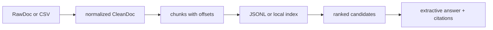

# bijux-canon-ingest

<!-- bijux-canon-badges:generated:start -->
[](https://pypi.org/project/bijux-canon-ingest/)
[-0A7BBB)](https://pypi.org/project/bijux-canon-ingest/)
[](https://github.com/bijux/bijux-canon/blob/main/LICENSE)
[](https://github.com/bijux/bijux-canon/actions/workflows/verify.yml?query=branch%3Amain)
[](https://github.com/bijux/bijux-canon)

[](https://pypi.org/project/bijux-canon-ingest/)
[](https://pypi.org/project/bijux-canon-runtime/)
[](https://pypi.org/project/bijux-canon/)
[](https://pypi.org/project/bijux-canon-agent/)
[](https://pypi.org/project/bijux-canon-reason/)
[](https://pypi.org/project/bijux-canon-index/)
[](https://pypi.org/project/agentic-flows/)
[](https://pypi.org/project/bijux-agent/)
[](https://pypi.org/project/bijux-rag/)
[](https://pypi.org/project/bijux-rar/)
[](https://pypi.org/project/bijux-vex/)

[](https://github.com/bijux/bijux-canon/pkgs/container/bijux-canon%2Fbijux-canon-ingest)
[](https://github.com/bijux/bijux-canon/pkgs/container/bijux-canon%2Fbijux-canon-runtime)
[](https://github.com/bijux/bijux-canon/pkgs/container/bijux-canon%2Fbijux-canon)
[](https://github.com/bijux/bijux-canon/pkgs/container/bijux-canon%2Fbijux-canon-agent)
[](https://github.com/bijux/bijux-canon/pkgs/container/bijux-canon%2Fbijux-canon-reason)
[](https://github.com/bijux/bijux-canon/pkgs/container/bijux-canon%2Fbijux-canon-index)
[](https://github.com/bijux/bijux-canon/pkgs/container/bijux-canon%2Fagentic-flows)
[](https://github.com/bijux/bijux-canon/pkgs/container/bijux-canon%2Fbijux-agent)
[](https://github.com/bijux/bijux-canon/pkgs/container/bijux-canon%2Fbijux-rag)
[](https://github.com/bijux/bijux-canon/pkgs/container/bijux-canon%2Fbijux-rar)
[](https://github.com/bijux/bijux-canon/pkgs/container/bijux-canon%2Fbijux-vex)

[](https://bijux.io/bijux-canon/02-bijux-canon-ingest/)
[](https://bijux.io/bijux-canon/06-bijux-canon-runtime/)
[](https://bijux.io/bijux-canon/05-bijux-canon-agent/)
[](https://bijux.io/bijux-canon/04-bijux-canon-reason/)
[](https://bijux.io/bijux-canon/03-bijux-canon-index/)
<!-- bijux-canon-badges:generated:end -->

`bijux-canon-ingest` is the package that turns raw documents into deterministic
ingest artifacts and retrieval-ready structures. It is where cleaning,
chunking, package-local retrieval assembly, and ingest-facing boundaries live.

The dependency-light root import exposes immutable document types,
deterministic transforms, streaming combinators, typed `Result`/`Option`
helpers, safeguards, and tree folds. Application, CLI, HTTP, storage, embedding,
and vector adapters stay behind their owning modules and are resolved lazily
where compatibility requires root-level access.



## Minimal Transformation

```python
from bijux_canon_ingest import RagEnv, RawDoc, chunk_doc, clean_doc

source = RawDoc(
    doc_id="policy-17",
    title="Retention policy",
    abstract="  Keep signed run records for seven years.  ",
    categories="governance",
)

clean = clean_doc(source)
chunks = chunk_doc(clean, RagEnv(chunk_size=48, overlap=8))
assert chunks[0].doc_id == "policy-17"
```

Cleaning normalizes abstract whitespace and case. Chunking validates positive
chunk size, non-negative overlap smaller than the chunk size, and an explicit
tail policy (`emit_short`, `drop`, or `pad`). The resulting offsets and document
identity make later retrieval evidence traceable to its source.

## Command Workflows

```bash
# Run a configured CSV-to-JSONL preparation pipeline.
bijux-canon-ingest documents.csv --config pipeline.json --out chunks.jsonl

# Build and query a deterministic local BM25 index.
bijux-canon-ingest index build \
  --input documents.csv --out corpus.index --backend bm25
bijux-canon-ingest retrieve \
  --index corpus.index --query "retention period" --top-k 5
bijux-canon-ingest ask \
  --index corpus.index --query "How long are records retained?"
```

`index build` also supports `numpy-cosine`; embeddings can use deterministic
`hash16` or the optional sentence-transformer adapter. `eval` consumes a suite
directory containing `queries.jsonl` and can compare metrics with a baseline
and tolerance.

## HTTP Contract

The v1 API pins five operations in
[`apis/bijux-canon-ingest/v1/schema.yaml`](../../apis/bijux-canon-ingest/v1/schema.yaml):
health, chunking, index construction, retrieval, and extractive answering. The
checked-in schema, pinned OpenAPI JSON, and schema hash are release artifacts;
implementation output is tested against them.

## Inspect The Evidence Chain

| Result | Evidence to retain | Claim boundary |
| --- | --- | --- |
| cleaned document | source identity, normalization configuration, `CleanDoc` | repeatable preparation, not source truth |
| chunk | parent document, start/end offsets, chunk geometry, text | traceable segmentation while the prepared parent is retained |
| local index | backend, corpus fingerprint, schema version, prepared records | reproducible ingest-local retrieval, not general vector execution |
| ranked candidates | index identity, query, filters, scores, chunk metadata | what this backend ranked, not corpus completeness |
| extractive answer | candidates plus exact citations | evidence used by assembly, not factual certification |

Parse, validation, safeguard, transformation, retry, and adapter failures
remain typed and stage-specific. An empty result is not substituted for a
failed preparation stage.

## Public API Routing

Use the package root for stable, dependency-light ingestion primitives.
Reach into submodules only when you need a specific boundary:

- `bijux_canon_ingest` for stable transforms, result helpers, and shared ingest primitives
- `bijux_canon_ingest.application` for workflow orchestration
- `bijux_canon_ingest.interfaces` for CLI and HTTP edges
- `bijux_canon_ingest.config` for builder-style package configuration

## Package Continuity

[`bijux-rag`](https://pypi.org/project/bijux-rag/) is an exact-version
compatibility distribution for this package. It preserves the `bijux_rag`
import root and `bijux-rag` command while delegating normalization, chunking,
typed results, and failures to `bijux-canon-ingest`. The preserved “RAG” name
does not make the bridge an owner of retrieval or reasoning behavior.

Use `bijux_canon_ingest` and `bijux-canon-ingest` in new integrations. Follow
the [migration guide](https://bijux.io/bijux-canon/08-compat-packages/migration/migration-guidance/)
to validate source configuration and prepared-output consumers as well as
imports. The former [`bijux/bijux-rag`](https://github.com/bijux/bijux-rag)
repository is historical; current implementation authority is this repository.

## Package Boundary

Ingest owns the path from raw source shape to deterministic prepared material,
including its dependency-light local retrieval workflow. `bijux-canon-index`
owns declared vector execution, backend capability negotiation, execution
artifacts, and cross-backend replay. Reasoning, orchestration, and whole-run
acceptance remain with reason, agent, and runtime respectively.

Downstream code should consume stable records, identifiers, offsets, and
fingerprints. It should not repair missing provenance or reinterpret an ingest
failure as evidence that no matching content exists.

## Failure Semantics

- Pipeline parse failures render structured JSON and exit with status `2`.
- Processing and adapter failures exit with status `1` and retain error code,
  message, and stage.
- `Result` collectors let callers choose fail-fast, bounded error collection,
  partitioning, recovery, or error-rate termination explicitly.
- Retry policies classify retriable errors and preserve input ordering; circuit
  breakers and truncation policies remain opt-in.
- Importing `bijux_canon_ingest` does not eagerly import optional CLI, HTTP, or
  orchestration dependencies.

## Source Map

- [`src/bijux_canon_ingest/processing`](https://github.com/bijux/bijux-canon/tree/main/packages/bijux-canon-ingest/src/bijux_canon_ingest/processing) for deterministic document transforms
- [`src/bijux_canon_ingest/retrieval`](https://github.com/bijux/bijux-canon/tree/main/packages/bijux-canon-ingest/src/bijux_canon_ingest/retrieval) for retrieval-oriented models and assembly
- [`src/bijux_canon_ingest/application`](https://github.com/bijux/bijux-canon/tree/main/packages/bijux-canon-ingest/src/bijux_canon_ingest/application) for package workflows
- [`src/bijux_canon_ingest/infra`](https://github.com/bijux/bijux-canon/tree/main/packages/bijux-canon-ingest/src/bijux_canon_ingest/infra) and [`src/bijux_canon_ingest/integrations`](https://github.com/bijux/bijux-canon/tree/main/packages/bijux-canon-ingest/src/bijux_canon_ingest/integrations) for adapters
- [`src/bijux_canon_ingest/interfaces`](https://github.com/bijux/bijux-canon/tree/main/packages/bijux-canon-ingest/src/bijux_canon_ingest/interfaces) for CLI and HTTP edges
- [`tests`](https://github.com/bijux/bijux-canon/tree/main/packages/bijux-canon-ingest/tests) for behavior, layout, and corpus-backed checks

## Read This Next

- [Package guide](https://bijux.io/bijux-canon/02-bijux-canon-ingest/)
- [Package overview](https://bijux.io/bijux-canon/02-bijux-canon-ingest/foundation/package-overview/)
- [Ownership boundary](https://bijux.io/bijux-canon/02-bijux-canon-ingest/foundation/ownership-boundary/)
- [Architecture overview](https://bijux.io/bijux-canon/02-bijux-canon-ingest/architecture/)
- [Operator workflows](https://bijux.io/bijux-canon/02-bijux-canon-ingest/interfaces/operator-workflows/)
- [Compatibility packages](https://bijux.io/bijux-canon/08-compat-packages/)
- [Changelog](https://github.com/bijux/bijux-canon/blob/main/packages/bijux-canon-ingest/CHANGELOG.md)

## Primary Entrypoint

- console script: `bijux-canon-ingest`
- package history: [`CHANGELOG.md`](CHANGELOG.md)
