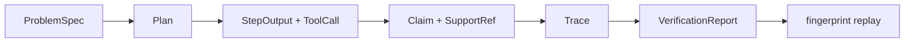

# bijux-canon-reason

<!-- bijux-canon-badges:generated:start -->
[](https://pypi.org/project/bijux-canon-reason/)
[-0A7BBB)](https://pypi.org/project/bijux-canon-reason/)
[](https://github.com/bijux/bijux-canon/blob/main/LICENSE)
[](https://github.com/bijux/bijux-canon/actions/workflows/verify.yml?query=branch%3Amain)
[](https://github.com/bijux/bijux-canon)

[](https://pypi.org/project/bijux-canon-reason/)
[](https://pypi.org/project/bijux-canon-runtime/)
[](https://pypi.org/project/bijux-canon/)
[](https://pypi.org/project/bijux-canon-agent/)
[](https://pypi.org/project/bijux-canon-ingest/)
[](https://pypi.org/project/bijux-canon-index/)
[](https://pypi.org/project/agentic-flows/)
[](https://pypi.org/project/bijux-agent/)
[](https://pypi.org/project/bijux-rag/)
[](https://pypi.org/project/bijux-rar/)
[](https://pypi.org/project/bijux-vex/)

[](https://github.com/bijux/bijux-canon/pkgs/container/bijux-canon%2Fbijux-canon-reason)
[](https://github.com/bijux/bijux-canon/pkgs/container/bijux-canon%2Fbijux-canon-runtime)
[](https://github.com/bijux/bijux-canon/pkgs/container/bijux-canon%2Fbijux-canon)
[](https://github.com/bijux/bijux-canon/pkgs/container/bijux-canon%2Fbijux-canon-agent)
[](https://github.com/bijux/bijux-canon/pkgs/container/bijux-canon%2Fbijux-canon-ingest)
[](https://github.com/bijux/bijux-canon/pkgs/container/bijux-canon%2Fbijux-canon-index)
[](https://github.com/bijux/bijux-canon/pkgs/container/bijux-canon%2Fagentic-flows)
[](https://github.com/bijux/bijux-canon/pkgs/container/bijux-canon%2Fbijux-agent)
[](https://github.com/bijux/bijux-canon/pkgs/container/bijux-canon%2Fbijux-rag)
[](https://github.com/bijux/bijux-canon/pkgs/container/bijux-canon%2Fbijux-rar)
[](https://github.com/bijux/bijux-canon/pkgs/container/bijux-canon%2Fbijux-vex)

[](https://bijux.io/bijux-canon/04-bijux-canon-reason/)
[](https://bijux.io/bijux-canon/06-bijux-canon-runtime/)
[](https://bijux.io/bijux-canon/05-bijux-canon-agent/)
[](https://bijux.io/bijux-canon/02-bijux-canon-ingest/)
[](https://bijux.io/bijux-canon/03-bijux-canon-index/)
<!-- bijux-canon-badges:generated:end -->

`bijux-canon-reason` is the package that turns available evidence into planned
reasoning steps, structured claims, and verification outcomes. It is where
reasoning behavior is made explicit enough to inspect, test, and defend.

If you need to understand how claims are formed, how reasoning steps are
planned and executed, how evidence is used, or where verification lives, start
here. If you need runtime governance, storage, or vector execution internals,
you are outside this package's boundary.

## Reasoning Record



The package root exports the stable model and validation vocabulary:
`ProblemSpec`, `Plan`, `PlanNode`, `Claim`, `EvidenceRef`, `SupportRef`,
`ToolRequest`, `ToolResult`, `Trace`, `VerificationCheck`, and
`VerificationReport`, together with canonical serialization, fingerprinting,
stable-ID, and validation helpers.

Support is content-addressed. A `SupportRef` records whether it refers to a
claim, evidence item, or tool call; its source identity; an exact non-empty
span; and the SHA-256 digest of the cited snippet. Claims separately record
their observed, assumed, or derived type and proposed, validated, or rejected
status.

## CLI Workflow

```bash
bijux-canon-reason run \
  --spec problem.json \
  --preset default \
  --seed 0 \
  --artifacts-dir artifacts/bijux-canon-reason \
  --fail-on-verify \
  --json

bijux-canon-reason verify \
  --trace artifacts/bijux-canon-reason/runs/<run-id>/trace.jsonl \
  --plan artifacts/bijux-canon-reason/runs/<run-id>/plan.json \
  --fail-on-verify --json

bijux-canon-reason replay \
  --trace artifacts/bijux-canon-reason/runs/<run-id>/trace.jsonl \
  --fail-on-diff --json

bijux-canon-reason research \
  --input research-input.json \
  --artifacts-dir artifacts/bijux-canon-reason --json
```

`run` writes `spec.json`, `plan.json`, `trace.jsonl`, `verify.json`,
`fingerprint.txt`, `run_meta.json`, and `manifest.json` beneath a stable run
identifier. The manifest and invariant checksum bind the inputs, plan, trace,
runtime descriptor, schema version, and producer version.

Bounded RAR uses one `ResearchApplicationService` across the package-root API,
the canonical command, and the `bijux-rar` compatibility command. A research
record binds verified graph synthesis, exact evidence provenance, immutable
attempts, replayed states, and their attributed comparison. The `inspect`,
`verify --research-id`, `replay --research-id`, and `compare` commands all load
that same manifested record after restart.

The `eval` command loads a named suite from a declared suite root, retains every
case run, and writes case and summary diagnostics. Those diagnostics do not
replace reviewed retrieval, claim, citation, or refusal truth.

## Local Grounded Answers

`LocalGroundedAnswerService` owns the credential-free RAG boundary. It consumes
retrieved document chunks, selects question-relevant finding, method,
limitation, counterevidence, and definition clauses, removes repeated facts,
normalizes atomic claims, binds exact locators and hashes, verifies direct
support, and applies the grounding admission decision before rendering an
answer. Each normalized claim retains typed modality, negation, population,
temporal, and quantitative qualifiers extracted conservatively from its exact
answer span. Questions, transition-only text, and explicit personal opinions
cannot enter the factual claim set or inflate claim metrics.

Bibliographic fields are integrity and discovery inputs; they are not answer
evidence. An admitted local answer is derived from the retrieved publication
content. A request for an unsupported universal guarantee produces an
abstention with no claims or citations, even when retrieval returns incidental
mentions of related methods or yields.

Credential-free synthesis uses a closed set of conservative projections, such
as removing source-attribution boilerplate or resolving a labeled definition.
The verifier independently reproduces the projection from exact cited text;
arbitrary paraphrases, lexical overlap, and same-document matches do not count
as support. Provider paths are optional and lazy. Context records distinguish
citation integrity from unassessed study quality, and conflict-oriented
questions preserve divergent source-scoped claims without declaring a
contradiction that has not been semantically verified.

## HTTP Contract

The v1 API supports health, item CRUD, run creation, run lookup, manifest and
trace retrieval, verification, and replay. Its source, pinned representation,
and digest live under
[`apis/bijux-canon-reason/v1/`](../../apis/bijux-canon-reason/v1/).

## Evaluate A Reasoning Claim

| Question | Evidence to inspect | What is not enough |
| --- | --- | --- |
| Where did the claim originate? | claim kind, introducing event, plan node, stable identity | final prose alone |
| Which bytes support it? | evidence identity, exact span, snippet digest, `SupportRef` | a source title or confidence score |
| Was it validated or rejected? | verification checks, findings, claim status, policy disposition | trace completion alone |
| Is the run complete? | manifest, file digests, invariant checksum, producer and schema versions | presence of a run directory |
| Did replay match? | original and replay fingerprints plus diff summary | similar-looking output |

Verification proves that registered checks passed over retained evidence. It
does not prove corpus completeness, scientific truth, or correctness of an
unstated inference.

## Preserve Claim Custody

A consumer needs more than the claim text. Carry the content-addressed claim
identity, kind and status, exact support references, verification findings,
plan node, trace identity, and run manifest together. This separates three
questions that are often conflated: what the source said, what inference was
made from it, and which checks accepted or rejected that inference.

Agent may schedule work that produces or consumes these records, but its trace
does not supersede reasoning verification. Runtime may accept a completed
workflow, but acceptance does not promote a proposed or rejected claim to
validated status.

## Package Continuity

[`bijux-rar`](https://pypi.org/project/bijux-rar/) is an exact-version
compatibility distribution for this package. It preserves the `bijux_rar`
import root and delegates to canonical reasoning modules. The
`bijux-canon-reason` distribution currently registers both the
`bijux-canon-reason` and `bijux-rar` commands against the same canonical
application; command continuity does not make the old Python root canonical.

Use `bijux_canon_reason` and `bijux-canon-reason` in new integrations. Follow
the [migration guide](https://bijux.io/bijux-canon/08-compat-packages/migration/migration-guidance/)
to validate plans, claims, traces, provenance, and stored-artifact readers. The
former [`bijux/bijux-rar`](https://github.com/bijux/bijux-rar) repository is
historical; current implementation authority is this repository.

## Package Boundary

Reason owns content-addressed planning, local tool execution, evidence-linked
claims, reasoning traces, and reasoning-level verification. It consumes
prepared and retrieved evidence without taking ownership of source
normalization or vector ranking. Agent may coordinate several reasoning calls;
runtime decides whether the resulting whole run is acceptable and durable.

Structured provider synthesis is part of the base installation and uses the
standard-library HTTP client against an OpenAI-compatible endpoint. There is no
provider SDK extra to install. Credential-free workflows do not resolve provider
credentials; a credential is requested lazily only when that provider path is
selected.

Downstream consumers should preserve the run manifest and exact support
references. Rebuilding a citation from display text loses the byte-level
contract that verification and replay depend on.

## Runtime Reasoning Adapter

Runtime adapts an installed retrieval evidence set into Reason's immutable
evidence packet and calls `LocalGroundedAnswerService`. Reason owns synthesis,
claim normalization, citation linking and verification, context, conflict
representation, abstention, and the final safe answer text. Runtime persists
the complete Reason artifacts and independently reproduces normalization,
citation verification, grounding admission, and answer rendering before a run
can complete.

The adapter is exercised from the public `bijux-canon-runtime v2 ask` command.
Its output retains the corpus, index generation, retrieval trace, evidence
packet, source descriptors, claim graph, exact citations, admission decision,
and content-addressed grounded-answer identity. Runtime composition does not
replace Reason policy with runtime-owned generated prose.

## Verification And Failure Semantics

- trace and plan validation reject invalid topology and inconsistent event
  structure before successful verification
- evidence paths are constrained and provenance references are checked rather
  than trusted as arbitrary filesystem input
- `--fail-on-verify` promotes verification findings to exit status `2` while
  retaining the machine-readable report
- replay compares original and reproduced trace fingerprints and returns a diff
  summary on mismatch
- disk, wall-time, CPU, corpus-size, and retrieval limits are explicit runtime
  controls, not undocumented environment behavior

## Source Map

- [`src/bijux_canon_reason/planning`](https://github.com/bijux/bijux-canon/tree/main/packages/bijux-canon-reason/src/bijux_canon_reason/planning) for planning behavior
- [`src/bijux_canon_reason/reasoning`](https://github.com/bijux/bijux-canon/tree/main/packages/bijux-canon-reason/src/bijux_canon_reason/reasoning) for claim and reasoning semantics
- [`src/bijux_canon_reason/execution`](https://github.com/bijux/bijux-canon/tree/main/packages/bijux-canon-reason/src/bijux_canon_reason/execution) for step execution
- [`src/bijux_canon_reason/verification`](https://github.com/bijux/bijux-canon/tree/main/packages/bijux-canon-reason/src/bijux_canon_reason/verification) for checks and outcomes
- [`src/bijux_canon_reason/interfaces`](https://github.com/bijux/bijux-canon/tree/main/packages/bijux-canon-reason/src/bijux_canon_reason/interfaces) and [`src/bijux_canon_reason/api`](https://github.com/bijux/bijux-canon/tree/main/packages/bijux-canon-reason/src/bijux_canon_reason/api) for boundaries
- [`tests`](https://github.com/bijux/bijux-canon/tree/main/packages/bijux-canon-reason/tests) for executable protection of the package contract

## Read this next

- [Package guide](https://bijux.io/bijux-canon/04-bijux-canon-reason/)
- [Ownership boundary](https://bijux.io/bijux-canon/04-bijux-canon-reason/foundation/ownership-boundary/)
- [Architecture overview](https://bijux.io/bijux-canon/04-bijux-canon-reason/architecture/)
- [Interface contracts](https://bijux.io/bijux-canon/04-bijux-canon-reason/interfaces/)
- [Compatibility packages](https://bijux.io/bijux-canon/08-compat-packages/)
- [Test strategy](https://bijux.io/bijux-canon/04-bijux-canon-reason/quality/test-strategy/)
- [Changelog](https://github.com/bijux/bijux-canon/blob/main/packages/bijux-canon-reason/CHANGELOG.md)

## Primary entrypoint

- console script: `bijux-canon-reason`
- package history: [`CHANGELOG.md`](CHANGELOG.md)
