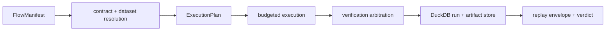
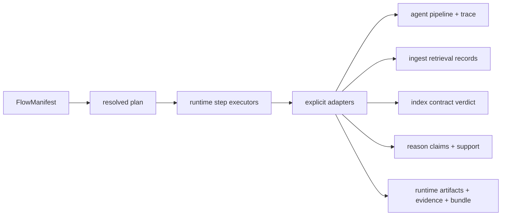

# bijux-canon-runtime

<!-- bijux-canon-badges:generated:start -->
[](https://pypi.org/project/bijux-canon-runtime/)
[-0A7BBB)](https://pypi.org/project/bijux-canon-runtime/)
[](https://github.com/bijux/bijux-canon/blob/main/LICENSE)
[](https://github.com/bijux/bijux-canon/actions/workflows/verify.yml?query=branch%3Amain)
[](https://github.com/bijux/bijux-canon)

[](https://pypi.org/project/bijux-canon-runtime/)
[](https://pypi.org/project/bijux-canon/)
[](https://pypi.org/project/bijux-canon-agent/)
[](https://pypi.org/project/bijux-canon-ingest/)
[](https://pypi.org/project/bijux-canon-reason/)
[](https://pypi.org/project/bijux-canon-index/)
[](https://pypi.org/project/agentic-flows/)
[](https://pypi.org/project/bijux-agent/)
[](https://pypi.org/project/bijux-rag/)
[](https://pypi.org/project/bijux-rar/)
[](https://pypi.org/project/bijux-vex/)

[](https://github.com/bijux/bijux-canon/pkgs/container/bijux-canon%2Fbijux-canon-runtime)
[](https://github.com/bijux/bijux-canon/pkgs/container/bijux-canon%2Fbijux-canon)
[](https://github.com/bijux/bijux-canon/pkgs/container/bijux-canon%2Fbijux-canon-agent)
[](https://github.com/bijux/bijux-canon/pkgs/container/bijux-canon%2Fbijux-canon-ingest)
[](https://github.com/bijux/bijux-canon/pkgs/container/bijux-canon%2Fbijux-canon-reason)
[](https://github.com/bijux/bijux-canon/pkgs/container/bijux-canon%2Fbijux-canon-index)
[](https://github.com/bijux/bijux-canon/pkgs/container/bijux-canon%2Fagentic-flows)
[](https://github.com/bijux/bijux-canon/pkgs/container/bijux-canon%2Fbijux-agent)
[](https://github.com/bijux/bijux-canon/pkgs/container/bijux-canon%2Fbijux-rag)
[](https://github.com/bijux/bijux-canon/pkgs/container/bijux-canon%2Fbijux-rar)
[](https://github.com/bijux/bijux-canon/pkgs/container/bijux-canon%2Fbijux-vex)

[](https://bijux.io/bijux-canon/06-bijux-canon-runtime/)
[](https://bijux.io/bijux-canon/05-bijux-canon-agent/)
[](https://bijux.io/bijux-canon/02-bijux-canon-ingest/)
[](https://bijux.io/bijux-canon/04-bijux-canon-reason/)
[](https://bijux.io/bijux-canon/03-bijux-canon-index/)
<!-- bijux-canon-badges:generated:end -->

`bijux-canon-runtime` is the package that decides whether and how a flow runs,
what gets recorded about that run, and how a later replay should be judged. It
is the authority layer for execution, replay, runtime persistence, and
non-determinism governance.

If you need to understand plan versus run modes, replay acceptance, trace
capture, execution-store behavior, or non-determinism policy enforcement, start
here.

## Authority Model



The manifest declares flow and tenant identity, state, determinism level,
replay acceptability, entropy budget, replay envelope, dataset descriptor,
agents, dependencies, retrieval contracts, verification gates, allowed
variance, nondeterminism intent, and replay mode. It is immutable structural
input; resolution and execution enforce semantic validity.

Runtime authority is narrower than arbitrary orchestration power. Authority
tokens constrain who may execute or override a decision. Verification rules
run at declared phases, and arbitration determines whether findings block,
qualify, or permit continuation. Human intervention is recorded as replayable
state rather than an invisible exception.

## Run Modes

| Mode | Execution | Persistence and authority posture |
| --- | --- | --- |
| `plan` | resolves and constructs the immutable plan | no step execution |
| `dry-run` | exercises preparation and checks | no normal live side effects |
| `live` | runs declared steps | full policy, trace, verification, and persistence path |
| `observe` | observes execution evidence | does not silently acquire live authority |
| `unsafe` | permits explicitly reduced guarantees | remains labelled unsafe in the run record |

Plan and dry-run do not invoke lower-package intelligence. Observe evaluates a
supplied run. Those modes can prove planning, synthetic execution records, or
verification behavior without proving that live package adapters are
callable. Live and unsafe execution cross the adapter boundary when their
steps require agent, retrieval, vector-contract, or reasoning work.

## Executable Integration Boundary



The step executors currently resolve four package-root callables. None is
provided by the installed canonical package roots:

| Runtime request | Current package truth | Consequence |
| --- | --- | --- |
| `bijux_canon_agent.run(...)` | the root exports only `API_VERSION` | no live agent handoff |
| `bijux_canon_ingest.retrieve(query, top_k, scope, vector_contract_id)` | retrieval is a path-based application API with a different typed contract | no lossless retrieval handoff |
| `bijux_canon_index.enforce_contract(contract_id, evidence)` | the root exports version metadata only | no live vector-contract verdict |
| `bijux_canon_reason.reason(...) -> ReasoningBundle` | the root exports reason-owned models and validators, not this callable or runtime type | no live reasoning handoff |

The `bijux-agent`, `bijux-rag`, `bijux-vex`, and `bijux-rar` compatibility roots
delegate to their canonical packages; they do not supply extra adapter
behavior. Consequently, aligned package versions and successful imports are
dependency evidence, not end-to-end execution evidence.

Each adapter must be explicit about model conversion and custody: agent traces
to runtime artifacts, prepared retrieval records to runtime evidence, index
decisions to contract verdicts, and reason claims and support to runtime
bundles. The acceptance bar is an installed-package test that executes every
applicable loader and verifies identity, failure, and provenance preservation
through the resulting runtime records.

## CLI Workflow

```bash
bijux-canon-runtime run flow.json \
  --policy policy.json \
  --db-path artifacts/bijux-canon-runtime/runs.duckdb \
  --strict-determinism --json

bijux-canon-runtime replay flow.json \
  --policy policy.json \
  --run-id <run-id> \
  --tenant-id <tenant-id> \
  --db-path artifacts/bijux-canon-runtime/runs.duckdb \
  --strict-determinism --json

bijux-canon-runtime inspect run <run-id> \
  --tenant-id <tenant-id> \
  --db-path artifacts/bijux-canon-runtime/runs.duckdb --json
```

The CLI also implements `plan`, `dry-run`, `unsafe-run`, run diff, failure
explanation, and database validation commands. Those commands are currently
suppressed from the top-level help display; their presence must not be confused
with the three prominently advertised commands.

The live `run` syntax above documents the CLI contract. With the canonical
package family as shipped, a flow that reaches one of the four integrations
stops at its missing or incompatible callable. Use `plan` to inspect resolution
without step execution and `dry-run` for the package's intelligence-free
synthetic trace path; neither is a substitute for a successful live adapter
test.

## HTTP Contract

The experimental v1 application implements health and DuckDB readiness probes.
Run and replay requests are schema-validated and require authority headers, but
both endpoints currently return `501 Not Implemented`; no successful
`FlowRunResponse` is produced over HTTP today. The tracked future-facing
contract is pinned under
[`apis/bijux-canon-runtime/v1/`](../../apis/bijux-canon-runtime/v1/).

## Evaluate A Runtime Claim

| Claim | Evidence to inspect | What is not enough |
| --- | --- | --- |
| execution was authorized | authority token, manifest, resolved plan, mode, policy fingerprint | a completed lower-package call |
| the run is accepted | finalized trace, verification results, arbitration, certifiability | trace finalization alone |
| resume preserved identity | tenant, manifest, plan, dataset, policy, checkpoint, store | reusing a run ID |
| replay is exact | original envelope, retained inputs, event/artifact identity, verdict | similar final output |
| bounded replay is acceptable | original variance declaration and evaluated semantic diff | tolerance chosen after divergence |

Runtime records and judges declared execution. It cannot make an external tool
transactional, recover state that was never captured, or infer determinism
from a seed alone.

## Minimal Example

```python
from bijux_canon_runtime import RunMode, execute_flow
from bijux_canon_runtime.application.execute_flow import ExecutionConfig

result = execute_flow(
    manifest=my_manifest,
    config=ExecutionConfig(
        mode=RunMode.PLAN,
        determinism_level=my_manifest.determinism_level,
    ),
)
print(result.resolved_flow.manifest.flow_id)
assert result.trace is None
assert result.run_id is None
```

The default `execute_flow(manifest)` selects live, strict execution; it is not a
preview. Executable modes need a write store and the verification, authority,
and nondeterminism resources required by their policy.

The dependency-light package root exposes exactly `FlowManifest`, `RunMode`,
and `execute_flow`; the latter two are resolved lazily. Broader runtime models,
stores, policies, and service adapters remain in their owning modules. This
small root is an integration contract, not evidence that runtime hides the
lower-package boundaries it governs.

Treat result status as a lattice of distinct facts: step execution, trace
finalization, verification arbitration, certifiability, acceptance, and replay
verdict. A consumer that stores only “success” loses the distinction needed to
audit or safely replay the run.

## Package Continuity

[`bijux-canon`](https://pypi.org/project/bijux-canon/) and
[`agentic-flows`](https://pypi.org/project/agentic-flows/) are exact-version
compatibility distributions for this package. They preserve the
`bijux_canon` / `agentic_flows` import roots and the `bijux-canon` /
`agentic-flows` commands while delegating to runtime's modules and CLI. Neither
is an umbrella install for the complete package family or a separate runtime
implementation.

Use `bijux_canon_runtime` and `bijux-canon-runtime` in new integrations. See
the [compatibility catalog](https://bijux.io/bijux-canon/08-compat-packages/catalog/)
for verified mappings and the
[migration guide](https://bijux.io/bijux-canon/08-compat-packages/migration/migration-guidance/)
for consumer changes. The former
[`bijux/agentic-flows`](https://github.com/bijux/agentic-flows) repository is
historical; current implementation authority is this repository.

## Package Boundary

Runtime owns flow planning, execution authority, verification arbitration,
trace finalization, execution persistence, resume, and replay verdicts. It
consumes ingest, index, reason, and agent artifacts without redefining their
domain semantics. The execution store records external effects; it cannot roll
them back, so live executors require idempotency or compensation at their own
boundary.

## Persistence And Replay Evidence

- execution traces use stable event identity and causal ordering
- semantic run and request-plan identities include the effective Runtime
  configuration hash; changing retrieval policy, model, resource policy, or
  workspace authority cannot reuse an older execution as if behavior were
  unchanged
- artifacts carry tenant, type, scope, producer, parent, and content-hash
  identity; the artifact model does not contain the content payload
- the DuckDB execution store persists run and dataset identity, steps, events
  and their JSON payloads, checkpoints, artifact metadata, evidence metadata,
  entropy, tool invocations, and claim identifiers
- the run row retains the verification-policy fingerprint and arbitration
  decision, while verification and intervention detail may appear in events;
  there are no dedicated per-engine verification-result or replay-analysis
  tables in the current schema
- replay compares stored and current policy, dataset, environment, plan,
  entropy, and artifact identities before issuing a verdict
- crash recovery and partial failure retain recorded state rather than
  presenting an incomplete run as complete

The installed local composition stores immutable payloads in the workspace CAS
and registers every verified descriptor and dependency in the same DuckDB that
owns durable jobs and execution metadata. Job requests and results are CAS
objects linked by foreign keys, not private JSON in a second live database. A
legacy `jobs.sqlite` file is read only as migration input; new job transitions
are authoritative in `runtime.duckdb`. Moving or restoring a workspace therefore
requires the governed backup/restore path; a database file without its verified
CAS is not a complete Runtime authority.

Installed research traces persist the complete candidate-adjudication reports,
not merely retrieval hit identifiers. Verification recomputes each report and
classification identity and requires coverage of every candidate across the
search history. The trace therefore retains the exact citation locator and text
hash behind supporting, opposing, limiting, irrelevant, ambiguous, or
unclassified evidence; a completed state cannot conceal material unclassified
content.

## Source Map

- [`src/bijux_canon_runtime/model`](https://github.com/bijux/bijux-canon/tree/main/packages/bijux-canon-runtime/src/bijux_canon_runtime/model) for durable runtime models
- [`src/bijux_canon_runtime/runtime`](https://github.com/bijux/bijux-canon/tree/main/packages/bijux-canon-runtime/src/bijux_canon_runtime/runtime) for execution engines and lifecycle logic
- [`src/bijux_canon_runtime/application`](https://github.com/bijux/bijux-canon/tree/main/packages/bijux-canon-runtime/src/bijux_canon_runtime/application) for orchestration and replay coordination
- [`src/bijux_canon_runtime/observability`](https://github.com/bijux/bijux-canon/tree/main/packages/bijux-canon-runtime/src/bijux_canon_runtime/observability) for trace capture, analysis, and storage support
- [`src/bijux_canon_runtime/interfaces`](https://github.com/bijux/bijux-canon/tree/main/packages/bijux-canon-runtime/src/bijux_canon_runtime/interfaces) and [`src/bijux_canon_runtime/api`](https://github.com/bijux/bijux-canon/tree/main/packages/bijux-canon-runtime/src/bijux_canon_runtime/api) for boundaries
- [`tests`](https://github.com/bijux/bijux-canon/tree/main/packages/bijux-canon-runtime/tests) and [`examples`](https://github.com/bijux/bijux-canon/tree/main/packages/bijux-canon-runtime/examples) for executable expectations and teaching material

## Read this next

- [Package guide](https://bijux.io/bijux-canon/06-bijux-canon-runtime/)
- [Ownership boundary](https://bijux.io/bijux-canon/06-bijux-canon-runtime/foundation/ownership-boundary/)
- [Architecture overview](https://bijux.io/bijux-canon/06-bijux-canon-runtime/architecture/)
- [Interface contracts](https://bijux.io/bijux-canon/06-bijux-canon-runtime/interfaces/)
- [Release and versioning](https://bijux.io/bijux-canon/06-bijux-canon-runtime/operations/release-and-versioning/)
- [Compatibility packages](https://bijux.io/bijux-canon/08-compat-packages/)
- [Changelog](https://github.com/bijux/bijux-canon/blob/main/packages/bijux-canon-runtime/CHANGELOG.md)

## Primary entrypoint

- console script: `bijux-canon-runtime`
- package history: [`CHANGELOG.md`](CHANGELOG.md)
