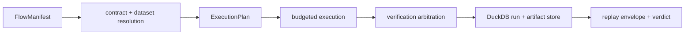

# bijux-canon-runtime

<!-- bijux-canon-badges:generated:start -->
[](https://pypi.org/project/bijux-canon-runtime/)
[-0A7BBB)](https://pypi.org/project/bijux-canon-runtime/)
[](https://github.com/bijux/bijux-canon/blob/main/LICENSE)
[](https://github.com/bijux/bijux-canon/actions/workflows/verify.yml?query=branch%3Amain)
[](https://github.com/bijux/bijux-canon)

[](https://pypi.org/project/bijux-canon-runtime/)
[](https://pypi.org/project/bijux-canon/)
[](https://pypi.org/project/bijux-canon-agent/)
[](https://pypi.org/project/bijux-canon-ingest/)
[](https://pypi.org/project/bijux-canon-reason/)
[](https://pypi.org/project/bijux-canon-index/)
[](https://pypi.org/project/agentic-flows/)
[](https://pypi.org/project/bijux-agent/)
[](https://pypi.org/project/bijux-rag/)
[](https://pypi.org/project/bijux-rar/)
[](https://pypi.org/project/bijux-vex/)

[](https://github.com/bijux/bijux-canon/pkgs/container/bijux-canon%2Fbijux-canon-runtime)
[](https://github.com/bijux/bijux-canon/pkgs/container/bijux-canon%2Fbijux-canon)
[](https://github.com/bijux/bijux-canon/pkgs/container/bijux-canon%2Fbijux-canon-agent)
[](https://github.com/bijux/bijux-canon/pkgs/container/bijux-canon%2Fbijux-canon-ingest)
[](https://github.com/bijux/bijux-canon/pkgs/container/bijux-canon%2Fbijux-canon-reason)
[](https://github.com/bijux/bijux-canon/pkgs/container/bijux-canon%2Fbijux-canon-index)
[](https://github.com/bijux/bijux-canon/pkgs/container/bijux-canon%2Fagentic-flows)
[](https://github.com/bijux/bijux-canon/pkgs/container/bijux-canon%2Fbijux-agent)
[](https://github.com/bijux/bijux-canon/pkgs/container/bijux-canon%2Fbijux-rag)
[](https://github.com/bijux/bijux-canon/pkgs/container/bijux-canon%2Fbijux-rar)
[](https://github.com/bijux/bijux-canon/pkgs/container/bijux-canon%2Fbijux-vex)

[](https://bijux.io/bijux-canon/06-bijux-canon-runtime/)
[](https://bijux.io/bijux-canon/05-bijux-canon-agent/)
[](https://bijux.io/bijux-canon/02-bijux-canon-ingest/)
[](https://bijux.io/bijux-canon/04-bijux-canon-reason/)
[](https://bijux.io/bijux-canon/03-bijux-canon-index/)
<!-- bijux-canon-badges:generated:end -->

`bijux-canon-runtime` is the package that decides whether and how a flow runs,
what gets recorded about that run, and how a later replay should be judged. It
is the authority layer for execution, replay, runtime persistence, and
non-determinism governance.

If you need to understand plan versus run modes, replay acceptance, trace
capture, execution-store behavior, or non-determinism policy enforcement, start
here.

## Authority Model



The manifest declares flow and tenant identity, state, determinism level,
replay acceptability, entropy budget, replay envelope, dataset descriptor,
agents, dependencies, retrieval contracts, verification gates, allowed
variance, nondeterminism intent, and replay mode. It is immutable structural
input; resolution and execution enforce semantic validity.

Runtime authority is narrower than arbitrary orchestration power. Authority
tokens constrain who may execute or override a decision. Verification rules
run at declared phases, and arbitration determines whether findings block,
qualify, or permit continuation. Human intervention is recorded as replayable
state rather than an invisible exception.

## Run Modes

| Mode | Execution | Persistence and authority posture |
| --- | --- | --- |
| `plan` | resolves and constructs the immutable plan | no step execution |
| `dry-run` | exercises preparation and checks | no normal live side effects |
| `live` | runs declared steps | full policy, trace, verification, and persistence path |
| `observe` | observes execution evidence | does not silently acquire live authority |
| `unsafe` | permits explicitly reduced guarantees | remains labelled unsafe in the run record |

## CLI Workflow

```bash
bijux-canon-runtime run flow.json \
  --policy policy.json \
  --db-path artifacts/bijux-canon-runtime/runs.duckdb \
  --strict-determinism --json

bijux-canon-runtime replay flow.json \
  --policy policy.json \
  --run-id <run-id> \
  --tenant-id <tenant-id> \
  --db-path artifacts/bijux-canon-runtime/runs.duckdb \
  --strict-determinism --json

bijux-canon-runtime inspect run <run-id> \
  --tenant-id <tenant-id> \
  --db-path artifacts/bijux-canon-runtime/runs.duckdb --json
```

The CLI also implements `plan`, `dry-run`, `unsafe-run`, run diff, failure
explanation, and database validation commands. Those commands are currently
suppressed from the top-level help display; their presence must not be confused
with the three prominently advertised commands.

## HTTP Contract

The v1 API exposes flow execution and replay plus health and readiness probes.
Responses carry run identity, status, result data, replay acceptability, and a
structured failure envelope. The contract is pinned under
[`apis/bijux-canon-runtime/v1/`](../../apis/bijux-canon-runtime/v1/).

## What This Package Takes And Produces

- takes: validated flow manifests or resolved execution plans plus explicit execution policy
- produces: flow run results, replayable traces, persisted run records, and contract failures when execution violates policy
- guarantees: runtime mode selection stays explicit, replay semantics are checked, and persisted outputs remain tied to one governed run id
- does not do: define agent behavior, own ingest or retrieval policy, or infer missing determinism from ambient state

## Minimal Example

```python
from bijux_canon_runtime import execute_flow

result = execute_flow(manifest=my_manifest)
print(result.resolved_flow.manifest.flow_id)
print(result.trace is not None)
print(result.run_id)
```

Expected shape:

- `result.resolved_flow` is always present
- `result.trace` is present for non-plan execution
- `result.run_id` is set once the runtime registers a persisted run

## Package continuity

- compatibility packages: [`bijux-canon`](https://pypi.org/project/bijux-canon/), [`agentic-flows`](https://pypi.org/project/agentic-flows/)
- preserved import roots: `bijux_canon`, `agentic_flows`
- preserved commands: `bijux-canon`, `agentic-flows`
- alias expectation: the preserved names above should resolve to the same
  runtime API and command behavior as `bijux-canon-runtime`
- family-root alias handbook: [bijux-canon alias handbook](https://bijux.io/bijux-canon/08-compat-packages/catalog/bijux-canon/)
- canonical migration guide: [Migration guidance](https://bijux.io/bijux-canon/08-compat-packages/migration/migration-guidance/)
- retired repository target: [https://github.com/bijux/agentic-flows](https://github.com/bijux/agentic-flows) (see [Repository consolidation notes](https://bijux.io/bijux-canon/08-compat-packages/migration/repository-consolidation/))

## What this package owns

- flow execution authority
- replay and acceptability semantics
- trace capture, runtime persistence, and execution-store behavior
- package-local CLI and API boundaries

## What this package does not own

- agent composition policy
- ingest or index domain ownership
- repository tooling and release support

## Persistence And Replay Evidence

- execution traces use stable event identity and causal ordering
- artifacts carry type, scope, producer, run, dataset, and contract identity
- the DuckDB execution store persists runs, events, envelopes, budgets,
  verification results, interventions, and replay analysis
- replay compares stored and current policy, dataset, environment, plan,
  entropy, and artifact identities before issuing a verdict
- crash recovery and partial failure retain recorded state rather than
  presenting an incomplete run as complete

## Source map

- [`src/bijux_canon_runtime/model`](https://github.com/bijux/bijux-canon/tree/main/packages/bijux-canon-runtime/src/bijux_canon_runtime/model) for durable runtime models
- [`src/bijux_canon_runtime/runtime`](https://github.com/bijux/bijux-canon/tree/main/packages/bijux-canon-runtime/src/bijux_canon_runtime/runtime) for execution engines and lifecycle logic
- [`src/bijux_canon_runtime/application`](https://github.com/bijux/bijux-canon/tree/main/packages/bijux-canon-runtime/src/bijux_canon_runtime/application) for orchestration and replay coordination
- [`src/bijux_canon_runtime/observability`](https://github.com/bijux/bijux-canon/tree/main/packages/bijux-canon-runtime/src/bijux_canon_runtime/observability) for trace capture, analysis, and storage support
- [`src/bijux_canon_runtime/interfaces`](https://github.com/bijux/bijux-canon/tree/main/packages/bijux-canon-runtime/src/bijux_canon_runtime/interfaces) and [`src/bijux_canon_runtime/api`](https://github.com/bijux/bijux-canon/tree/main/packages/bijux-canon-runtime/src/bijux_canon_runtime/api) for boundaries
- [`tests`](https://github.com/bijux/bijux-canon/tree/main/packages/bijux-canon-runtime/tests) and [`examples`](https://github.com/bijux/bijux-canon/tree/main/packages/bijux-canon-runtime/examples) for executable expectations and teaching material

## Read this next

- [Package guide](https://bijux.io/bijux-canon/06-bijux-canon-runtime/)
- [Ownership boundary](https://bijux.io/bijux-canon/06-bijux-canon-runtime/foundation/ownership-boundary/)
- [Architecture overview](https://bijux.io/bijux-canon/06-bijux-canon-runtime/architecture/)
- [Interface contracts](https://bijux.io/bijux-canon/06-bijux-canon-runtime/interfaces/)
- [Release and versioning](https://bijux.io/bijux-canon/06-bijux-canon-runtime/operations/release-and-versioning/)
- [Compatibility packages](https://bijux.io/bijux-canon/08-compat-packages/)
- [Changelog](https://github.com/bijux/bijux-canon/blob/main/packages/bijux-canon-runtime/CHANGELOG.md)

## Primary entrypoint

- console script: `bijux-canon-runtime`

## Release Readiness

- release line prepared for publish: `0.3.9`
- release date: `2026-07-04`
- package changelog: [`CHANGELOG.md`](CHANGELOG.md)
