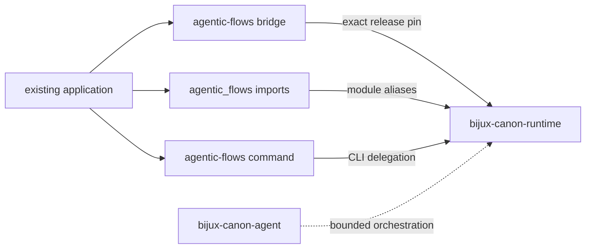

# agentic-flows

<!-- bijux-canon-badges:generated:start -->
[](https://pypi.org/project/agentic-flows/)
[-0A7BBB)](https://pypi.org/project/agentic-flows/)
[](https://github.com/bijux/bijux-canon/blob/main/LICENSE)
[](https://github.com/bijux/bijux-canon/actions/workflows/verify.yml?query=branch%3Amain)
[](https://github.com/bijux/bijux-canon)

[](https://pypi.org/project/agentic-flows/)
[](https://pypi.org/project/bijux-canon-runtime/)
[](https://pypi.org/project/bijux-canon/)
[](https://pypi.org/project/bijux-canon-agent/)
[](https://pypi.org/project/bijux-canon-ingest/)
[](https://pypi.org/project/bijux-canon-reason/)
[](https://pypi.org/project/bijux-canon-index/)
[](https://pypi.org/project/bijux-agent/)
[](https://pypi.org/project/bijux-rag/)
[](https://pypi.org/project/bijux-rar/)
[](https://pypi.org/project/bijux-vex/)

[](https://github.com/bijux/bijux-canon/pkgs/container/bijux-canon%2Fagentic-flows)
[](https://github.com/bijux/bijux-canon/pkgs/container/bijux-canon%2Fbijux-canon-runtime)
[](https://github.com/bijux/bijux-canon/pkgs/container/bijux-canon%2Fbijux-canon)
[](https://github.com/bijux/bijux-canon/pkgs/container/bijux-canon%2Fbijux-canon-agent)
[](https://github.com/bijux/bijux-canon/pkgs/container/bijux-canon%2Fbijux-canon-ingest)
[](https://github.com/bijux/bijux-canon/pkgs/container/bijux-canon%2Fbijux-canon-reason)
[](https://github.com/bijux/bijux-canon/pkgs/container/bijux-canon%2Fbijux-canon-index)
[](https://github.com/bijux/bijux-canon/pkgs/container/bijux-canon%2Fbijux-agent)
[](https://github.com/bijux/bijux-canon/pkgs/container/bijux-canon%2Fbijux-rag)
[](https://github.com/bijux/bijux-canon/pkgs/container/bijux-canon%2Fbijux-rar)
[](https://github.com/bijux/bijux-canon/pkgs/container/bijux-canon%2Fbijux-vex)

[](https://bijux.io/bijux-canon/06-bijux-canon-runtime/)
[](https://bijux.io/bijux-canon/05-bijux-canon-agent/)
[](https://bijux.io/bijux-canon/02-bijux-canon-ingest/)
[](https://bijux.io/bijux-canon/04-bijux-canon-reason/)
[](https://bijux.io/bijux-canon/03-bijux-canon-index/)
<!-- bijux-canon-badges:generated:end -->

`agentic-flows` preserves the former runtime distribution, Python package, and
command while execution ownership lives in
[`bijux-canon-runtime`](../bijux-canon-runtime/README.md). It exists so an
application can move deliberately without carrying two runtime
implementations.

Despite the name, this bridge targets the full runtime—not
`bijux-canon-agent`. Runtime owns flow admission, execution, persistence,
resume, and replay. Agent owns bounded role orchestration used beneath that
runtime.

## Install

```bash
python3.11 -m pip install agentic-flows
agentic-flows --help
python3.11 -m agentic_flows --help
```

The built wheel requires `bijux-canon-runtime` at the bridge's exact release.
This synchronized dependency is the basis of compatibility: the former name
cannot resolve to an arbitrary newer or older runtime.

## Identity Map

| Consumer surface | Preserved identity | Canonical identity |
| --- | --- | --- |
| distribution | `agentic-flows` | `bijux-canon-runtime` |
| Python package | `agentic_flows` | `bijux_canon_runtime` |
| console command | `agentic-flows` | `bijux-canon-runtime` |
| module execution | `python -m agentic_flows` | `python -m bijux_canon_runtime` |
| CLI module | `agentic_flows.interfaces.cli.entrypoint` | `bijux_canon_runtime.interfaces.cli.entrypoint` |
| representative model | `agentic_flows.model.flows.manifest.FlowManifest` | `bijux_canon_runtime.model.flows.manifest.FlowManifest` |



## Runtime Semantics

The `agentic_flows` root mirrors the canonical runtime's declared exports and
forwards attribute lookup lazily. A non-local nested import is resolved to the
corresponding `bijux_canon_runtime` module object. Classes imported under the
two names retain object identity rather than becoming parallel definitions.

Both the compatibility executable and module entrypoint call the canonical
runtime CLI. The bridge does not reinterpret flags, configuration, output,
exit status, run artifacts, or replay behavior.

## Verify A Consumer

Check identity at the Python boundary:

```python
from agentic_flows import FlowManifest as CompatibilityManifest
from bijux_canon_runtime import FlowManifest as CanonicalManifest

assert CompatibilityManifest is CanonicalManifest
```

```bash
agentic-flows --help
agentic-flows --version
python3.11 -m agentic_flows --help
```

For production acceptance, run a representative flow under both executable
names and compare exit status, structured output, persisted artifacts, resume,
and replay. Import parity cannot prove that external providers, secrets,
storage, or old run data are valid in a specific deployment.

## Migrate To Runtime Ownership

New consumers should install `bijux-canon-runtime`, import
`bijux_canon_runtime`, and invoke `bijux-canon-runtime`. For an existing
consumer:

1. Replace `agentic-flows` in package metadata and lock files.
2. Replace root and nested `agentic_flows` imports.
3. Replace command invocations in shells, containers, schedulers, and
   operational instructions.
4. Search configuration, plugin metadata, and serialized values for dotted
   `agentic_flows.*` paths.
5. Compare representative run artifacts and replay results.
6. Remove the bridge after deployed environments no longer request or invoke
   the former identities.

Source, documentation, issues, and releases now belong to the
`bijux/bijux-canon` repository. The retired standalone repository remains
historical context, not the current implementation authority.

## Read Next

- [Runtime handbook](https://bijux.io/bijux-canon/06-bijux-canon-runtime/)
  for execution and replay semantics
- [Compatibility contract](https://bijux.io/bijux-canon/08-compat-packages/catalog/agentic-flows/)
  for preserved identities and evidence
- [Migration guidance](https://bijux.io/bijux-canon/08-compat-packages/migration/migration-guidance/)
  for consumer inventory and acceptance
- [Retired repository](https://github.com/bijux/agentic-flows) for historical
  context
- [Package changelog](https://github.com/bijux/bijux-canon/blob/main/packages/compat-agentic-flows/CHANGELOG.md) for release history
