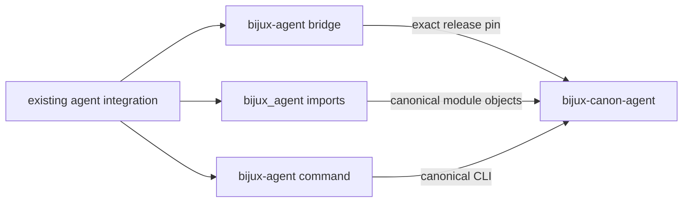

# bijux-agent

<!-- bijux-canon-badges:generated:start -->
[](https://pypi.org/project/bijux-agent/)
[-0A7BBB)](https://pypi.org/project/bijux-agent/)
[](https://github.com/bijux/bijux-canon/blob/main/LICENSE)
[](https://github.com/bijux/bijux-canon/actions/workflows/verify.yml?query=branch%3Amain)
[](https://github.com/bijux/bijux-canon)

[](https://pypi.org/project/bijux-agent/)
[](https://pypi.org/project/bijux-canon-runtime/)
[](https://pypi.org/project/bijux-canon/)
[](https://pypi.org/project/bijux-canon-agent/)
[](https://pypi.org/project/bijux-canon-ingest/)
[](https://pypi.org/project/bijux-canon-reason/)
[](https://pypi.org/project/bijux-canon-index/)
[](https://pypi.org/project/agentic-flows/)
[](https://pypi.org/project/bijux-rag/)
[](https://pypi.org/project/bijux-rar/)
[](https://pypi.org/project/bijux-vex/)

[](https://github.com/bijux/bijux-canon/pkgs/container/bijux-canon%2Fbijux-agent)
[](https://github.com/bijux/bijux-canon/pkgs/container/bijux-canon%2Fbijux-canon-runtime)
[](https://github.com/bijux/bijux-canon/pkgs/container/bijux-canon%2Fbijux-canon)
[](https://github.com/bijux/bijux-canon/pkgs/container/bijux-canon%2Fbijux-canon-agent)
[](https://github.com/bijux/bijux-canon/pkgs/container/bijux-canon%2Fbijux-canon-ingest)
[](https://github.com/bijux/bijux-canon/pkgs/container/bijux-canon%2Fbijux-canon-reason)
[](https://github.com/bijux/bijux-canon/pkgs/container/bijux-canon%2Fbijux-canon-index)
[](https://github.com/bijux/bijux-canon/pkgs/container/bijux-canon%2Fagentic-flows)
[](https://github.com/bijux/bijux-canon/pkgs/container/bijux-canon%2Fbijux-rag)
[](https://github.com/bijux/bijux-canon/pkgs/container/bijux-canon%2Fbijux-rar)
[](https://github.com/bijux/bijux-canon/pkgs/container/bijux-canon%2Fbijux-vex)

[](https://bijux.io/bijux-canon/06-bijux-canon-runtime/)
[](https://bijux.io/bijux-canon/05-bijux-canon-agent/)
[](https://bijux.io/bijux-canon/02-bijux-canon-ingest/)
[](https://bijux.io/bijux-canon/04-bijux-canon-reason/)
[](https://bijux.io/bijux-canon/03-bijux-canon-index/)
<!-- bijux-canon-badges:generated:end -->

`bijux-agent` preserves an earlier distribution, import root, and command for
[`bijux-canon-agent`](../bijux-canon-agent/README.md). It lets existing agent
integrations keep their established identities while orchestration behavior,
policy, traces, and releases remain owned by the canonical package.

The bridge adds no scheduler, provider adapter, convergence policy, lifecycle
event, or trace format of its own.

## Install

```bash
python3.11 -m pip install bijux-agent
bijux-agent --help
python3.11 -m bijux_agent --help
```

The built wheel requires `bijux-canon-agent` at exactly the same release as the
bridge, so compatibility cannot silently span different agent contracts.

## Identity Map

| Consumer surface | Preserved identity | Canonical identity |
| --- | --- | --- |
| distribution | `bijux-agent` | `bijux-canon-agent` |
| Python package | `bijux_agent` | `bijux_canon_agent` |
| console command | `bijux-agent` | `bijux-canon-agent` |
| module execution | `python -m bijux_agent` | `python -m bijux_canon_agent` |
| CLI module | `bijux_agent.interfaces.cli.entrypoint` | `bijux_canon_agent.interfaces.cli.entrypoint` |
| representative contract | `bijux_agent.contracts.execution_plan.ExecutionPlan` | `bijux_canon_agent.contracts.execution_plan.ExecutionPlan` |



## Agent Semantics

The compatibility root mirrors the canonical package's declared `__all__` and
forwards attribute access. Nested aliases resolve to the same canonical module
objects, so an `ExecutionPlan` imported through either root is the same class.
That protects type checks, dependency-injection registries, and serializers
when both names coexist during migration.

The executable and module entrypoint call the canonical agent CLI directly.
The bridge does not rewrite role definitions, tool permissions, model calls,
convergence decisions, lifecycle events, output, or exit status.

## Verify A Consumer

Confirm the import boundary used by the integration:

```python
from bijux_agent.contracts.execution_plan import (
    ExecutionPlan as CompatibilityPlan,
)
from bijux_canon_agent.contracts.execution_plan import (
    ExecutionPlan as CanonicalPlan,
)

assert CompatibilityPlan is CanonicalPlan
```

```bash
bijux-agent --help
python3.11 -m bijux_agent --help
```

Then execute representative accepted and refused orchestration cases. Compare
exit status, structured results, ordered tool/model interactions, lifecycle
events, and trace artifacts. Import identity cannot validate provider
configuration, secrets, or a consumer's policy wiring.

## Migrate To Canonical Agent Ownership

New integrations should depend on `bijux-canon-agent`, import
`bijux_canon_agent`, and invoke `bijux-canon-agent`. Existing integrations
should also search beyond ordinary source imports:

1. replace distribution requirements and lock-file entries;
2. replace root and nested imports;
3. replace command calls in scripts, images, schedulers, and runbooks;
4. inspect pipeline manifests, plugin registries, dependency injection,
   provider configuration, fixtures, and serialized dotted paths;
5. compare representative successful and refused orchestration evidence; and
6. remove the bridge only after deployed consumers no longer request its
   distribution, package, or command.

Private paths from the earlier package are not promoted to permanent canonical
API by the alias mechanism.

## Read Next

- [Agent handbook](https://bijux.io/bijux-canon/05-bijux-canon-agent/)
  for orchestration behavior and evidence
- [Compatibility contract](https://bijux.io/bijux-canon/08-compat-packages/catalog/bijux-agent/)
  for preserved identity details
- [Migration guidance](https://bijux.io/bijux-canon/08-compat-packages/migration/migration-guidance/)
  for a complete consumer inventory
- [Retired repository](https://github.com/bijux/bijux-agent) for historical
  context
- [Package changelog](CHANGELOG.md) for release history
