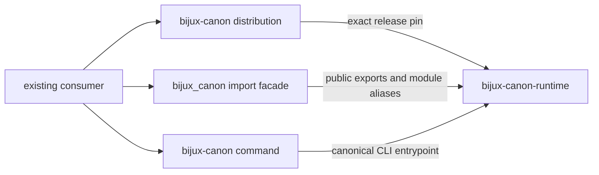

# bijux-canon

<!-- bijux-canon-badges:generated:start -->
[](https://pypi.org/project/bijux-canon/)
[-0A7BBB)](https://pypi.org/project/bijux-canon/)
[](https://github.com/bijux/bijux-canon/blob/main/LICENSE)
[](https://github.com/bijux/bijux-canon/actions/workflows/verify.yml?query=branch%3Amain)
[](https://github.com/bijux/bijux-canon)

[](https://pypi.org/project/bijux-canon/)
[](https://pypi.org/project/bijux-canon-runtime/)
[](https://pypi.org/project/bijux-canon-agent/)
[](https://pypi.org/project/bijux-canon-ingest/)
[](https://pypi.org/project/bijux-canon-reason/)
[](https://pypi.org/project/bijux-canon-index/)
[](https://pypi.org/project/agentic-flows/)
[](https://pypi.org/project/bijux-agent/)
[](https://pypi.org/project/bijux-rag/)
[](https://pypi.org/project/bijux-rar/)
[](https://pypi.org/project/bijux-vex/)

[](https://github.com/bijux/bijux-canon/pkgs/container/bijux-canon%2Fbijux-canon)
[](https://github.com/bijux/bijux-canon/pkgs/container/bijux-canon%2Fbijux-canon-runtime)
[](https://github.com/bijux/bijux-canon/pkgs/container/bijux-canon%2Fbijux-canon-agent)
[](https://github.com/bijux/bijux-canon/pkgs/container/bijux-canon%2Fbijux-canon-ingest)
[](https://github.com/bijux/bijux-canon/pkgs/container/bijux-canon%2Fbijux-canon-reason)
[](https://github.com/bijux/bijux-canon/pkgs/container/bijux-canon%2Fbijux-canon-index)
[](https://github.com/bijux/bijux-canon/pkgs/container/bijux-canon%2Fagentic-flows)
[](https://github.com/bijux/bijux-canon/pkgs/container/bijux-canon%2Fbijux-agent)
[](https://github.com/bijux/bijux-canon/pkgs/container/bijux-canon%2Fbijux-rag)
[](https://github.com/bijux/bijux-canon/pkgs/container/bijux-canon%2Fbijux-rar)
[](https://github.com/bijux/bijux-canon/pkgs/container/bijux-canon%2Fbijux-vex)

[](https://bijux.io/bijux-canon/06-bijux-canon-runtime/)
[](https://bijux.io/bijux-canon/05-bijux-canon-agent/)
[](https://bijux.io/bijux-canon/02-bijux-canon-ingest/)
[](https://bijux.io/bijux-canon/04-bijux-canon-reason/)
[](https://bijux.io/bijux-canon/03-bijux-canon-index/)
<!-- bijux-canon-badges:generated:end -->

`bijux-canon` is the short-name compatibility distribution for
[`bijux-canon-runtime`](../bijux-canon-runtime/README.md). It keeps established
dependency declarations, `bijux_canon` imports, and the `bijux-canon` command
working while all runtime behavior remains owned by the canonical package.

This is a runtime bridge, not an umbrella installation for the full Bijux
Canon family. Ingest, index, reason, and agent remain separately installable
packages with independent public contracts.

## Install

```bash
python3.11 -m pip install bijux-canon
bijux-canon --help
python3.11 -m bijux_canon --help
```

The bridge and canonical runtime are released together. The built
`bijux-canon` wheel requires `bijux-canon-runtime` at the exact same version,
preventing an alias release from silently forwarding into a different runtime
contract.

## Identity Map

| Consumer surface | Compatibility identity | Canonical identity |
| --- | --- | --- |
| distribution | `bijux-canon` | `bijux-canon-runtime` |
| Python package | `bijux_canon` | `bijux_canon_runtime` |
| console command | `bijux-canon` | `bijux-canon-runtime` |
| module execution | `python -m bijux_canon` | `python -m bijux_canon_runtime` |
| CLI module | `bijux_canon.interfaces.cli.entrypoint` | `bijux_canon_runtime.interfaces.cli.entrypoint` |
| representative model | `bijux_canon.model.flows.manifest.FlowManifest` | `bijux_canon_runtime.model.flows.manifest.FlowManifest` |



## Runtime Semantics

The package root exposes the canonical runtime's declared `__all__` and
forwards attribute access without eagerly importing execution or persistence
internals. Non-local `bijux_canon.*` imports are resolved against the matching
`bijux_canon_runtime.*` path. A nested class imported through either name is
therefore the same Python object, which protects `isinstance` checks,
registries, and serializers from duplicate class identities.

The compatibility command and `python -m bijux_canon` call the canonical CLI.
They do not translate arguments, configuration, exit codes, or artifacts.
Runtime admission, execution, persistence, resume, and replay consequently
have one implementation and one documentation authority.

## Verify A Consumer

Exercise the surfaces that the application actually depends on:

```python
from bijux_canon import FlowManifest as CompatibilityManifest
from bijux_canon_runtime import FlowManifest as CanonicalManifest

assert CompatibilityManifest is CanonicalManifest
```

```bash
bijux-canon --help
bijux-canon --version
python3.11 -m bijux_canon --help
```

For a real workflow, compare exit status, structured output, artifact layout,
and replay behavior under the compatibility and canonical commands. Matching
imports alone do not validate a deployment's providers, secrets, storage, or
historical run data.

## Migrate To The Canonical Name

New applications should depend on `bijux-canon-runtime`, import
`bijux_canon_runtime`, and invoke `bijux-canon-runtime`. Existing applications
can migrate one boundary at a time:

1. Replace the distribution requirement and lock-file entry.
2. Replace root and nested Python imports.
3. Replace shell commands, container entrypoints, and automation.
4. Search configuration and serialized metadata for dotted `bijux_canon.*`
   paths.
5. Run representative workflows and compare their artifacts and replay
   results.
6. Remove the bridge only after deployed consumers no longer load its
   distribution, module, or command identities.

The bridge intentionally does not promise every private runtime module as a
permanent API. Depend on documented canonical exports wherever possible.

## Read Next

- [Runtime handbook](https://bijux.io/bijux-canon/06-bijux-canon-runtime/)
  for execution, artifacts, resume, and replay semantics
- [Compatibility contract](https://bijux.io/bijux-canon/08-compat-packages/catalog/bijux-canon/)
  for the complete preserved-identity boundary
- [Migration guidance](https://bijux.io/bijux-canon/08-compat-packages/migration/migration-guidance/)
  for consumer inventory and validation
- [Package changelog](CHANGELOG.md) for release history
