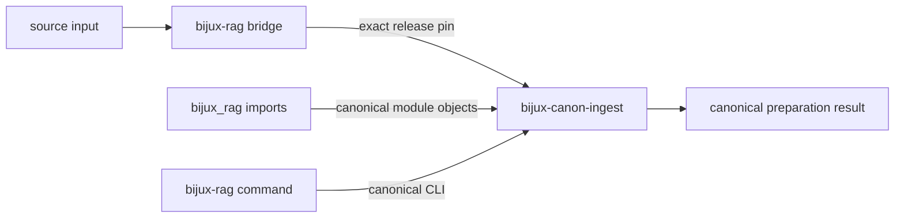

# bijux-rag

<!-- bijux-canon-badges:generated:start -->
[](https://pypi.org/project/bijux-rag/)
[-0A7BBB)](https://pypi.org/project/bijux-rag/)
[](https://github.com/bijux/bijux-canon/blob/main/LICENSE)
[](https://github.com/bijux/bijux-canon/actions/workflows/verify.yml?query=branch%3Amain)
[](https://github.com/bijux/bijux-canon)

[](https://pypi.org/project/bijux-rag/)
[](https://pypi.org/project/bijux-canon-runtime/)
[](https://pypi.org/project/bijux-canon/)
[](https://pypi.org/project/bijux-canon-agent/)
[](https://pypi.org/project/bijux-canon-ingest/)
[](https://pypi.org/project/bijux-canon-reason/)
[](https://pypi.org/project/bijux-canon-index/)
[](https://pypi.org/project/agentic-flows/)
[](https://pypi.org/project/bijux-agent/)
[](https://pypi.org/project/bijux-rar/)
[](https://pypi.org/project/bijux-vex/)

[](https://github.com/bijux/bijux-canon/pkgs/container/bijux-canon%2Fbijux-rag)
[](https://github.com/bijux/bijux-canon/pkgs/container/bijux-canon%2Fbijux-canon-runtime)
[](https://github.com/bijux/bijux-canon/pkgs/container/bijux-canon%2Fbijux-canon)
[](https://github.com/bijux/bijux-canon/pkgs/container/bijux-canon%2Fbijux-canon-agent)
[](https://github.com/bijux/bijux-canon/pkgs/container/bijux-canon%2Fbijux-canon-ingest)
[](https://github.com/bijux/bijux-canon/pkgs/container/bijux-canon%2Fbijux-canon-reason)
[](https://github.com/bijux/bijux-canon/pkgs/container/bijux-canon%2Fbijux-canon-index)
[](https://github.com/bijux/bijux-canon/pkgs/container/bijux-canon%2Fagentic-flows)
[](https://github.com/bijux/bijux-canon/pkgs/container/bijux-canon%2Fbijux-agent)
[](https://github.com/bijux/bijux-canon/pkgs/container/bijux-canon%2Fbijux-rar)
[](https://github.com/bijux/bijux-canon/pkgs/container/bijux-canon%2Fbijux-vex)

[](https://bijux.io/bijux-canon/06-bijux-canon-runtime/)
[](https://bijux.io/bijux-canon/05-bijux-canon-agent/)
[](https://bijux.io/bijux-canon/02-bijux-canon-ingest/)
[](https://bijux.io/bijux-canon/04-bijux-canon-reason/)
[](https://bijux.io/bijux-canon/03-bijux-canon-index/)
<!-- bijux-canon-badges:generated:end -->

`bijux-rag` preserves an earlier distribution, import root, and command for
[`bijux-canon-ingest`](../bijux-canon-ingest/README.md). Existing preparation
pipelines can keep those identities while source handling, normalization,
chunking, typed results, and releases remain owned by the canonical ingest
package.

The preserved “RAG” name does not make this bridge a retrieval system. Vector
execution belongs to index, evidence-bearing claims belong to reason, and
orchestration belongs to agent and runtime.

## Install

```bash
python3.11 -m pip install bijux-rag
bijux-rag --help
python3.11 -m bijux_rag --help
```

The built wheel requires `bijux-canon-ingest` at exactly the bridge's release,
keeping the alias and canonical preparation contract synchronized.

## Identity Map

| Consumer surface | Preserved identity | Canonical identity |
| --- | --- | --- |
| distribution | `bijux-rag` | `bijux-canon-ingest` |
| Python package | `bijux_rag` | `bijux_canon_ingest` |
| console command | `bijux-rag` | `bijux-canon-ingest` |
| module execution | `python -m bijux_rag` | `python -m bijux_canon_ingest` |
| CLI module | `bijux_rag.interfaces.cli.entrypoint` | `bijux_canon_ingest.interfaces.cli.entrypoint` |
| representative document type | `bijux_rag.core.types.RawDoc` | `bijux_canon_ingest.core.types.RawDoc` |



## Preparation Semantics

The compatibility root mirrors the canonical ingest package's declared
exports. Nested compatibility paths resolve to canonical modules, so `RawDoc`
and other imported types are not duplicated when both names coexist.

The executable and module entrypoint call the ingest CLI directly. The bridge
does not rewrite source identity, normalization, chunking parameters,
structured output, typed failures, or process exit status. It also does not
own a separate cache or prepared-artifact layout.

## Verify A Consumer

Confirm type identity at the boundary used by downstream code:

```python
from bijux_rag.core.types import RawDoc as CompatibilityRawDoc
from bijux_canon_ingest.core.types import RawDoc as CanonicalRawDoc

assert CompatibilityRawDoc is CanonicalRawDoc
```

```bash
bijux-rag --help
python3.11 -m bijux_rag --help
```

Then prepare a representative source under both identities and compare source
IDs, normalized content, chunk boundaries, structured results, typed failures,
and the first downstream consumer. Command discovery alone does not prove
artifact or cache compatibility.

## Migrate The Preparation Boundary

New pipelines should depend on `bijux-canon-ingest`, import
`bijux_canon_ingest`, and invoke `bijux-canon-ingest`. For an existing
pipeline:

1. replace dependency declarations and resolved lock entries;
2. replace root and nested imports;
3. replace executable names in scripts, images, schedulers, and runbooks;
4. inspect source configuration, plugin metadata, serialized dotted paths,
   cache keys, and prepared-artifact readers;
5. validate a representative source through its first downstream consumer;
   and
6. remove the bridge after deployed consumers no longer require its
   distribution, package, or command.

The alias machinery does not make undocumented historical modules or every
old artifact representation part of the canonical API.

## Read Next

- [Ingest handbook](https://bijux.io/bijux-canon/02-bijux-canon-ingest/)
  for preparation contracts and evidence
- [Compatibility contract](https://bijux.io/bijux-canon/08-compat-packages/catalog/bijux-rag/)
  for preserved identity details
- [Migration guidance](https://bijux.io/bijux-canon/08-compat-packages/migration/migration-guidance/)
  for consumer inventory and acceptance
- [Retired repository](https://github.com/bijux/bijux-rag) for historical
  context
- [Package changelog](https://github.com/bijux/bijux-canon/blob/main/packages/compat-bijux-rag/CHANGELOG.md) for release history
